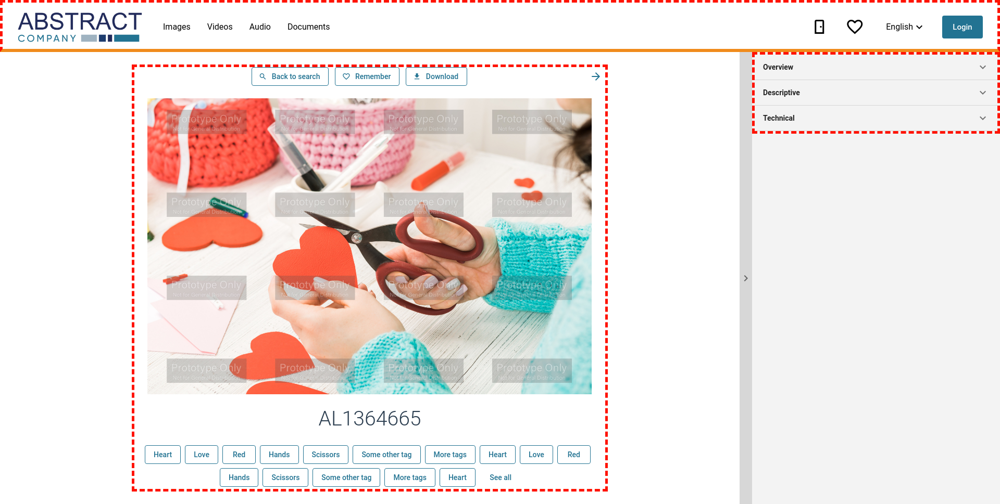
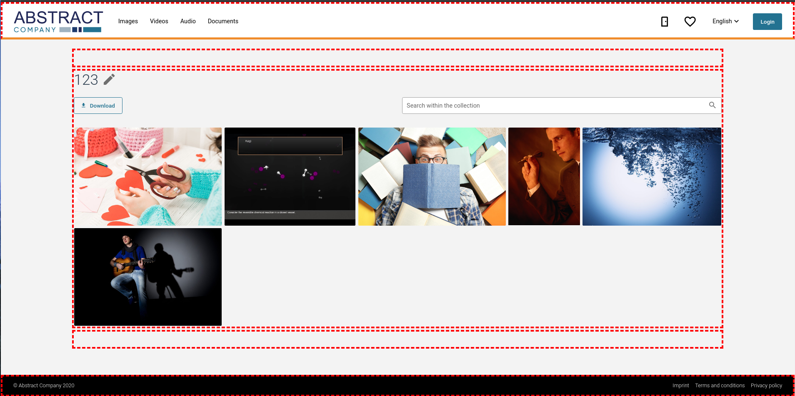
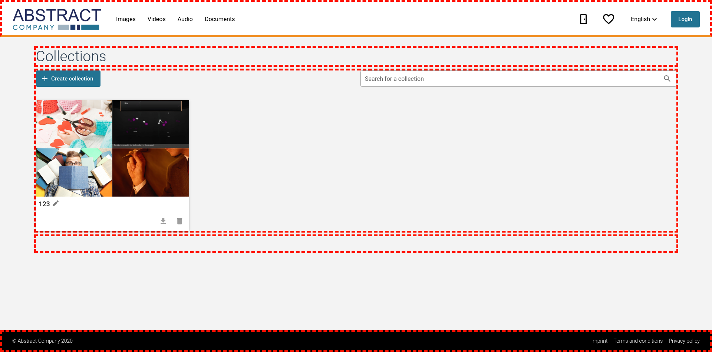
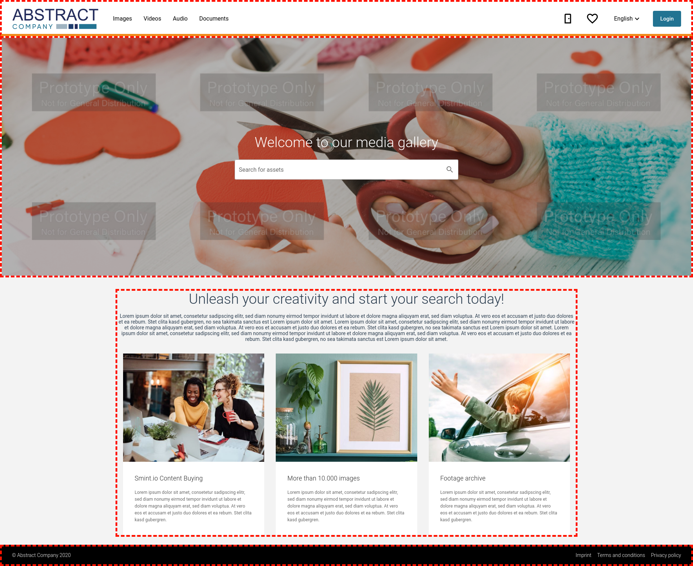
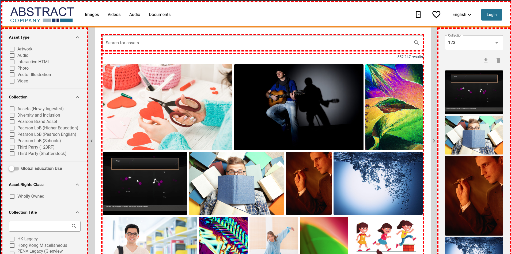
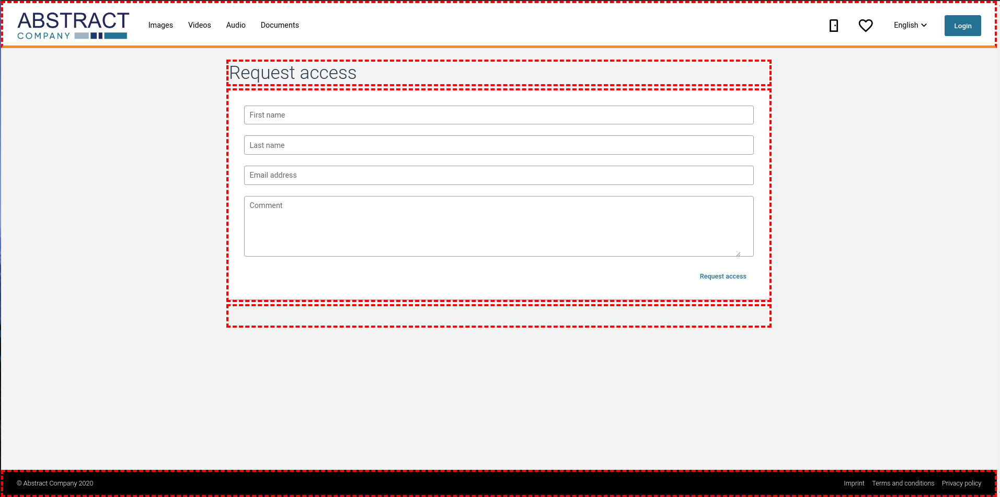
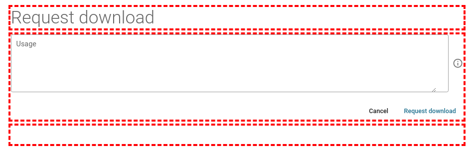

Page templates
--------------

* [Asset details page](https://github.com/smintio/Portals-UIComponents-Overview/blob/main/docs/smintio-ui-pages.md#asset-details-page)
* [Collection details page](https://github.com/smintio/Portals-UIComponents-Overview/blob/main/docs/smintio-ui-pages.md#collection-details-page)
* [Collections overview page](https://github.com/smintio/Portals-UIComponents-Overview/blob/main/docs/smintio-ui-pages.md#collections-overview-page)
* [Main Page](https://github.com/smintio/Portals-UIComponents-Overview/blob/main/docs/smintio-ui-pages.md#main-page)
* [Search page](https://github.com/smintio/Portals-UIComponents-Overview/blob/main/docs/smintio-ui-pages.md#search-page)
* [Request access page](https://github.com/smintio/Portals-UIComponents-Overview/blob/main/docs/smintio-ui-pages.md#request-access-page)
* [Request download page](https://github.com/smintio/Portals-UIComponents-Overview/blob/main/docs/smintio-ui-pages.md#request-download-page)

Current version of this document is: 1.0.0 (as of 3rd of March, 2022)

### Asset details page

This asset details page template is best suited for media centers. It was originally designed for the Imagination media center.

| Key                                          | Type                      |
|----------------------------------------------|---------------------------|
| `smintio-page-media-gallery-asset-details-1` | `page-type-asset-details` |

#### Slots

| Slot name | Slot ID    | Min items | Max items | Allowed types                 |
|-----------|------------|-----------|-----------|-------------------------------|
| Header    | `header`   | `0`       | `1`       | `ui-type-header`              |
| Top       | `top`      |           |           |                               |
| Form      | `form`     | `1`       | `1`       | `ui-type-request-access-form` |
| Bottom    | `bottom`   |           |           |                               |
| Footer    | `footer`   | `0`       | `1`       | `ui-type-footer`              |

---

### Collection details page

| Key                                          | Type                             |
|----------------------------------------------|----------------------------------|
| `smintio-page-generic-collection-details-1`  | `page-type-collection-details`   |

#### Slots

| Slot name | Slot ID   | Min items | Max items | Allowed types                 |
|-----------|-----------|-----------|-----------|-------------------------------|
| Header    | `header`  | `0`       | `1`       | `ui-type-header`              |
| Top       | `top`     |           |           |                               |
| Details   | `details` | `1`       | `1`       | `ui-type-collections-details` |
| Bottom    | `bottom`  |           |           |                               |
| Footer    | `footer`  | `0`       | `1`       | `ui-type-footer`              |

---

### Collections overview page

Collections overview

| Key                                           | Type                             |
|-----------------------------------------------|----------------------------------|
| `smintio-page-generic-collections-overview-1` | `page-type-collections-overview` |

#### Slots

| Slot name | Slot ID    | Min items | Max items | Allowed types                  |
|-----------|------------|-----------|-----------|--------------------------------|
| Header    | `header`   | `0`       | `1`       | `ui-type-header`               |
| Top       | `top`      |           |           |                                |
| Overview  | `overview` | `1`       | `1`       | `ui-type-collections-overview` |
| Bottom    | `bottom`   |           |           |                                |
| Footer    | `footer`   | `0`       | `1`       | `ui-type-footer`               |

---

### Main page

This cover page template is best suited for media centers. It was originally designed for the Imagination media center.

| Key                                  | Type                |
|--------------------------------------|---------------------|
| `smintio-page-media-gallery-main-1`  | `page-type-main`    |

#### Slots

| Slot name | Slot ID   | Min items | Max items | Allowed types     |
|-----------|-----------|-----------|-----------|-------------------|
| Header    | `header`  | `0`       | `1`       | `ui-type-header`  |
| Banner    | `banner`  | `1`       | `1`       | `ui-type-banner`  | 
| Content   | `content` |           |           |                   |
| Footer    | `footer`  | `0`       | `1`       | `ui-type-footer`  |

---

### Search page

This assets search page template is best suited for media centers. It was originally designed for the Imagination media center.

| Key                                          | Type                      |
|----------------------------------------------|---------------------------|
| `smintio-page-media-gallery-assets-search-1` | `page-type-assets-search` |

#### Slots

| Slot name     | Slot ID         | Min items | Max items | Allowed types                  |
|---------------|-----------------|-----------|-----------|--------------------------------|
| Header        | `header`        | `0`       | `1`       | `ui-type-header`               |
| Left          | `left`          | `0`       | `1`       | `ui-type-search-form`          | 
| Right         | `right`         | `0`       | `1`       | `ui-type-collection-quickview` | 
| Search bar    | `search-bar`    | `1`       | `1`       | `ui-type-search-bar`           |
| Search result | `search-result` | `1`       | `1`       | `ui-type-search-result`        |
| Footer        | `footer`        | `0`       | `1`       | `ui-type-footer`               |

#### Props

| Prop name                | Type            | Default  | Description |
|--------------------------|-----------------|----------|-------------|
| `assetsSearch`           | `IAssetsSearch` |          |             |
| `leftExpandedByDefault`  | `boolean`       | `true`   |             |
| `rightExpandedByDefault` | `boolean`       | `false`  |             |

---

### Request access page

Request access

| Key                                     | Type                       |
|-----------------------------------------|----------------------------|
| `smintio-page-generic-request-access-1` | `page-type-request-access` |

#### Slots

| Slot name | Slot ID   | Min items | Max items | Allowed types    |
|-----------|-----------|-----------|-----------|------------------|
| Header    | `header`  | `0`       | `1`       | `ui-type-header` |
| Left      | `left`    | `0`       | `1`       |                  | 
| Right     | `right`   | `1`       |           |                  | 
| Content   | `content` | `0`       | `1`       |                  |
| Footer    | `footer`  | `0`       | `1`       | `ui-type-footer` |

#### Props

| Prop name                | Type            | Default   | Description |
|--------------------------|-----------------|-----------|-------------|
| `rightExpandedByDefault` | `boolean`       | `false`   |             |

---

### Request download page

| Key                                       | Type                         |
|-------------------------------------------|------------------------------|
| `smintio-page-generic-request-download-1` | `page-type-request-download` |

#### Slots

| Slot name | Slot ID  | Min items | Max items | Allowed types                   |
|-----------|----------|-----------|-----------|---------------------------------|
| Header    | `header` | `0`       | `1`       | `ui-type-header`                |
| Top       | `top`    |           |           |                                 |
| Form      | `form`   | `1`       | `1`       | `ui-type-request-download-form` |
| Bottom    | `bottom` |           |           |                                 |
| Footer    | `footer` | `0`       | `1`       | `ui-type-footer`                |

---

Contributors
============

- Yanko Belov, Smint.io. GmbH
- Reinhard Holzner, Smint.io GmbH
