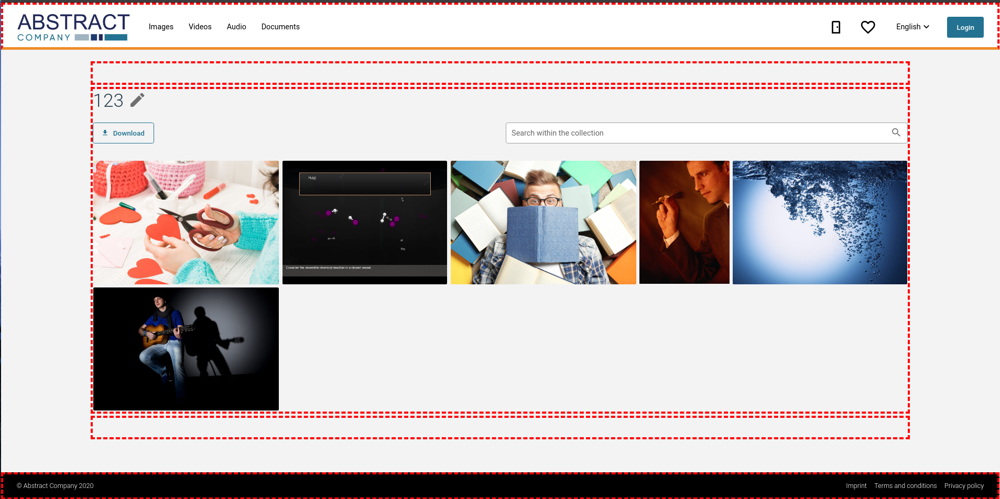
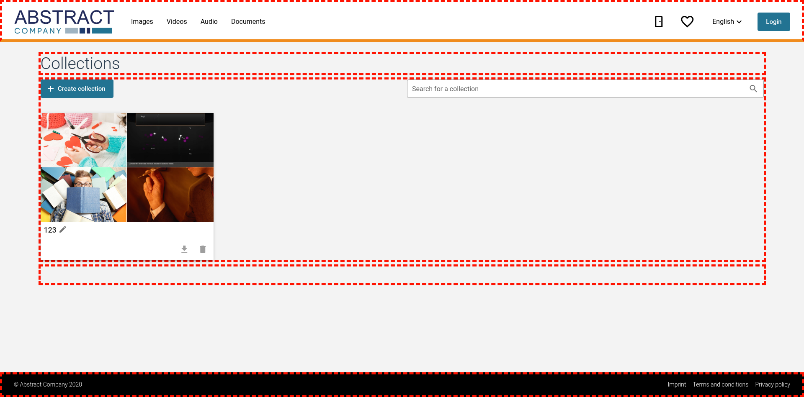
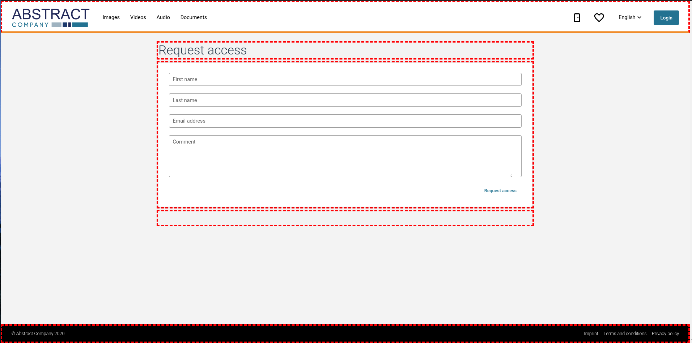
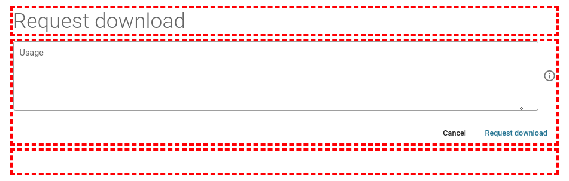
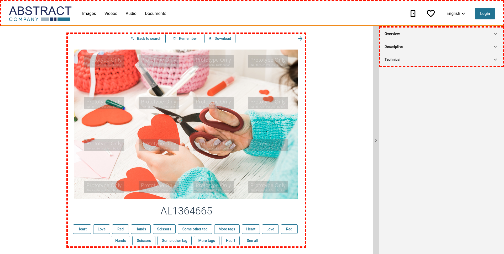
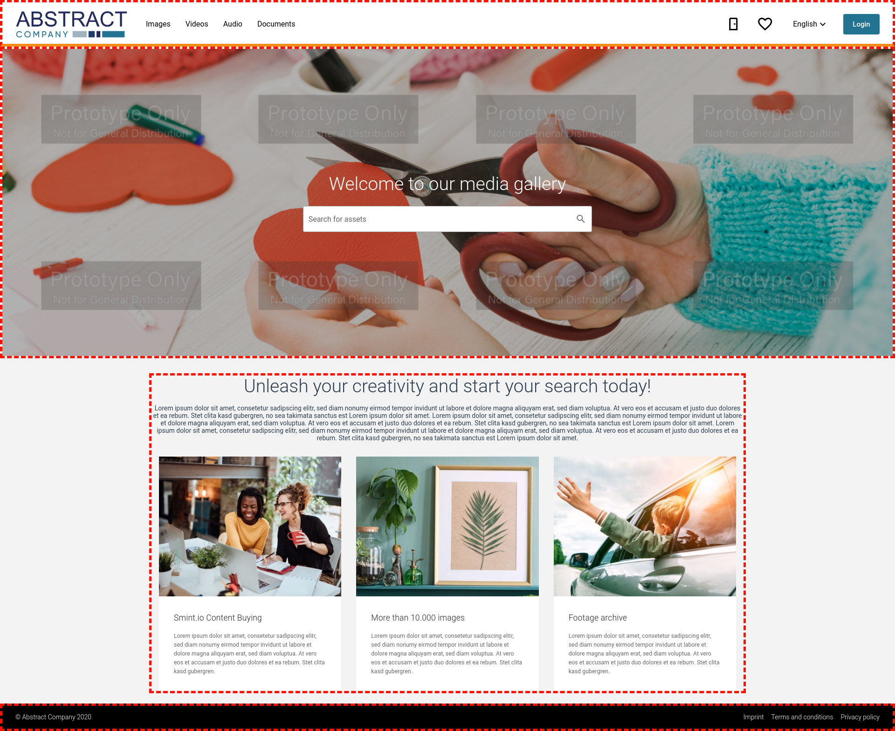

Smint.io Portals page templates
===============================

Current version of this document is: 2.0.0 (as of 10th of September, 2026)

This is the full list of page templates delivered and maintained by Smint.io, generated
from the page template sources.

For each page template the *slots* it declares are listed, together with the UI component
types the slot accepts and the minimum and maximum number of components it holds. A slot
with no type restriction accepts any UI component.

## Content and media gallery pages

### Content page

This is a content page, with header, footer, left and right areas and an area for content in the middle.

| Key | Type |
|---|---|
| `smintio-page-generic-1` | `page-type-generic` |

#### Slots

| Slot id | Min | Max | Accepted UI component types |
|---|---|---|---|
| `header` | 0 | 1 | `ui-type-header` |
| `left` |  |  | any |
| `content` | 1 |  | any |
| `right` |  |  | any |
| `footer` | 0 | 1 | `ui-type-footer` |

*Additional properties come from the shared mixins:* `SContentWidthProps`, `SPageTemplateColorsProps`

#### Props

| Prop name | Type | Default | Description |
|---|---|---|---|
| `contentGap` | `string` | `"default"` | **Top and bottom gap**    *Allowed values:* `"none", "small", "medium", "large", "xlarge", "xxlarge", "default"` |

---

### Collection details

| Key | Type |
|---|---|
| `smintio-page-generic-collection-details-1` | `page-type-collection-details` |

#### Slots

| Slot id | Min | Max | Accepted UI component types |
|---|---|---|---|
| `header` | 0 | 1 | `ui-type-header` |
| `top` |  |  | any |
| `right` | 0 | 1 | `ui-type-collection-comments` |
| `details` | 1 | 1 | `ui-type-collection-details` |
| `bottom` |  |  | any |
| `footer` | 0 | 1 | `ui-type-footer` |

#### Props

| Prop name | Type | Default | Description |
|---|---|---|---|
| `rightExpandableText` | `ILocalizedStringsModel` |  | **Panel text**    Give a text to display if the right expansion panel is collapsed. |

---

### Collections overview

| Key | Type |
|---|---|
| `smintio-page-generic-collections-overview-1` | `page-type-collections-overview` |

#### Slots

| Slot id | Min | Max | Accepted UI component types |
|---|---|---|---|
| `header` | 0 | 1 | `ui-type-header` |
| `top` |  |  | any |
| `overview` | 1 | 1 | `ui-type-collections-overview` |
| `bottom` |  |  | any |
| `footer` | 0 | 1 | `ui-type-footer` |

---

### Dialog

| Key | Type |
|---|---|
| `smintio-page-generic-dialog-1` | `page-type-generic-dialog` |

#### Slots

| Slot id | Min | Max | Accepted UI component types |
|---|---|---|---|
| `top` |  |  | any |
| `content` |  |  | any |
| `bottom` |  |  | any |

---

### Error

This is a generic error page.

| Key | Type |
|---|---|
| `smintio-page-generic-error-1` | `page-type-error` |

#### Slots

| Slot id | Min | Max | Accepted UI component types |
|---|---|---|---|
| `header` | 0 | 1 | `ui-type-header` |
| `top` |  |  | any |
| `form` | 1 | 1 | `ui-type-error-form` |
| `bottom` |  |  | any |
| `footer` | 0 | 1 | `ui-type-footer` |

---

### Imprint page

This is a page for imprint content, with header, footer, left and right areas and an area for content in the middle.

| Key | Type |
|---|---|
| `smintio-page-generic-imprint-1` | `page-type-imprint` |

#### Slots

| Slot id | Min | Max | Accepted UI component types |
|---|---|---|---|
| `header` | 0 | 1 | `ui-type-header` |
| `left` |  |  | any |
| `content` | 1 |  | any |
| `right` |  |  | any |
| `footer` | 0 | 1 | `ui-type-footer` |

*Additional properties come from the shared mixins:* `SContentWidthProps`, `SPageTemplateColorsProps`

#### Props

| Prop name | Type | Default | Description |
|---|---|---|---|
| `contentGap` | `string` | `"default"` | **Top and bottom gap**    *Allowed values:* `"none", "small", "medium", "large", "xlarge", "xxlarge", "default"` |

---

### System page

This is a special page provided by the Smint.io Portals system.

| Key | Type |
|---|---|
| `smintio-page-generic-mpa-1` | `page-type-mpa` |

#### Slots

| Slot id | Min | Max | Accepted UI component types |
|---|---|---|---|
| `header` | 0 | 1 | `ui-type-header` |
| `form` | 1 |  | `ui-type-mpa-form` |
| `content` |  |  | any |
| `footer` | 0 | 1 | `ui-type-footer` |

---

### Privacy policy page

This is a page for privacy policy content, with header, footer, left and right areas and an area for content in the middle.

| Key | Type |
|---|---|
| `smintio-page-generic-privacy-policy-1` | `page-type-privacy-policy` |

#### Slots

| Slot id | Min | Max | Accepted UI component types |
|---|---|---|---|
| `header` | 0 | 1 | `ui-type-header` |
| `left` |  |  | any |
| `content` | 1 |  | any |
| `right` |  |  | any |
| `footer` | 0 | 1 | `ui-type-footer` |

*Additional properties come from the shared mixins:* `SContentWidthProps`, `SPageTemplateColorsProps`

#### Props

| Prop name | Type | Default | Description |
|---|---|---|---|
| `contentGap` | `string` | `"default"` | **Top and bottom gap**    *Allowed values:* `"none", "small", "medium", "large", "xlarge", "xxlarge", "default"` |

---

### Request access

| Key | Type |
|---|---|
| `smintio-page-generic-request-access-1` | `page-type-request-access` |

#### Slots

| Slot id | Min | Max | Accepted UI component types |
|---|---|---|---|
| `header` | 0 | 1 | `ui-type-header` |
| `top` |  |  | any |
| `form` | 1 | 1 | `ui-type-request-access-form` |
| `bottom` |  |  | any |
| `footer` | 0 | 1 | `ui-type-footer` |

---

### Request download

| Key | Type |
|---|---|
| `smintio-page-generic-request-download-1` | `page-type-request-download` |

#### Slots

| Slot id | Min | Max | Accepted UI component types |
|---|---|---|---|
| `top` |  |  | any |
| `form` | 1 | 1 | `ui-type-request-download-form` |
| `bottom` |  |  | any |

---

### Request permission

| Key | Type |
|---|---|
| `smintio-page-generic-request-permission-1` | `page-type-request-permission` |

#### Slots

| Slot id | Min | Max | Accepted UI component types |
|---|---|---|---|
| `header` | 0 | 1 | `ui-type-header` |
| `top` |  |  | any |
| `form` | 1 | 1 | `ui-type-request-permission-form` |
| `bottom` |  |  | any |
| `footer` | 0 | 1 | `ui-type-footer` |

---

### Share link details

| Key | Type |
|---|---|
| `smintio-page-generic-share-details-1` | `page-type-share-details` |

#### Slots

| Slot id | Min | Max | Accepted UI component types |
|---|---|---|---|
| `header` | 0 | 1 | `ui-type-header` |
| `top` |  |  | any |
| `right` | 0 | 1 | `ui-type-collection-comments` |
| `details` | 1 | 1 | `ui-type-share-details` |
| `bottom` |  |  | any |
| `footer` | 0 | 1 | `ui-type-footer` |

#### Props

| Prop name | Type | Default | Description |
|---|---|---|---|
| `rightExpandableText` | `ILocalizedStringsModel` |  | **Panel text**    Give a text to display if the right expansion panel is collapsed. |
| `passwordDialogTitleText` | `ILocalizedStringsModel` | `"text_password_dialog_title"` | **Title text**    *Values offered by:* `StringResourceAllowedValuesProvider`    *Advanced setting* |
| `passwordPasswordText` | `ILocalizedStringsModel` | `"text_share_link_password"` | **Password text**    *Values offered by:* `StringResourceAllowedValuesProvider`    *Advanced setting* |
| `passwordButtonSubmitText` | `ILocalizedStringsModel` | `"button_submit"` | **Submit button text**    *Values offered by:* `StringResourceAllowedValuesProvider`    *Advanced setting* |

---

### Share links overview

| Key | Type |
|---|---|
| `smintio-page-generic-shared-links-1` | `page-type-shared-links` |

#### Slots

| Slot id | Min | Max | Accepted UI component types |
|---|---|---|---|
| `header` | 0 | 1 | `ui-type-header` |
| `top` |  |  | any |
| `links` | 1 | 1 | `ui-type-shared-links` |
| `bottom` |  |  | any |
| `footer` | 0 | 1 | `ui-type-footer` |

---

### Terms and conditions page

This is a page for terms and conditions content, with header, footer, left and right areas and an area for content in the middle.

| Key | Type |
|---|---|
| `smintio-page-generic-terms-and-conditions-1` | `page-type-terms-and-conditions` |

#### Slots

| Slot id | Min | Max | Accepted UI component types |
|---|---|---|---|
| `header` | 0 | 1 | `ui-type-header` |
| `left` |  |  | any |
| `content` | 1 |  | any |
| `right` |  |  | any |
| `footer` | 0 | 1 | `ui-type-footer` |

*Additional properties come from the shared mixins:* `SContentWidthProps`, `SPageTemplateColorsProps`

#### Props

| Prop name | Type | Default | Description |
|---|---|---|---|
| `contentGap` | `string` | `"default"` | **Top and bottom gap**    *Allowed values:* `"none", "small", "medium", "large", "xlarge", "xxlarge", "default"` |

---

### Asset details with side flaps

This is an asset details page to show a preview of an asset and its associated metadata, with optional side flaps to the left and/or right.

| Key | Type |
|---|---|
| `smintio-page-media-gallery-asset-details-1` | `page-type-asset-details` |

#### Slots

| Slot id | Min | Max | Accepted UI component types |
|---|---|---|---|
| `header` | 0 | 1 | `ui-type-header` |
| `left` |  |  | any |
| `content` | 1 |  | any |
| `right` |  |  | any |
| `footer` | 0 | 1 | `ui-type-footer` |

*Additional properties come from the shared mixins:* `SPageTemplateColorsProps`

#### Props

| Prop name | Type | Default | Description |
|---|---|---|---|
| `rightExpandableText` | `ILocalizedStringsModel` |  | **Panel text**    Give a text to display if the right expansion panel is collapsed. |
| `rightExpandedByDefault` | `boolean` |  | **Expanded by default**    Check this to make the right expansion panel expanded by default. |
| `overridePageTitle` | `boolean` | `false` | **Override browser title with asset name** |

---

### Search assets (Media center - Imagination)

This assets search page template is best suited for media centers. It was originally designed for the Imagination media center.

")

| Key | Type |
|---|---|
| `smintio-page-media-gallery-assets-search-1` | `page-type-assets-search` |

#### Slots

| Slot id | Min | Max | Accepted UI component types |
|---|---|---|---|
| `header` | 0 | 1 | `ui-type-header` |
| `left` | 0 | 1 | `ui-type-search-form` |
| `search-bar` | 0 | 1 | `ui-type-search-bar` |
| `search-result` | 1 | 1 | `ui-type-search-result` |
| `right` | 0 | 1 | `ui-type-collections-quickview` |
| `footer` | 0 | 1 | `ui-type-footer` |

*Additional properties come from the shared mixins:* `SDataSourceProps`, `SPageTemplateColorsProps`

#### Props

| Prop name | Type | Default | Description |
|---|---|---|---|
| `assetsSearch` | `IAssetsSearch` |  | **Asset data source**    The data source to query assets from. |
| `searchMode` | `string` | `"assets_only"` | **Search mode**    *Allowed values:* `"assets_only", "composite_only", "both"` |
| `leftExpandableText` | `ILocalizedStringsModel` |  | **Panel text**    Give a text to display if the left expansion panel is collapsed. |
| `leftExpandedByDefault` | `boolean` | `true` | **Expanded by default**    Check this to make the left expansion panel expanded by default. |
| `rightExpandableText` | `ILocalizedStringsModel` |  | **Panel text**    Give a text to display if the right expansion panel is collapsed. |
| `rightExpandedByDefault` | `boolean` |  | **Expanded by default**    Check this to make the right expansion panel expanded by default. |

---

### Cover page

This is a cover page, with header, footer, left and right areas and an area for a banner and for content in the middle.

| Key | Type |
|---|---|
| `smintio-page-media-gallery-main-1` | `page-type-main` |

#### Slots

| Slot id | Min | Max | Accepted UI component types |
|---|---|---|---|
| `header` | 0 | 1 | `ui-type-header` |
| `left` |  |  | any |
| `banner` |  |  | `ui-type-banner`, `ui-type-section` |
| `content` |  |  | any |
| `right` |  |  | any |
| `footer` | 0 | 1 | `ui-type-footer` |

*Additional properties come from the shared mixins:* `SContentWidthProps`, `SPageTemplateColorsProps`

#### Props

| Prop name | Type | Default | Description |
|---|---|---|---|
| `hasTransparentHeader` | `boolean` | `false` | **Header is transparent**    If you enable this setting, the header of the main page will be displayed with a transparent instead of a solid background. |
| `transparentHeaderLogo` | `IImage` |  | **Logo for transparent header**    If you need a special logo variant for the transparent header, you can specify the logo variant here. If you give no logo variant here, the default logo of the portal will be used.    *Values offered by:* `ImageResourceAllowedValuesProvider`    *Used IF:* `hasTransparentHeader Equal true` |
| `contentGap` | `string` | `"default"` | **Top and bottom gap**    *Allowed values:* `"none", "small", "medium", "large", "xlarge", "xxlarge", "default"` |

---

### Asset details with banner

This is an asset details page to show a preview of an asset and its associated metadata, with an area for a banner and for content in the middle.

| Key | Type |
|---|---|
| `smintio-press-portal-asset-details-1` | `page-type-asset-details` |

#### Slots

| Slot id | Min | Max | Accepted UI component types |
|---|---|---|---|
| `header` | 0 | 1 | `ui-type-header` |
| `left` |  |  | any |
| `banner` | 0 | 1 | `ui-type-asset-details-banner` |
| `content` |  |  | any |
| `right` |  |  | any |
| `footer` | 0 | 1 | `ui-type-footer` |

*Additional properties come from the shared mixins:* `SContentWidthProps`, `SPageTemplateColorsProps`

#### Props

| Prop name | Type | Default | Description |
|---|---|---|---|
| `hasTransparentHeader` | `boolean` | `false` | **Header is transparent**    If you enable this setting, the header of the main page will be displayed with a transparent instead of a solid background. |
| `transparentHeaderLogo` | `IImage` |  | **Logo for transparent header**    If you need a special logo variant for the transparent header, you can specify the logo variant here. If you give no logo variant here, the default logo of the portal will be used.    *Values offered by:* `ImageResourceAllowedValuesProvider`    *Used IF:* `hasTransparentHeader Equal true` |
| `contentGap` | `string` | `"default"` | **Top and bottom gap**    *Allowed values:* `"none", "small", "medium", "large", "xlarge", "xxlarge", "default"` |
| `overridePageTitle` | `boolean` | `true` | **Override browser title with asset name** |

---

## Login and account pages

### Accept terms

| Key | Type |
|---|---|
| `smintio-page-generic-account-accept-terms-1` | `page-type-account-accept-terms` |

#### Slots

| Slot id | Min | Max | Accepted UI component types |
|---|---|---|---|
| `header` | 0 | 1 | `ui-type-header` |
| `top` |  |  | any |
| `form` | 1 | 1 | `ui-type-account-accept-terms-form` |
| `bottom` |  |  | any |
| `footer` | 0 | 1 | `ui-type-footer` |

---

### Access denied

This is a generic access denied page.

| Key | Type |
|---|---|
| `smintio-page-generic-account-access-denied-1` | `page-type-account-access-denied` |

#### Slots

| Slot id | Min | Max | Accepted UI component types |
|---|---|---|---|
| `header` | 0 | 1 | `ui-type-header` |
| `top` |  |  | any |
| `form` | 1 | 1 | `ui-type-account-access-denied-form` |
| `bottom` |  |  | any |
| `footer` | 0 | 1 | `ui-type-footer` |

---

### Confirm email address

| Key | Type |
|---|---|
| `smintio-page-generic-account-confirm-email-1` | `page-type-account-confirm-email` |

#### Slots

| Slot id | Min | Max | Accepted UI component types |
|---|---|---|---|
| `header` | 0 | 1 | `ui-type-header` |
| `top` |  |  | any |
| `form` | 1 | 1 | `ui-type-account-confirm-email-form` |
| `bottom` |  |  | any |
| `footer` | 0 | 1 | `ui-type-footer` |

---

### Cookie consent banner

| Key | Type |
|---|---|
| `smintio-page-generic-account-cookie-consent-1` | `page-type-account-cookie-consent` |

#### Slots

| Slot id | Min | Max | Accepted UI component types |
|---|---|---|---|
| `banner` | 1 | 1 | `ui-type-account-cookie-consent` |

---

### Email confirmation message sent

| Key | Type |
|---|---|
| `smintio-page-generic-account-email-confirmation-sent-1` | `page-type-account-email-confirmation-sent` |

#### Slots

| Slot id | Min | Max | Accepted UI component types |
|---|---|---|---|
| `header` | 0 | 1 | `ui-type-header` |
| `top` |  |  | any |
| `form` | 1 | 1 | `ui-type-account-email-confirmation-sent-form` |
| `bottom` |  |  | any |
| `footer` | 0 | 1 | `ui-type-footer` |

---

### Email not yet confirmed

| Key | Type |
|---|---|
| `smintio-page-generic-account-email-not-confirmed-1` | `page-type-account-email-not-confirmed` |

#### Slots

| Slot id | Min | Max | Accepted UI component types |
|---|---|---|---|
| `header` | 0 | 1 | `ui-type-header` |
| `top` |  |  | any |
| `form` | 1 | 1 | `ui-type-account-email-not-confirmed-form` |
| `bottom` |  |  | any |
| `footer` | 0 | 1 | `ui-type-footer` |

---

### Forgot password

| Key | Type |
|---|---|
| `smintio-page-generic-account-forgot-password-1` | `page-type-account-forgot-password` |

#### Slots

| Slot id | Min | Max | Accepted UI component types |
|---|---|---|---|
| `header` | 0 | 1 | `ui-type-header` |
| `top` |  |  | any |
| `form` | 1 | 1 | `ui-type-account-forgot-password-form` |
| `bottom` |  |  | any |
| `footer` | 0 | 1 | `ui-type-footer` |

---

### Password reset message sent

| Key | Type |
|---|---|
| `smintio-page-generic-account-forgot-password-confirmation-1` | `page-type-account-forgot-password-confirmation` |

#### Slots

| Slot id | Min | Max | Accepted UI component types |
|---|---|---|---|
| `header` | 0 | 1 | `ui-type-header` |
| `top` |  |  | any |
| `form` | 1 | 1 | `ui-type-account-forgot-password-confirmation-form` |
| `bottom` |  |  | any |
| `footer` | 0 | 1 | `ui-type-footer` |

---

### Accept or decline invitation to collection

| Key | Type |
|---|---|
| `smintio-page-generic-account-invitation-collection-1` | `page-type-account-invitation-collection` |

#### Slots

| Slot id | Min | Max | Accepted UI component types |
|---|---|---|---|
| `header` | 0 | 1 | `ui-type-header` |
| `top` |  |  | any |
| `form` | 1 | 1 | `ui-type-account-invitation-collection-form` |
| `bottom` |  |  | any |
| `footer` | 0 | 1 | `ui-type-footer` |

---

### Login

| Key | Type |
|---|---|
| `smintio-page-generic-account-login-1` | `page-type-account-login` |

#### Slots

| Slot id | Min | Max | Accepted UI component types |
|---|---|---|---|
| `header` | 0 | 1 | `ui-type-header` |
| `top` |  |  | any |
| `form` | 1 | 1 | `ui-type-account-login-form` |
| `bottom` |  |  | any |
| `footer` | 0 | 1 | `ui-type-footer` |

---

### Logout

| Key | Type |
|---|---|
| `smintio-page-generic-account-logout-1` | `page-type-account-logout` |

#### Slots

| Slot id | Min | Max | Accepted UI component types |
|---|---|---|---|
| `header` | 0 | 1 | `ui-type-header` |
| `top` |  |  | any |
| `form` | 1 | 1 | `ui-type-account-logout-form` |
| `bottom` |  |  | any |
| `footer` | 0 | 1 | `ui-type-footer` |

---

### Manage account

| Key | Type |
|---|---|
| `smintio-page-generic-account-manage-1` | `page-type-account-manage` |

#### Slots

| Slot id | Min | Max | Accepted UI component types |
|---|---|---|---|
| `header` | 0 | 1 | `ui-type-header` |
| `top` |  |  | any |
| `form` | 1 | 1 | `ui-type-account-manage-form` |
| `bottom` |  |  | any |
| `footer` | 0 | 1 | `ui-type-footer` |

---

### Change password

| Key | Type |
|---|---|
| `smintio-page-generic-account-manage-change-password-1` | `page-type-account-manage-change-password` |

#### Slots

| Slot id | Min | Max | Accepted UI component types |
|---|---|---|---|
| `header` | 0 | 1 | `ui-type-header` |
| `top` |  |  | any |
| `form` | 1 | 1 | `ui-type-account-manage-change-password-form` |
| `bottom` |  |  | any |
| `footer` | 0 | 1 | `ui-type-footer` |

---

### Register

| Key | Type |
|---|---|
| `smintio-page-generic-account-register-1` | `page-type-account-register` |

#### Slots

| Slot id | Min | Max | Accepted UI component types |
|---|---|---|---|
| `header` | 0 | 1 | `ui-type-header` |
| `top` |  |  | any |
| `form` | 1 | 1 | `ui-type-account-register-form` |
| `bottom` |  |  | any |
| `footer` | 0 | 1 | `ui-type-footer` |

---

### Reset password

| Key | Type |
|---|---|
| `smintio-page-generic-account-reset-password-1` | `page-type-account-reset-password` |

#### Slots

| Slot id | Min | Max | Accepted UI component types |
|---|---|---|---|
| `header` | 0 | 1 | `ui-type-header` |
| `top` |  |  | any |
| `form` | 1 | 1 | `ui-type-account-reset-password-form` |
| `bottom` |  |  | any |
| `footer` | 0 | 1 | `ui-type-footer` |

---

### Password has been reset

| Key | Type |
|---|---|
| `smintio-page-generic-account-reset-password-confirmation-1` | `page-type-account-reset-password-confirmation` |

#### Slots

| Slot id | Min | Max | Accepted UI component types |
|---|---|---|---|
| `header` | 0 | 1 | `ui-type-header` |
| `top` |  |  | any |
| `form` | 1 | 1 | `ui-type-account-reset-password-confirmation-form` |
| `bottom` |  |  | any |
| `footer` | 0 | 1 | `ui-type-footer` |

---

Contributors
============

- Reinhard Holzner, Smint.io GmbH
- Yanko Belov, Smint.io GmbH
- Yosif Velev, Smint.io GmbH
