Components
--------------

* [Generic components](https://github.com/smintio/Portals-UIComponents-Overview/blob/main/docs/smintio-ui-components.md#generic-componentns)  
   * [Assets overview](https://github.com/smintio/Portals-UIComponents-Overview/blob/main/docs/smintio-ui-components.md#assets-preview)  
   * [Banner with search bar](https://github.com/smintio/Portals-UIComponents-Overview/blob/main/docs/smintio-ui-components.md#banner-with-search-bar)
   * [Category chooser](https://github.com/smintio/Portals-UIComponents-Overview/blob/main/docs/smintio-ui-components.md#category-chooser)  
   * [Category carousel](https://github.com/smintio/Portals-UIComponents-Overview/blob/main/docs/smintio-ui-components.md#category-carousel)  
   * [Collection details](https://github.com/smintio/Portals-UIComponents-Overview/blob/main/docs/smintio-ui-components.md#collection-details)  
   * [Collections overview](https://github.com/smintio/Portals-UIComponents-Overview/blob/main/docs/smintio-ui-components.md#collections-overview)  
   * [Color indicator with text](https://github.com/smintio/Portals-UIComponents-Overview/blob/main/docs/smintio-ui-components.md#color-indicator-with-text)  
   * [Footer](https://github.com/smintio/Portals-UIComponents-Overview/blob/main/docs/smintio-ui-components.md#footer)  
   * [Header](https://github.com/smintio/Portals-UIComponents-Overview/blob/main/docs/smintio-ui-components.md#header)  
   * [Image](https://github.com/smintio/Portals-UIComponents-Overview/blob/main/docs/smintio-ui-components.md#image)  
   * [Image with text](https://github.com/smintio/Portals-UIComponents-Overview/blob/main/docs/smintio-ui-components.md#image-with-text)  
   * [Location](https://github.com/smintio/Portals-UIComponents-Overview/blob/main/docs/smintio-ui-components.md#location)  
   * [Menu item chooser](https://github.com/smintio/Portals-UIComponents-Overview/blob/main/docs/smintio-ui-components.md#menu-item-chooser)  
   * [Page title](https://github.com/smintio/Portals-UIComponents-Overview/blob/main/docs/smintio-ui-components.md#page-title)  
   * [Search bar](https://github.com/smintio/Portals-UIComponents-Overview/blob/main/docs/smintio-ui-components.md#search-bar)  
   * [Side menu](https://github.com/smintio/Portals-UIComponents-Overview/blob/main/docs/smintio-ui-components.md#side-menu)  
   * [Text block](https://github.com/smintio/Portals-UIComponents-Overview/blob/main/docs/smintio-ui-components.md#text-block)  
   * [Text block with up to 3 columns](https://github.com/smintio/Portals-UIComponents-Overview/blob/main/docs/smintio-ui-components.md#text-block-with-up-to-3-columns)  
   * [Video](https://github.com/smintio/Portals-UIComponents-Overview/blob/main/docs/smintio-ui-components.md#video)
* [Asset details components](https://github.com/smintio/Portals-UIComponents-Overview/blob/main/docs/smintio-ui-components.md#asset-details-components)
  * [Action bar](https://github.com/smintio/Portals-UIComponents-Overview/blob/main/docs/smintio-ui-components.md#action-bar)
  * [Asset preview](https://github.com/smintio/Portals-UIComponents-Overview/blob/main/docs/smintio-ui-components.md#asset-preview)
  * [Details text](https://github.com/smintio/Portals-UIComponents-Overview/blob/main/docs/smintio-ui-components.md#details-text)
  * [Metadata viewer](https://github.com/smintio/Portals-UIComponents-Overview/blob/main/docs/smintio-ui-components.md#metadata-viewer)
  * [Tag viewer](https://github.com/smintio/Portals-UIComponents-Overview/blob/main/docs/smintio-ui-components.md#tag-viewer)
* [Media center components](https://github.com/smintio/Portals-UIComponents-Overview/blob/main/docs/smintio-ui-components.md#media-center-components)
   * [Collections quickview](https://github.com/smintio/Portals-UIComponents-Overview/blob/main/docs/smintio-ui-components.md#collections-quickview)    
   * [Facet based search form](https://github.com/smintio/Portals-UIComponents-Overview/blob/main/docs/smintio-ui-components.md#facet-based-search-form)  
   * [Search result](https://github.com/smintio/Portals-UIComponents-Overview/blob/main/docs/smintio-ui-components.md#search-result)  

Current version of this document is: 1.0.0 (as of 3rd of March, 2022)

## Generic components  

### Assets preview
This component shows multiple assets in a neat preview. The user can then easily download or collect assets directly from the preview.

| Key                                              | Type                         |
|--------------------------------------------------|------------------------------|
| `smintio-ui-generic-assets-preview-1`            | `ui-type-assets-preview`     |

#### Props

| Prop name                | Type                    | Default     | Description                                                                                                                                                                                                                                                                                                                                                                                   |
|--------------------------|-------------------------|-------------|-----------------------------------------------------------------------------------------------------------------------------------------------------------------------------------------------------------------------------------------------------------------------------------------------------------------------------------------------------------------------------------------------|
| `assetDetailPage`        | `IPageReference`        |             | **Asset detail page**    Choose a reference to the customizable asset detail page.                                                                                                                                                                                                                                                                                                    |
| `assetsReference`        | `IAssetsReferenceModel` |             | **Assets to display**    Choose individual assets, a folder or configure an asset search.                                                                                                                                                                                                                                                                                             |
| `approximateAssetHeight` | `string`                | `'one_row'` | **Masonry row height**    The masonry asset viewer adjusts the asset height automatically for the assets to nicely match to the masonry. However, you can give an approximate target asset height value here, and the algorithm will try to match it as good as possible.   *Allowed values:* `'half_row', 'three_quarter_row', 'one_row', 'one_and_a_half_rows', 'two_rows'` |
| `masonryGap`             | `string`                | `'medium'`  | **Masonry gap**     *Allowed values:* `'small', 'medium', 'large', 'xlarge'`                                                                                                                                                                                                                                                                                                          |
---

### Banner with search bar

This component displays a banner with an optional title and a search bar.

| Key                                      | Type             |
|------------------------------------------|------------------|
| `smintio-ui-generic-banner-searchbar-1`  | `ui-type-banner` |

#### Props

| Prop name                          | Type                         | Default    | Description                                                                                                                                                                                                                                                |
|------------------------------------|------------------------------|------------|------------------------------------------------------------------------------------------------------------------------------------------------------------------------------------------------------------------------------------------------------------|
| `bannerText`                       | `ILocalizedStringsModel`     |            | **Banner title**    The main title for the banner.                                                                                                                                                                                                 | 
| `hasSearchbar`                     | `boolean`                    | `true`     | **Show search bar**    If you enable this setting, the search bar input field will be shown.                                                                                                                                                       | 
| `searchBarAutoCompletion`          | `IAssetsSearch`              |            | **Data source for auto completion**    The data source to query the search bar auto completion suggestions from.    *Used IF:* `hasSearchbar === true`                                                                                     |
| `searchPage`                       | `IPageReference`             |            | **Search page**    The page that will be opened when the user confirms the search bar input.    *Used IF:* `hasSearchbar === true`                                                                                                         |
| `bannerHeight`                     | `string`                     | `'tall'`   | **Height**    Height of the banner.    *Allowed values:* `'low', 'medium', 'tall', 'very_tall', 'maximum'`                                                                                                                                 |
| `backgroundColor`                  | `string`                     |            | **Color**    Background color of the banner.                                                                                                                                                                                                       |
| `backgroundType`                   | `string`                     | `'none'`   | **Background type**    *Allowed values:* `'none', 'random_asset', 'fixed_asset', 'random_image', 'random_video_asset', 'fixed_video_asset', 'random_video'`                                                                                        | 
| `backgroundImageRandomAsset`       | `IAssetsReadRandom`          |            | **Random asset data source**    The data source to query the random asset for the background from.    *Used IF:* `['random_asset', 'random_video_asset'].include(backgroundType)`                                                          |
| `backgroundImageRandomResources`   | `IImage[]`                   |            | **Images from resources for random choice**    *Used IF:* `backgroundType === 'random_image'`                                                                                                                                                      |
| `backgroundVideoRandomResources`   | `IVideo[]`                   |            | **Videos from resources for random choice**    *Used IF:* `backgroundType === 'random_video'`                                                                                                                                                      |
| `imageAssetIdentifiers`            | `IAssetIdentifier[]`         |            | **Images assets for random choice**    *Used IF:* `backgroundType === 'fixed_asset'`                                                                                                                                                               |
| `videoAssetIdentifiers`            | `IAssetIdentifier[]`         |            | **Video assets for random choice**    *Used IF:* `backgroundType === 'fixed_video_asset'`                                                                                                                                                          |
| `backgroundPosition`               | `string`                     | `'center'` | **Assets viewport**    *Used IF:* `backgroundType !== 'none'`    *Allowed values:* ''top-left', 'center'`                                                                                                                                  |
| `automaticFading`                  | `boolean`                    | `false`    | **Automatically fade assets**    Determines if the background assets should automatically fade through assets    *Used IF:* `backgroundType !== 'none'`                                                                                    |
| `automaticFadingIntervalInSeconds` | `number`                     | `10`       | **Assets fading interval**    The interval in seconds to wait before fading to the next background asset.    *Min value:* `1`    *Max value:* `300`    *Used IF:* `backgroundType !== 'none' AND automaticFading === true` |
| `maxNumberOfRandomAssetsToFade`    | `number`                     | `3`        | **Maximum number of assets to query for fading**    *Min value:* `1`    *Max value:* `10`    *Used IF:* `['random_asset', 'random_video_asset'].include(backgroundType) AND automaticFading === true`                              |
| `backgroundBrightness`             | `string`                     | `'light'`  | **Darken assets**   *Allowed values:* `'none', 'light', 'strong'`    *Used IF:* `backgroundType !== 'none'`                                                                                                                                |
| `bannerShadow`                     | `string`                     | `'none'`   | **Shadow at the bottom**    *Allowed values:* `'none', 'light', 'strong'`    *Used IF:* `backgroundType !== 'none'`                                                                                                                        |
| `transparentHeader`                | `boolean`                    | `false`    | **Is the header transparent when the page scroll is 0**                                                                                                                                                                                                    |

---

### Category chooser

This component displays a column-based category chooser for one or more categories.

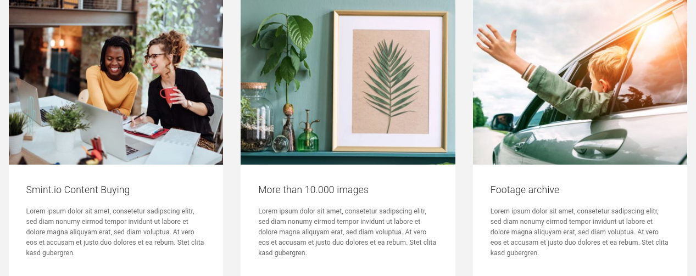

| Key                                      | Type                        |
|------------------------------------------|-----------------------------|
| `smintio-ui-generic-category-chooser-1`  | `ui-type-category-chooser`  |

#### Props

| Prop name           | Type          | Default     | Description                                                                           |
|---------------------|---------------|-------------|---------------------------------------------------------------------------------------|
| `categories`        | `ICategory[]` |             | **Categories**   The categories to display to the user.                       |
| `categoryGap`       | `string`      | `'default'` | **Gap between categories**   *Allowed values:* `'default', 'medium', 'large'` |
| `categoriesShadow`  | `string`      | `'none'`    | **Shadow**   *Allowed values:* `'none', 'light', 'strong'`                    |

#### Note

The component has margin on it's X axis intentionally because the components are centered inside.

---

### Category carousel

This component displays a category carousel for one or more categories.

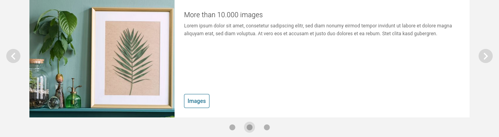

| Key                                     | Type                      |
|-----------------------------------------|---------------------------|
| `smintio-ui-generic-category-slider-1`  | `ui-type-category-slider` |

#### Props

| Prop name            | Type          | Default     | Description                                                                                                                                                                                         |
|----------------------|---------------|-------------|-----------------------------------------------------------------------------------------------------------------------------------------------------------------------------------------------------|
| `categories`         | `ICategory[]` |             | **Categories**   The categories to display to the user.                                                                                                                                     |
| `categoryGap`        | `string`      | `'default'` | **Gap between categories**   *Allowed values:* `'default', 'medium', 'large'`                                                                                                               |
| `categoriesShadow`   | `string`      | `'none'`    | **Shadow**   *Allowed values:* `'none', 'light', 'strong'`                                                                                                                                  |
| `cycle`              | `boolean`     | `true`      | **Automatic sliding**   Determines if the carousel should automatically slide through the categories.                                                                                       |
| `intervalInSeconds`  | `number`      | `10`        | **Sliding interval**   The interval in seconds to wait before sliding to the next category.   *Min value:* `1`    *Max value:* `300`    *Used IF:* `cycle === true` |

#### Note

The component has margin on it's X axis intentionally because the slide arrows are centered inside.

---

### Collection details

This component displays the details and the content of a collection.

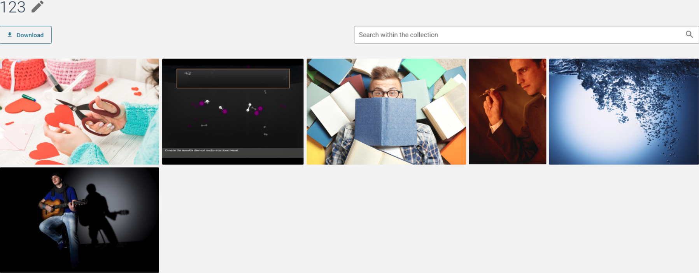

| Key                                          | Type                           |
|----------------------------------------------|--------------------------------|
| `smintio-ui-generic-collection-details-1`    | `ui-type-collection-details`   |

#### Props

| Prop name             | Type              | Default | Description                                                                              |
|-----------------------|-------------------|---------|------------------------------------------------------------------------------------------|
| `assetDetailPage`     | `IPageReference`  |         | **Asset detail page**  Choose a reference to the customizable asset detail page. |

---

### Collections overview

This component displays an overview of all collections of the user.

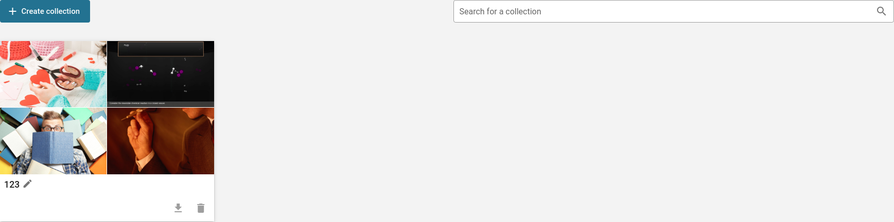

| Key                                          | Type                            |
|----------------------------------------------|---------------------------------|
| `smintio-ui-generic-collections-overview-1`  | `ui-type-collections-overview`  |

#### Props

| Prop name                 | Type               | Default | Description                                                                                      |
|---------------------------|--------------------|---------|--------------------------------------------------------------------------------------------------|
| `collectionDetailPage`    | `IPageReference`   |         | **Collections overview**  Choose a reference to the customizable collection detail page. |

---

### Color indicator with text

This component displays a color indicator with text to the left or to the right.

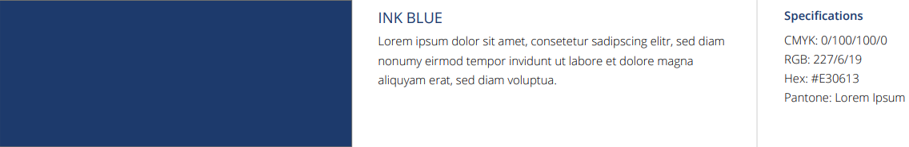

| Key                            | Type                       |
|--------------------------------|----------------------------|
| `smintio-ui-generic-color-1`   | `ui-type-text-with-color`  |

#### Props

| Prop name                   | Type                     | Default    | Description                                                                               |
|-----------------------------|--------------------------|------------|-------------------------------------------------------------------------------------------|
| `color`                     | `string`                 |            | **Color**                                                                                 |
| `colorPosition`             | `string`                 | `'left'`   | **Color position**   *Allowed values:* `'left', 'right'`                          | 
| `colorShadow`               | `string`                 | `'none'`   | **Shadow**   *Allowed values:* `'none', 'light', 'strong'`                        | 
| `colorTextGap`              | `string`                 | `'medium'` | **Gap between color and text**   *Allowed values:* `'default', 'medium', 'large'` | 
| `contentVerticalAlignment`  | `string`                 | `'top'`    | **Vertical alignment of content**   *Allowed values:* `'top', 'middle', 'bottom'` | 
| `headerText`                | `ILocalizedStringsModel` |            | **Header**                                                                                |
| `subHeaderText`             | `ILocalizedStringsModel` |            | **Sub header**                                                                            |
| `continuousText`            | `ILocalizedStringsModel` |            | **Continuous text**                                                                       |
| `alignment`                 | `string`                 | `'left'`   | **Alignment**   *Allowed values:* `'left', 'center', 'right'`                     | 
---

### Footer

This component displays a page footer.

| Key                            | Type              |
|--------------------------------|-------------------|
| `smintio-ui-generic-footer-1`  | `ui-type-footer`  |

#### Props

| Prop name    | Type            | Default | Description                                        |
|--------------|-----------------|---------|----------------------------------------------------|
| `menuItems`  | `IMenuItem[]`   |         | **Menu items**  The menu items to display. |

#### Colors

| Color name        | Default                                                                    | CSS variable             | Description                     |
|-------------------|----------------------------------------------------------------------------|--------------------------|---------------------------------|
| Footer text       |  `#FFFFFF`  | `--v-s-header-base`      | Background color of the footer  |
| Footer background |  `#000000`  | `--v-s-header-text-base` | Color of the text in the footer |

---

### Header

This component displays a page header.

| Key                            | Type              |
|--------------------------------|-------------------|
| `smintio-ui-generic-header-1`  |  `ui-type-header` |

#### Props

| Prop name                | Type          | Default     | Description                                                                                                                                                                                              |
|--------------------------|---------------|-------------|----------------------------------------------------------------------------------------------------------------------------------------------------------------------------------------------------------|
| `headerHeight`           | `string`      | `'medium'`  | **Height**  *Allowed values:* `'low', 'medium', 'tall'`                                                                                                                                          |
| `separatorStyle`         | `string`      | `'border'`  | **Height**  *Allowed values:* `'elevation', 'border', 'elevation-and-border', 'none'`                                                                                                            |
| `menuItemsLeft`          | `IMenuItem[]` |             | **Menu items to the left**  The menu items to display to the left.                                                                                                                               |
| `menuItemsRight`         | `IMenuItem[]` |             | **Menu items to the right**  The menu items to display to the right.                                                                                                                             |
| `maxSubMenuDepth`        | `string`      | `'1'`       | **Maximum menu depth**  Menus can have many sub menu levels. Here you can specify how many sub menu levels will be shown at a maximum.    *Allowed values:* `'0', '1', '2', '3', 'none'` | 
| `useShortLanguagesNames` | `boolean`     | `false`     | **Use short language names**  Use short character codes for language chooser (eg. EN, DE).                                                                                                       | 

#### Colors

| Color name        | Default                                                                    | CSS variable             | Description                      |
|-------------------|----------------------------------------------------------------------------|--------------------------|----------------------------------|
| Header background |  `#FFFFFF`  | `--v-s-header-base`      | Background color of the header   |
| Header text       |  `#000000`  | `--v-s-header-text-base` | Color of the text in the header  |
| Header accent     |  `#FF0000`  | `--v-accent-base`        | Color of the bottom border       |

---

### Image

This component displays an image.

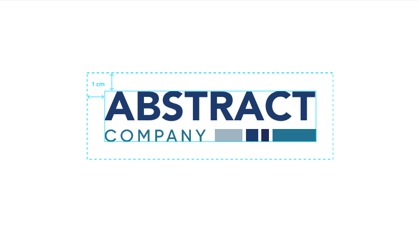

| Key                             | Type            |
|---------------------------------|-----------------|
| `smintio-ui-generic-image-1`    | `ui-type-image` |

#### Props

| Prop name          | Type               | Default       | Description                                                                                                                               |
|--------------------|--------------------|---------------|-------------------------------------------------------------------------------------------------------------------------------------------|
| `imageSource`      | `string`           | `'resource'`  | **Type**  *Allowed values:* `'asset', 'resource'`                                                                                 |
| `image`            | `IImage`           |               | **Image to display from resources**  *Used ID:* `imageSource==='resource'`                                                        |
| `assetIdentifier`  | `IAssetIdentifier` |               | **Image asset to display**  *Used ID:* `imageSource==='asset'`                                                                    |
| `imageAlignment`   | `string`           | `'center'`    | **Alignment**  *Allowed values:* `'left', 'center', 'right'`                                                                      |
| `imageWidth`       | `number`           | `75`          | **Width**  *Allowed values:* `50, 58, 66, 75, 83, 92, 100, 105, 110, 120`                                                         |
| `imageHeightLimit` | `string`           | `'one_row'`   | **Height limit**  *Allowed values:* `'half_row', 'three_quarters_row', 'one_row', 'one_and_a_half_rows', 'two_rows', 'unlimited'` |
| `imageDisplayMode` | `string`           | `'contained'` | **Display mode**  *Allowed values:* `'contained', 'cut_to_fit'`                                                                   |
| `imageShadow`      | `string`           | `'none'`      | **Display mode**  *Allowed values:* `'none', 'light', 'strong'`                                                                   |
---

### Image with text

This component displays an image with text to the left or to the right.

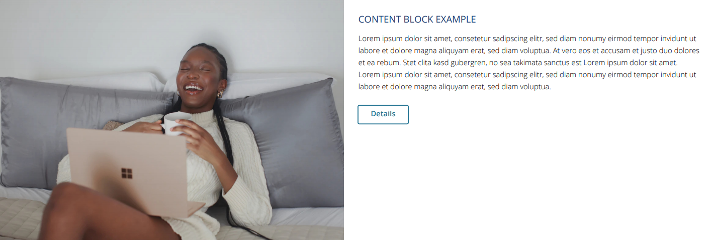

| Key                                     | Type                       |
|-----------------------------------------|----------------------------|
| `smintio-ui-generic-image-with-text-1`  | `ui-type-image-with-text`  |

#### Props

| Prop name                   | Type                     | Default       | Description                                                                                                                              |
|-----------------------------|--------------------------|---------------|------------------------------------------------------------------------------------------------------------------------------------------|
| `imageSource`               | `string`                 | `'resource'`  | **Type**  *Allowed values:* `'asset', 'resource'`                                                                                |
| `image`                     | `IImage`                 |               | **Image to display from resources**  *Used ID:* `imageSource==='resource'`                                                       |
| `assetIdentifier`           | `IAssetIdentifier`       |               | **Image asset to display**  *Used ID:* `imageSource==='asset'`                                                                   |
| `allowAssetUserInteraction` | `boolean`                | `false`       | **Allow user interaction with the asset (e.g. collect & download, visit asset detail page)**  *Used ID:* `imageSource==='asset'` |
| `imagePosition`             | `string`                 | `left`        | **Position**  *Allowed values*: `left`, `right`                                                                                  |
| `imageWidth`                | `number`                 | `50`          | **Width**  *Allowed values:* `25, 33, 50, 66, 75`                                                                                |
| `imageHeightLimit`          | `string`                 | `'one_row'`   | **Height limit**  *Allowed values:* `'one_row', 'one_and_a_half_rows', 'two_rows', 'unlimited'`                                  |
| `imageDisplayMode`          | `string`                 | `'contained'` | **Display mode**  *Allowed values:* `'contained', 'cut_to_fit'`                                                                  |
| `imageShadow`               | `string`                 | `'none'`      | **Shadow**  *Allowed values:* `'none', 'light', 'strong'`                                                                        |
| `gapAroundImage`            | `string`                 | `'none'`      | **Gap around image**  *Allowed values:* `'none', 'light', 'strong'`                                                              |
| `imageTextGap`              | `string`                 | `'medium'`    | **Gap between image and text**  *Allowed values:* `'default', 'medium', 'large'`                                                 |
| `contentVerticalAlignment`  | `string`                 | `'top'`       | **Vertical alignment of content**   *Allowed values:* `'top', 'middle', 'bottom'`                                                |
| `assetDetailPage`           | `IPageReference`         |               | **Asset detail page**    Choose a reference to the customizable asset detail page.                                               |
| `headerText`                | `ILocalizedStringsModel` |               | **Header**                                                                                                                               |
| `subHeaderText`             | `ILocalizedStringsModel` |               | **Sub header**                                                                                                                           |
| `continuousText`            | `ILocalizedStringsModel` |               | **Continuous text**                                                                                                                      |
| `alignment`                 | `string`                 | `'left'`      | **Alignment**   *Allowed values:* `'left', 'center', 'right'`                                                                    | 
---

### Location

This component displays a location.

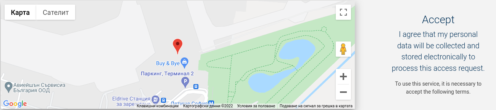

| Key                                | Type                |
|------------------------------------|---------------------|
| `smintio-ui-generic-location-1`    | `ui-type-location`  |

#### Props

| Prop name                  | Type                     | Default         | Description                                                                                                                                 |
|----------------------------|--------------------------|-----------------|---------------------------------------------------------------------------------------------------------------------------------------------|
| `shouldShowAddress`        | `boolen`                 | `true`          | **Show address**                                                                                                                            |
| `headerText`               | `ILocalizedStringsModel` |                 | **Header**   *Used IF:* `shouldShowAddress === true`                                                                                |
| `subHeaderText`            | `ILocalizedStringsModel` |                 | **Sub header**   *Used IF:* `shouldShowAddress === true`                                                                            |
| `continuousText`           | `ILocalizedStringsModel` |                 | **Continuous text**   *Used IF:* `shouldShowAddress === true`                                                                       |
| `alignment`                | `string`                 | `'left'`        | **Alignment**   *Allowed values:* `'left', 'center', 'right'`   *Used IF:* `shouldShowAddress === true`                     |
| `mapTextGap`               | `string`                 | `'medium'`      | **Gap between image and Map**   *Allowed values:* `'default', 'medium', 'large'`   *Used IF:* `shouldShowAddress === true`  |
| `contentVerticalAlignment` | `string`                 | `'top'`         | **Vertical alignment of content**   *Allowed values:* `'top', 'middle', 'bottom'`   *Used IF:* `shouldShowAddress === true` |
| `shouldShowMap`            | `boolen`                 | `true`          | **Show map**                                                                                                                                |
| `longitude`                | `number`                 |                 | **Longitude**   *Used IF:* `shouldShowMap === true`                                                                                 |
| `latitude`                 | `number`                 |                 | **Latitude**   *Used IF:* `shouldShowMap === true`                                                                                  |
| `mapProvider`              | `string`                 | `openstreetmap` | **Map provider**  *Allowed values*: `openstreetmap`, `google-maps`   *Used IF:* `shouldShowMap === true`                    |
| `googleMapsToken`          | `number`                 |                 | **Google Maps Token**   *Used IF:* `shouldShowMap === true`                                                                         |
| `mapPosition`              | `string`                 | `'left'`        | **Map position**  *Allowed values:* `'right', 'right', 'top', 'bottom'`   *Used IF:* `shouldShowMap === true`               |
| `mapWidth`                 | `number`                 | `75`            | **Width**  *Allowed values:* `25, 33, 50, 66, 75`    *Used IF:* `shouldShowMap === true`                                    |
| `mapHeight`                | `string`                 | `normal`        | **Height**  *Allowed values:* `'low', 'normal', 'big'`    *Used IF:* `shouldShowMap === true`                               |
| `mapZoom`                  | `number`                 | `16`            | **Map zoom**  *Allowed values:* `20, 18, 16, 13, 10`   *Used IF:* `shouldShowMap === true`                                  |
| `mapShadow`                | `string`                 | `'none'`        | **Shadow**  *Allowed values:* `'none', 'light', 'strong'`   *Used IF:* `shouldShowMap === true`                             |

---

### Menu item chooser

This component displays a column-based menu item chooser for one or more menu items and sub menu items.

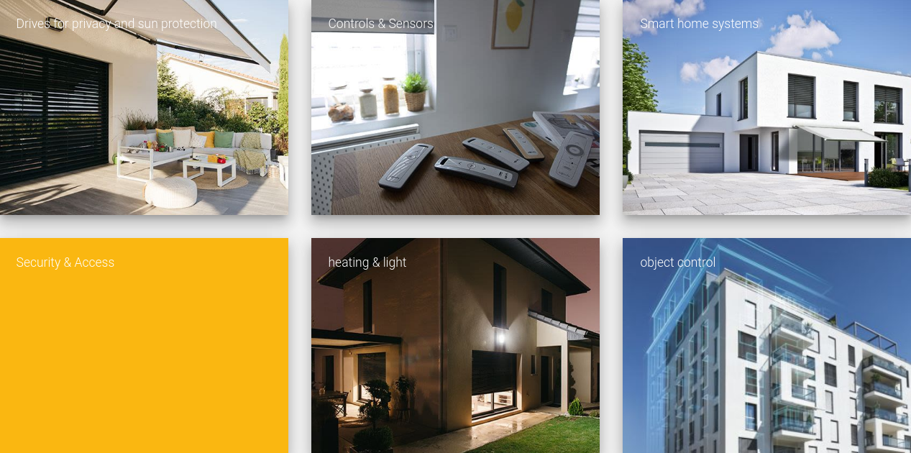

| Key                                      | Type                       |
|------------------------------------------|----------------------------|
| `smintio-ui-generic-menu-item-chooser-1` | `ui-type-category-chooser` |

#### Props

| Prop name                  | Type          | Default             | Description                                                                                                                                                                                                |
|----------------------------|---------------|---------------------|------------------------------------------------------------------------------------------------------------------------------------------------------------------------------------------------------------|
| `menuItems`                | `IMenuItem[]` |                     | **Menu items**  The menu items to display to the user.                                                                                                                                             |
| `alwaysShowSubMenuItems`   | `boolean`     | `false`             | **Always show sub menu items**  By default, sub menu items are only shown if the user interacts with the parent menu item. However, you can turn on this option to always show the sub menu items. |
| `colorScheme`              | `string`      | `'category-viewer'` | **Color scheme**   *Allowed values:* `'category-viewer', 'solid-button'`                                                                                                                           |
| `menuGap`                  | `string`      | `'small`            | **Gap between menu items**   *Allowed values:* `'no-gap', 'small', 'medium', 'large'`                                                                                                              |
| `menusShadow`              | `string`      | `'none'`            | **Shadow**   *Allowed values:* `'none', 'light', 'strong'`                                                                                                                                         | 
| `alignment`                | `string`      | `'left'`            | **Alignment**   *Allowed values:* `'left', 'center', 'right'`                                                                                                                                      | 
| `contentVerticalAlignment` | `string`      | `'top'`             | **Vertical alignment of content**   *Allowed values:* `'top', 'middle', 'bottom'`                                                                                                                  |  

---

### Page title

This component displays a page title and subtitle.

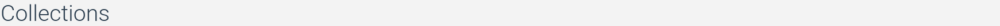

| Key                                      | Type                   |
|------------------------------------------|------------------------|
| `smintio-ui-generic-page-title-1`        | `ui-type-page-title`   |

#### Props

| Prop name        | Type                     | Default  | Description                                                           |
|------------------|--------------------------|----------|-----------------------------------------------------------------------|
| `headerText`     | `ILocalizedStringsModel` |          | **Header**                                                            |
| `subHeaderText`  | `ILocalizedStringsModel` |          | **Sub header**                                                        |
| `continuousText` | `ILocalizedStringsModel` |          | **Continuous text**                                                   |
| `alignment`      | `string`                 | `'left'` | **Alignment**   *Allowed values:* `'left', 'center', 'right'` | 

---

### Search bar

This component displays a search bar for assets.

| Key                                | Type                  |
|------------------------------------|-----------------------|
| `smintio-ui-generic-search-bar-1`  | `ui-type-search-bar`  |

#### Props

| Prop name                 | Type                      | Default | Description                                                                                                             |
|---------------------------|---------------------------|---------|-------------------------------------------------------------------------------------------------------------------------|
| `searchBarText`           | `ILocalizedStringsModel`  |         | **Hint for the search bar**                                                                                             |
| `searchBarAutoCompletion` | `IAssetsSearch`           |         | **Data source for auto completion**   The data source to query the search bar auto completion suggestions from. |
| `searchPage`              | `IPageReference`          |         | **Search page**   The page that will be opened when the user confirms the search bar input.                     |

---

### Side menu

This component displays a multi level side menu.

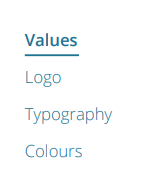

| Key                              | Type                 |
|----------------------------------|----------------------|
| `smintio-ui-generic-side-menu-1` | `ui-type-side-menu`  |

#### Props

| Prop name      | Type            | Default      | Description                                        |
|----------------|-----------------|--------------|----------------------------------------------------|
| `menuItems`    | `IMenuItem[]`   |              | **Menu items**  The menu items to display. |

---

### Text block

This component displays a text block with header, sub header and continuous text.

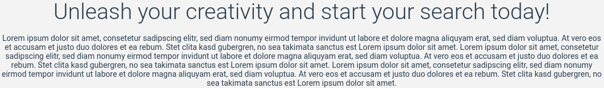

| Key                         | Type           |
|-----------------------------|----------------|
| `smintio-ui-generic-text-1` | `ui-type-text` |

#### Props

| Prop name        | Type                     | Default   | Description                                                                                                   |
|------------------|--------------------------|-----------|---------------------------------------------------------------------------------------------------------------|
| `headerText`     | `ILocalizedStringsModel` |           | **Header**                                                                                                    |
| `subHeaderText`  | `ILocalizedStringsModel` |           | **Sub header**                                                                                                |
| `continuousText` | `ILocalizedStringsModel` |           | **Continuous text**                                                                                           |
| `alignment`      | `string`                 | `'left'`  | **Alignment**   *Allowed values:* `'left', 'center', 'right'`                                         | 
| `textWidth`      | `number`                 | `100`     | **Width**   *Allowed values:* `25, 33, 50, 66, 75, 100`                                               |
| `textPosition`   | `string`                 | `'left'`  | **Position**    *Used IF:* `textWidth < 100`    *Allowed values:* `'left', 'center', 'right'` | 

---

### Text block with up to 3 columns

This component displays a text block with up to 3 columns.

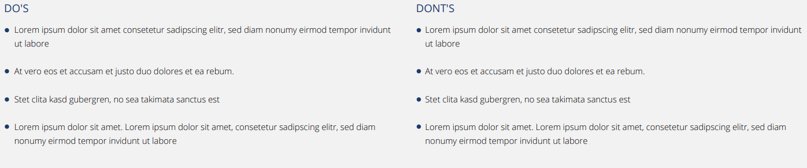

| Key                                 | Type           |
|-------------------------------------|----------------|
| `smintio-ui-generic-text-columns-1` | `ui-type-text` |

#### Props

| Prop name          | Type                     | Default  | Description                                                                                                                                     |
|--------------------|--------------------------|----------|-------------------------------------------------------------------------------------------------------------------------------------------------|
| `numberOfColumns`  | `number`                 | `1`      | Allowed values: `1, 2, 3`                                                                                                                       |
| `useSingleHeader`  | `boolean`                | `false`  | **Use same header for all columns**                                                                                                             |
| `headerText`       | `ILocalizedStringsModel` |          | **Header**   *Used IF:* `useSingleHeader === true`                                                                                      |
| `subHeaderText`    | `ILocalizedStringsModel` |          | **Sub header**   *Used IF:* `useSingleHeader === true`                                                                                  |
| `alignment`        | `string`                 | `'left'` | **Alignment**   *Allowed values:* `'left', 'center', 'right'`   *Used IF:* `useSingleHeader === true`                           | 
| `headerTextC1`     | `ILocalizedStringsModel` |          | **Header**   *Used IF:* `useSingleHeader === false`                                                                                     |
| `subHeaderTextC1`  | `ILocalizedStringsModel` |          | **Sub header**   *Used IF:* `useSingleHeader === false`                                                                                 |
| `continuousTextC1` | `ILocalizedStringsModel` |          | **Continuous text**                                                                                                                             |
| `alignmentC1`      | `string`                 | `'left'` | **Alignment**   *Allowed values:* `'left', 'center', 'right'`   *Used IF:* `useSingleHeader === false`                          |
| `headerTextC2`     | `ILocalizedStringsModel` |          | **Header**   *Used IF:* `useSingleHeader === false AND numberOfColumns >= 2`                                                            |
| `subHeaderTextC2`  | `ILocalizedStringsModel` |          | **Sub header**    *Used IF:* `useSingleHeader === false AND numberOfColumns >= 2`                                                       |
| `continuousTextC2` | `ILocalizedStringsModel` |          | **Continuous text**   *Used IF:* `numberOfColumns >= 2`                                                                                 |
| `alignmentC2`      | `string`                 | `'left'` | **Alignment**   *Allowed values:* `'left', 'center', 'right'`   *Used IF:* `useSingleHeader === false AND numberOfColumns >= 2` |
| `headerTextC3`     | `ILocalizedStringsModel` |          | **Header**   *Used IF:* `useSingleHeader === false AND numberOfColumns >= 3`                                                            |
| `subHeaderTextC3`  | `ILocalizedStringsModel` |          | **Sub header**   *Used IF:* `useSingleHeader === false AND numberOfColumns >= 3`                                                        |
| `continuousTextC3` | `ILocalizedStringsModel` |          | **Continuous text**   *Used IF:* `numberOfColumns >= 3`                                                                                 |
| `alignmentC3`      | `string`                 | `'left'` | **Alignment**   *Allowed values:* `'left', 'center', 'right'`   *Used IF:* `useSingleHeader === false AND numberOfColumns >= 3` |
---

### Video

This component displays a video.

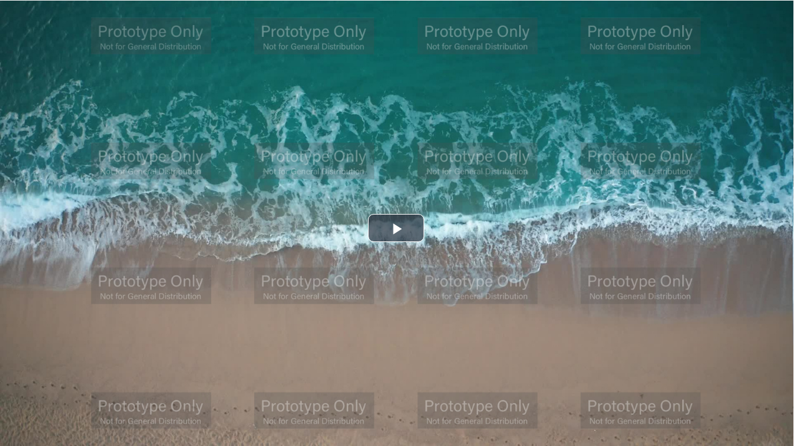

| Key                          | Type            |
|------------------------------|-----------------|
| `smintio-ui-generic-video-1` | `ui-type-video` |

#### Props

| Prop name            | Type               | Default       | Description                                                                                                                               |
|----------------------|--------------------|---------------|-------------------------------------------------------------------------------------------------------------------------------------------|
| `videoType`          | `string`           | `'resource'`  | **Type**  *Allowed values:* `'asset', 'resource'`                                                                                 |
| `videoResource`      | `IVideo`           |               | **Video to display from resources**  *Used ID:* `videoType==='resource'`                                                          |
| `assetIdentifier`    | `IAssetIdentifier` |               | **Video asset to display**  *Used ID:* `videoType==='asset'`                                                                      |
| `videoAlignment`     | `string`           | `'center'`    | **Alignment**  *Allowed values:* `'left', 'center', 'right'`                                                                      |
| `videoWidth`         | `number`           | `75`          | **Width**  *Allowed values:* `50, 58, 66, 75, 83, 92, 100, 105, 110, 120`                                                         |
| `videoShadow`        | `string`           | `'none'`      | **Display mode**  *Allowed values:* `'none', 'light', 'strong'`                                                                   |
---

## Asset details components

### Action bar

This asset details action bar component is best suited for media centers. It was originally designed for the Imagination media center.

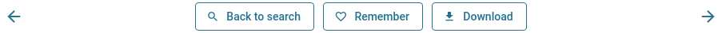

| Key                                                   | Type                               |
|-------------------------------------------------------|------------------------------------|
| `smintio-ui-media-gallery-asset-details-action-bar-1` | `ui-type-asset-details-action-bar` |

---

### Asset preview

This asset preview component for the asset details view is best suited for media centers. It was originally designed for the Imagination media center.

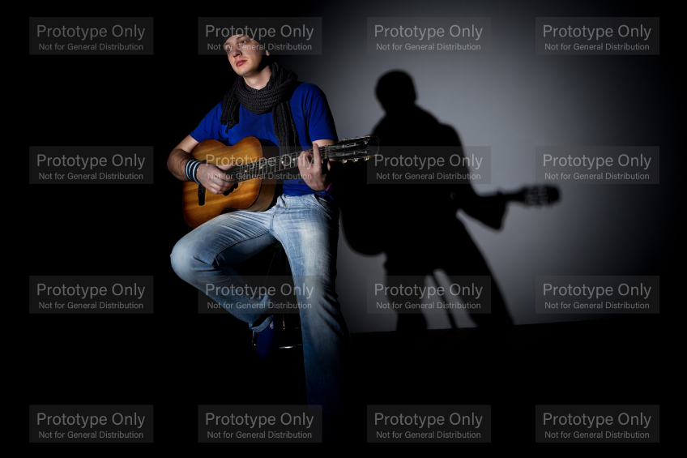

| Key                                                | Type                            |
|----------------------------------------------------|---------------------------------|
| `smintio-ui-media-gallery-asset-details-preview-1` | `ui-type-asset-details-preview` |

---

### Details text

This details text component for the asset details view is best suited for media centers. It was originally designed for the Imagination media center.

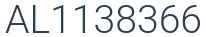

| Key                                             | Type                         |
|-------------------------------------------------|------------------------------|
| `smintio-ui-media-gallery-asset-details-text-1` | `ui-type-asset-details-text` |

#### Props

| Prop name                      | Type                         | Default | Description                                                                                                                                                                                            |
|--------------------------------|------------------------------|---------|--------------------------------------------------------------------------------------------------------------------------------------------------------------------------------------------------------|
| `nameAttribute`                | `IMetadataAttributeModel[]`  |         | **Name attributes**  Please select the metadata attributes that contain the name of the asset. If you give no setting, defaults will be used. The first match will be shown.                   |
| `descriptionAttribute`         | `IMetadataAttributeModel[]`  |         | **Description attribute**  Please select the metadata attributes that contain the description of the asset. If you give no setting, defaults will be used. The first match will be shown.      |
| `displayDescriptionNewlines`   | `boolean`                    | `true`  | **Display description newlines**  If you enable this setting, newlines contained in the description text will be displayed. Otherwise, newlines contained in the description will be ignored.  |

---

### Metadata viewer

This metadata viewer component for the asset details view is best suited for media centers. It was originally designed for the Imagination media center.

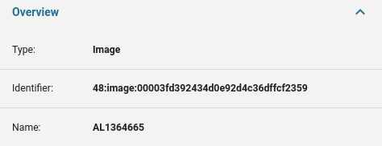

| Key                                                        | Type                                    |
|------------------------------------------------------------|-----------------------------------------|
| `smintio-ui-media-gallery-asset-details-metadata-viewer-1` | `ui-type-asset-details-metadata-viewer` |

#### Props

| Prop name                      | Type                          | Default | Description                                                                                                                                                                                     |
|--------------------------------|-------------------------------|---------|-------------------------------------------------------------------------------------------------------------------------------------------------------------------------------------------------|
| `headerText`                   | `ILocalizedStringsModel`      |         | **Header**                                                                                                                                                                                      |
| `expandedByDefault`            | `boolean`                     | `true`  | **Expanded by default**  Check this to make the metadata viewer expansion panel expanded by default.                                                                                    |
| `metadataAttributeDisplayList` | `IMetadataAttributeModel[]`   |         | **Attributes to display**  Please select all the metadata attributes that the user should see. If you specify no attributes, only the basic attributes of the asset will be displayed.  |

---

### Tag viewer

This tag viewer component for the asset details view is best suited for media centers. It was originally designed for the Imagination media center.

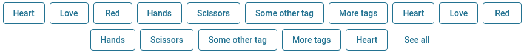

| Key                                                   | Type                               |
|-------------------------------------------------------|------------------------------------|
| `smintio-ui-media-gallery-asset-details-tag-viewer-1` | `ui-type-asset-details-tag-viewer` |

#### Props

| Prop name                   | Type                        | Default      | Description                                                                                                                                                                                                         |
|-----------------------------|-----------------------------|--------------|---------------------------------------------------------------------------------------------------------------------------------------------------------------------------------------------------------------------|
| `keywordAttributeList`      | `IMetadataAttributeModel[]` |              | **Tag attributes**  Please select all the metadata attributes that tags should be queried from. All the tags will then be added to one list in alphabetical order, duplicates being removed in the process. |
| `automaticSplitting`        | `boolean`                   | `true`       | **Automatic splitting**  If automatic splitting is enabled, texts will be automatically split into individual keywords if separators (comma, semicolon) are being detected.                                 |

---

## Media center components

### Collections quickview

This collections quickview component is best suited for media centers. It was originally designed for the Imagination media center.

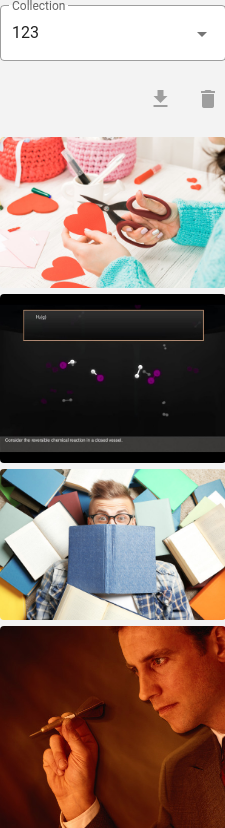

| Key                                                | Type                            |
|----------------------------------------------------|---------------------------------|
| `smintio-ui-media-gallery-collections-quickview-1` | `ui-type-collections-quickview` |

#### Props

| Prop name             | Type               | Default | Description                                                                                |
|-----------------------|--------------------|---------|--------------------------------------------------------------------------------------------|
| `assetDetailPage`     | `IPageReference`   |         | **Asset detail page**    Choose a reference to the customizable asset detail page. |

---

### Facet based search form

This facet based search form is best suited for media centers. It was originally designed for the Imagination media center.

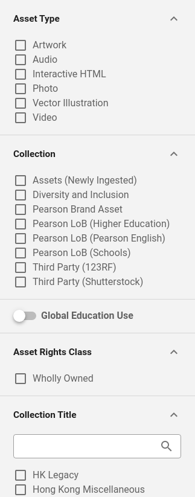

| Key                                            | Type                  |
|------------------------------------------------|-----------------------|
| `smintio-ui-media-gallery-search-form-facet-1` | `ui-type-search-form` |

#### Props

| Prop name                      | Type             | Default | Description                                                                                                                                                                                                                                                                 |
|--------------------------------|------------------|---------|-----------------------------------------------------------------------------------------------------------------------------------------------------------------------------------------------------------------------------------------------------------------------------|
| `formItemAllowList`            | `string[]`       |         | **Allowed search fragments**  Please select all the search fragments that the user is allowed to search for. If you give none, the user is allowed to search for all available search fragments.                                                                    |
| `formItemDenyList`             | `string[]`       |         | **Not allowed search fragments**  Optionally here you can specify search fragments, that the user dedicatedly is not allowed to search for.                                                                                                                         |
| `searchGroupsOfAdvancedMode`   | `string[]`       |         | **Advanced search fragments**  Here you can specify a list of advanced or rarely used search fragments. Those fragments will be collapsed by default. This helps improving usability of the search form.                                                            |
| `hideUncheckedValuesGroupIds`  | `string[]`       |         | **Hide choices by default for search fragments**  Only applies to multiple choice search fragments. Here you can specify a list of search fragments, that will show available choices only once the user entered some search term to the fragment search input box. |
| `formItemDoNotSortList`        | `string[]`       |         | **Non-sorted search fragments**  If you do not want to sort values of search fragments, you can specify that search fragments here.                                                                                                                                 |
| `showAllowedValueResultCount`  | `boolean`        |         | **Show result count for values**    If you want to show the result count for values of search fragments, please check this option.                                                                                                                                  |
| `assetDetailPage`              | `IPageReference` |         | **Asset detail page**    Choose a reference to the customizable asset detail page.                                                                                                                                                                                  |
---

### Search result

This search result display component is best suited for media centers. It was originally designed for the Imagination media center.

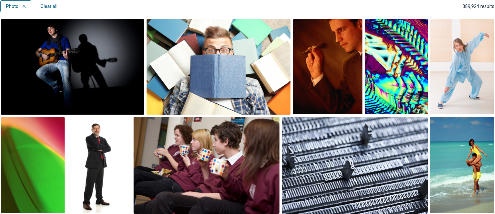

| Key                                        | Type                    |
|--------------------------------------------|-------------------------|
| `smintio-ui-media-gallery-search-result-1` | `ui-type-search-result` |

#### Props

| Prop name                | Type             | Default     | Description                                                                                                                                                                                                                                                                                                                   |
|--------------------------|------------------|-------------|-------------------------------------------------------------------------------------------------------------------------------------------------------------------------------------------------------------------------------------------------------------------------------------------------------------------------------|
| `approximateAssetHeight` | `string`         | `'default'` | **Asset row height**    The asset viewer adjusts the asset height automatically for the assets to nicely match to the layout. However, you can give an approximate target asset height value here, and the algorithm will try to match it as good as possible.   *Allowed values:* `'low', 'default', 'high'` |
| `assetGap`               | `string`         | `'small'`   | **Asset gap**    *Allowed values:* `'small', 'medium', 'large', 'xlarge'`                                                                                                                                                                                                                                             |
| `assetDetailPage`        | `IPageReference` |             | **Asset detail page**    Choose a reference to the customizable asset detail page.                                                                                                                                                                                                                                    |
---

Contributors
============

- Yanko Belov, Smint.io. GmbH
- Reinhard Holzner, Smint.io GmbH
