Smint.io Portals UI components
==============================

Current version of this document is: 2.0.0 (as of 10th of September, 2026)

This is the full list of UI components delivered and maintained by Smint.io, generated
from the component sources.

Only properties declared by the component itself are listed. Where a component mixes in
shared property mixins (`STextProps`, `SLinkButtonProps`, `SDownloadProps`, …), those
contribute further properties and are named per component.

The `Key` is the value you would see in a portal configuration; the `Type` is the UI
component type that decides which page template slots accept the component. See
[the frontend component types](smintio-frontend-component-types.md).

## Contents

**Generic components** — Asset overview, Collapsible text panel, Banner with search bar, Chooser with image, text and button, Carousel with image, text and button, Comments view, Collection details, Collections overview, Color indicator with text, Error display, Document, Footer, Header, Image, Image with text, Menu item chooser, Page title, Request access form, Request download form, Generic request form, Request permission form, Search bar, Share link details, Share links overview, Side menu, Text block, Text block with up to 3 columns, Asset upload form, Video

**Section components** — End of section, Start conditional section, Start expansion panel section, Start tab panel section, Start table section

**Login and account components** — Accept terms form, Access denied display, Confirm email address form, Cookie consent banner, Email confirmation message sent display, Email address not yet confirmed display, Forgot password form, Password reset message sent display, Accept or decline invitation to collection form, Login form, Logout confirmation form, Manage account form, Change password form, Manage cookie consent, Registration form, Reset password form, Password has been reset display

**Media gallery components** — Action bar for asset details view, Metadata viewer for side panels, Form based metadata viewer, Asset preview for asset details view, Metadata-based tag viewer for asset details view, Metadata-based text block for asset details view, Collections quickview (Media center - Imagination), Facet based search form (Media center - Imagination), Search result display (Media center - Imagination)

**Press portal components** — Metadata based banner for asset details view, Metadata-based link block for asset details view, Metadata-based quote block for asset details view, Press releases overview

## Generic components

### Asset overview

This component shows multiple assets in a neat preview. The user can then easily download or collect assets directly from the preview.

| Key | Type |
|---|---|
| `smintio-ui-generic-assets-preview-1` | `ui-type-assets-preview` |

*Additional properties come from the shared mixins:* `SBottomGapProps`, `SCiHubProps`, `SDownloadProps`, `SHtmlProps`, `SQuickViewProps`, `SRememberProps`, `SShareProps`, `SUiComponentColorsProps`

#### Props

| Prop name | Type | Default | Description |
|---|---|---|---|
| `assetsReference` | `IAssetsReferenceModel` |  | **Assets to display**    Choose individual assets, a folder or configure an asset search.    *Values offered by:* `AssetsReferenceAllowedValuesProvider` |
| `maxNumberAssets` | `number` |  | **Maximum number of assets to display**    *Min value:* `1`    *Max value:* `50` |
| `view` | `string` | `"gallery"` | **View**    Please select, which types of view should be used to display the assets.    *Allowed values:* `"gallery", "cards"` |
| `numberOfAssetsRowDesktop` | `number` | `4` | **Number of assets in a row (desktop)**    *Allowed values:* `2, 3, 4`    *Used IF:* `view Equal "cards"` |
| `approximateAssetHeight` | `string` | `"one_row"` | **Asset row height**    The asset viewer adjusts the asset height automatically for the assets to nicely match to the layout. However, you can give an approximate target asset height value here, and the algorithm will try to match it as good as possible.    *Allowed values:* `"half_row", "three_quarter_row", "one_row", "one_and_a_half_rows", "two_rows"` |
| `assetShadow` | `string` | `"none"` | **Shadow**    *Allowed values:* `"none", "light", "strong"` |
| `muted` | `boolean` | `true` | **Mute videos and audio files** |
| `previewBackgroundColor` | `string` |  | **Background color**    *Used IF:* `view Equal "cards"` |
| `previewGap` | `string` | `"default"` | **Gap within area**    *Allowed values:* `"none", "default", "medium", "large", "xlarge", "xxlarge"`    *Used IF:* `view Equal "cards"` |
| `metadataAttributeDisplayList` | `IMetadataAttributeModel[]` |  | **Attributes to display**    Please select all the metadata attributes that the user should see. If you specify no attributes, only the basic attributes of the asset will be displayed.    *Values offered by:* `MetadataAttributeAllowedValuesProvider`    *Used IF:* `view Equal "cards"` |
| `attributesGap` | `string` | `"default"` | **Gap within area**    *Allowed values:* `"default", "medium", "large", "xlarge", "xxlarge"`    *Used IF:* `view Equal "cards"` |
| `masonryGap` | `string` | `"medium"` | **Asset gap**    *Allowed values:* `"small", "medium", "large", "xlarge"` |
| `allowAssetSearchPage` | `boolean` | `false` | **Allow the user to navigate to an asset search page to browse the search result in full** |
| `browseAssetsButtonText` | `ILocalizedStringsModel` | `"button_browse_assets"` | **Browse assets button text**    *Values offered by:* `StringResourceAllowedValuesProvider`    *Advanced setting*    *Used IF:* `allowAssetSearchPage Equal true` |
| `assetSearchPage` | `IPageReference` |  | **Asset search page**    The page that will be opened, if a user wants to further browse the search result in full.    *Used IF:* `allowAssetSearchPage Equal true` |
| `openAssetSearchPageInNewWindow` | `boolean` | `true` | **Open asset search page in new window**    *Used IF:* `allowAssetSearchPage Equal true` |
| `allowAssetsUserInteraction` | `boolean` | `true` |  |
| `enableLightbox` | `boolean` | `false` | **Enable lightbox**    *Used IF:* `allowAssetsUserInteraction Equal false` |
| `assetDetailPage` | `IPageReference` |  | **Asset detail page**    Choose a reference to the customizable detail page for file based assets.    *Used IF:* `allowAssetsUserInteraction Equal true` |
| `pressReleaseDetailPage` | `IPageReference` |  | **Press release detail page**    Choose a reference to the customizable detail page for press releases.    *Used IF:* `allowAssetsUserInteraction Equal true` |
| `otherDetailPage` | `IPageReference` |  | **Detail page for composite assets**    Choose a reference to the customizable detail page for composite assets.    *Used IF:* `allowAssetsUserInteraction Equal true` |
| `allowBulkDownload` | `boolean` | `false` | **Allow the user to download all displayed assets in bulk**    *Used IF:* `allowAssetsUserInteraction Equal true` |
| `downloadAllDisplayedAssetsButtonText` | `ILocalizedStringsModel` | `"button_download_all_displayed_assets"` | **Download all displayed assets button text**    *Values offered by:* `StringResourceAllowedValuesProvider`    *Advanced setting*    *Used IF:* `allowAssetsUserInteraction Equal true`    *Used IF:* `allowBulkDownload Equal true` |
| `placeholderImage` | `IImage` |  | **Placeholder image**    The placeholder image will be displayed, if there is no assets from the data source that can be displayed.    *Values offered by:* `ImageResourceAllowedValuesProvider` |
| `noViewPermissionText` | `ILocalizedStringsModel` | `"text_no_view_permission"` | **No view permission text**    *Values offered by:* `StringResourceAllowedValuesProvider`    *Advanced setting* |
| `buttonOpenDetailsInNewWindow` | `ILocalizedStringsModel` | `"button_open_details_in_new_window"` | **Open in new window button text**    *Values offered by:* `StringResourceAllowedValuesProvider`    *Advanced setting* |
| `buttonOpenQuickView` | `ILocalizedStringsModel` | `"button_open_quick_view"` | **Open in quick view button text**    *Values offered by:* `StringResourceAllowedValuesProvider`    *Advanced setting* |
| `buttonClearSelectionText` | `ILocalizedStringsModel` | `"button_clear_selection"` | **Clear selection button text**    *Values offered by:* `StringResourceAllowedValuesProvider`    *Advanced setting* |
| `assetsWidth` | `number` | `100` | **Width (desktop)**    *Allowed values:* `50, 58, 66, 75, 83, 92, 100, 105, 110, 120` |
| `assetsWidthMobile` | `number` | `-1` | **Width (mobile)**    *Allowed values:* `-1, 50, 58, 66, 75, 83, 92, 100, 105, 110, 120` |
| `assetsAlignment` | `string` | `"center"` | **Alignment**    *Allowed values:* `"left", "center", "right"` |

---

### Collapsible text panel

This component displays a collapsible panel with text in it.

| Key | Type |
|---|---|
| `smintio-ui-generic-banner-expansion-1` | `ui-type-banner` |

*Additional properties come from the shared mixins:* `SBottomGapProps`, `SHtmlProps`, `SLinkButtonProps`, `STextProps`, `SUiComponentColorsProps`

#### Props

| Prop name | Type | Default | Description |
|---|---|---|---|
| `expansionPanelHeaderText` | `ILocalizedStringsModel` |  | **Expansion panel header text** |
| `expansionPanelHeaderAlignment` | `string` | `"center"` | **Expansion panel header text alignment**    *Allowed values:* `"left", "center", "right"` |
| `expansionPanelHeaderHeight` | `string` | `"medium"` | **Expansion panel header height**    *Allowed values:* `"small", "medium", "large"` |
| `expansionPanelContentGap` | `string` | `"default"` | **Expansion panel content gap**    *Allowed values:* `"none", "small", "medium", "large", "xlarge", "xxlarge", "default"` |
| `expansionPanelContentTextWidth` | `string` | `"100%"` | **Expansion panel content width**    *Allowed values:* `"33%", "66%", "100%"` |
| `textWidth` | `number` | `100` | **Width (desktop)**    *Allowed values:* `25, 33, 50, 66, 75, 100` |
| `textWidthMobile` | `number` | `-1` | **Width (mobile)**    *Allowed values:* `-1, 25, 33, 50, 66, 75, 100` |
| `textPosition` | `string` | `"center"` | **Alignment**    *Allowed values:* `"left", "center", "right"` |

---

### Banner with search bar

This component displays a banner with an optional title and a search bar.

| Key | Type |
|---|---|
| `smintio-ui-generic-banner-searchbar-1` | `ui-type-banner` |

*Additional properties come from the shared mixins:* `SBottomGapProps`, `SCssProps`

#### Props

| Prop name | Type | Default | Description |
|---|---|---|---|
| `bannerText` | `ILocalizedStringsModel` |  | **Banner title**    The main title for the banner. |
| `avoidLinebreakTexts` | `string[]` |  | **Avoid linebreak for texts**    For the given texts no linebreak will be performed in the banner.    *Advanced setting* |
| `hasSearchbar` | `boolean` | `true` | **Show search bar**    If you enable this setting, the search bar input field will be shown. |
| `showSearchbarOnlyWhenLoggedIn` | `boolean` | `false` | **Show search bar only when logged in**    *Used IF:* `hasSearchbar Equal true` |
| `searchBarText` | `ILocalizedStringsModel` | `"text_search_bar"` | **Hint for the search bar**    The hint for the search bar input field.    *Values offered by:* `StringResourceAllowedValuesProvider`    *Used IF:* `hasSearchbar Equal true` |
| `searchSuggestionsEnabled` | `boolean` | `false` | **Enable search suggestions**    Check this box if you want to provide search suggestions to the user. Please note that this functionality only works if it is supported by the data source!    *Used IF:* `hasSearchbar Equal true` |
| `searchSuggestionsDataSource` | `IAssetsSearch` |  | **Data source for search suggestions**    The data source to query the search suggestions from.    *Used IF:* `hasSearchbar Equal true`    *Used IF:* `searchSuggestionsEnabled Equal true` |
| `searchPage` | `IPageReference` |  | **Search page**    The page that will be opened when the user confirms the search bar input.    *Used IF:* `hasSearchbar Equal true` |
| `queryParameters` | `ILocalizedStringsModel` |  | **Query parameters**    Please enter the query parameters, that should be appended to the effective URL of the search page. |
| `bannerHeight` | `number` | `"tall"` | **Height**    *Allowed values:* `"low", "medium", "tall", "very_tall", "maximum"` |
| `backgroundColor` | `string (color)` |  | **Color** |
| `backgroundType` | `string` | `"none"` | **Type**    *Allowed values:* `"none", "random_asset", "fixed_asset", "random_image", "random_video_asset", "fixed_video_asset", "random_video"` |
| `backgroundImageRandomAsset` | `IAssetsReadRandom` |  | **Random asset data source**    The data source to query the random asset for the background from.    *Used IF:* `backgroundType OneOf ["random_asset", "random_video_asset"]` |
| `backgroundImageRandomResources` | `IImage[]` |  | **Images from resources for random choice**    *Values offered by:* `ImageResourceAllowedValuesProvider`    *Used IF:* `backgroundType Equal "random_image"` |
| `backgroundVideoRandomResources` | `IVideo[]` |  | **Videos from resources for random choice**    *Values offered by:* `VideoResourceAllowedValuesProvider`    *Used IF:* `backgroundType Equal "random_video"` |
| `imageAssetIdentifiers` | `IAssetIdentifier[]` |  | **Images assets for random choice**    *Values offered by:* `AssetIdAllowedValuesProvider`    *Used IF:* `backgroundType Equal "fixed_asset"` |
| `videoAssetIdentifiers` | `IAssetIdentifier[]` |  | **Video assets for random choice**    *Values offered by:* `AssetIdAllowedValuesProvider`    *Used IF:* `backgroundType Equal "fixed_video_asset"` |
| `backgroundPosition` | `string` | `"center"` | **Assets viewport**    *Allowed values:* `"top-left", "center"`    *Used IF:* `backgroundType NotEqual "none"` |
| `automaticFading` | `boolean` | `false` | **Automatically fade assets**    Determines if the background assets should automatically fade through assets    *Used IF:* `backgroundType NotEqual "none"` |
| `automaticFadingIntervalInSeconds` | `number` | `10` | **Assets fading interval**    The interval in seconds to wait before fading to the next background asset.    *Min value:* `1`    *Max value:* `300`    *Used IF:* `automaticFading Equal true`    *Used IF:* `backgroundType NotEqual "none"` |
| `maxNumberOfRandomAssetsToFade` | `number` | `3` | **Maximum number of assets to query for fading**    *Min value:* `1`    *Max value:* `10`    *Used IF:* `automaticFading Equal true`    *Used IF:* `backgroundType OneOf ["random_asset", "random_video_asset"]` |
| `backgroundBrightness` | `string` | `"light"` | **Darken assets**    *Allowed values:* `"none", "light", "strong"`    *Used IF:* `backgroundType NotEqual "none"` |
| `bannerShadow` | `string` | `"none"` | **Shadow at the bottom**    *Allowed values:* `"none", "light", "strong"` |

---

### Chooser with image, text and button

This component allows the user to choose from several options, each containing image, text and an optional button.

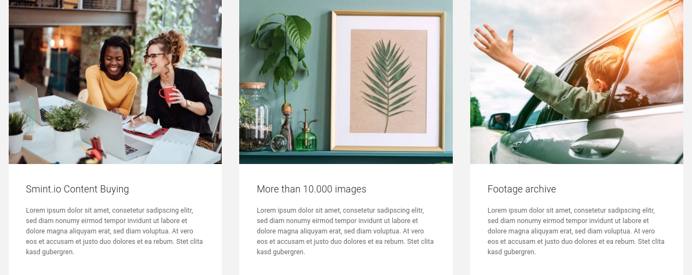

| Key | Type |
|---|---|
| `smintio-ui-generic-category-chooser-1` | `ui-type-category-chooser` |

*Additional properties come from the shared mixins:* `SBackgroundProps`, `SBottomGapProps`, `SEffectsProps`, `SHtmlProps`, `SImageProps`, `STextsProps`, `SUiComponentColorsProps`

#### Props

| Prop name | Type | Default | Description |
|---|---|---|---|
| `optionsType` | `string` | `"categories"` | **Type**    *Allowed values:* `"categories", "assets"` |
| `categories` | `ICategory[]` |  | **Categories**    The categories to display to the user.    *Values offered by:* `CategoryResourceAllowedValuesProvider`    *Used IF:* `optionsType Equal "categories"` |
| `assetsReference` | `IAssetsReferenceModel` |  | **Assets to display**    Choose individual assets, a folder or configure an asset search.    *Values offered by:* `AssetsReferenceAllowedValuesProvider`    *Used IF:* `optionsType Equal "assets"` |
| `maxNumberAssets` | `number` |  | **Maximum number of assets to display**    *Min value:* `1`    *Max value:* `50`    *Used IF:* `optionsType Equal "assets"` |
| `assetDetailPage` | `IPageReference` |  | **Asset detail page**    Choose a reference to the customizable detail page for file based assets.    *Used IF:* `optionsType Equal "assets"` |
| `pressReleaseDetailPage` | `IPageReference` |  | **Press release detail page**    Choose a reference to the customizable detail page for press releases.    *Used IF:* `optionsType Equal "assets"` |
| `otherDetailPage` | `IPageReference` |  | **Detail page for composite assets**    Choose a reference to the customizable detail page for composite assets.    *Used IF:* `optionsType Equal "assets"` |
| `placeholderImage` | `IImage` |  | **Placeholder image**    The placeholder image will be displayed, if there is no assets from the data source that can be displayed.    *Values offered by:* `ImageResourceAllowedValuesProvider`    *Used IF:* `optionsType Equal "assets"` |
| `imageHeightLimit` | `string` | `"one_row"` | **Image height limit**    *Allowed values:* `"half_row", "three_quarter_row", "one_row", "one_and_a_half_rows", "two_rows"` |
| `imageSize` | `string` | `"cover"` | **Image display mode**    *Allowed values:* `"cover", "contain"`    *Used IF:* `optionsType Equal "assets"` |
| `imageColor` | `string (color)` |  | **Image gap color**    If the image does not cover the whole display area, this color will be used to fill that resulting gap.    *Used IF:* `optionsType Equal "assets"`    *Used IF:* `imageSize Equal "contain"` |
| `imageViewport` | `string` | `"center"` | **Image viewport**    *Allowed values:* `"topleft", "center"`    *Used IF:* `optionsType Equal "assets"`    *Used IF:* `imageSize Equal "cover"` |
| `hoverEffect` | `string` | `"none"` | **Zoom on hover**    *Allowed values:* `"none", "light", "strong"` |
| `headerAttributes` | `IMetadataAttributeModel[]` |  | **Header attributes**    Please select the metadata attributes that contain the header text. If you give no setting, defaults will be used.    *Values offered by:* `MetadataAttributeAllowedValuesProvider`    *Used IF:* `optionsType Equal "assets"` |
| `capitalizeHeaderText` | `boolean` | `false` | **Capitalize header text**    *Used IF:* `optionsType Equal "assets"` |
| `displayMultipleHeaderTexts` | `boolean` | `false` | **Display multiple header texts**    If more than one header text is found, display all texts instead of just the one first found.    *Used IF:* `optionsType Equal "assets"` |
| `headerSeparationText` | `string` |  | **Text for separating multiple header texts**    *Used IF:* `optionsType Equal "assets"`    *Used IF:* `displayMultipleHeaderTexts Equal true` |
| `subHeaderAttributes` | `IMetadataAttributeModel[]` |  | **Sub header attributes**    Please select the metadata attributes that contain the sub header text.    *Values offered by:* `MetadataAttributeAllowedValuesProvider`    *Used IF:* `optionsType Equal "assets"` |
| `capitalizeSubHeaderText` | `boolean` | `false` | **Capitalize sub header text**    *Used IF:* `optionsType Equal "assets"` |
| `displayMultipleSubHeaderTexts` | `boolean` | `false` | **Display multiple sub header texts**    If more than one sub header text is found, display all texts instead of just the one first found.    *Used IF:* `optionsType Equal "assets"` |
| `subHeaderSeparationText` | `string` |  | **Text for separating multiple sub header texts**    *Used IF:* `optionsType Equal "assets"`    *Used IF:* `displayMultipleSubHeaderTexts Equal true` |
| `continuousTextAttributes` | `IMetadataAttributeModel[]` |  | **Continuous text attributes**    Please select the metadata attributes that contain the continuous text. If you give no setting, defaults will be used.    *Values offered by:* `MetadataAttributeAllowedValuesProvider`    *Used IF:* `optionsType Equal "assets"` |
| `displayMultipleContinuousTexts` | `boolean` | `false` | **Display multiple continuous texts**    If more than one continuous text is found, display all texts instead of just the one first found.    *Used IF:* `optionsType Equal "assets"` |
| `continuousTextSeparationText` | `string` |  | **Text for separating multiple continuous texts**    *Used IF:* `optionsType Equal "assets"`    *Used IF:* `displayMultipleContinuousTexts Equal true` |
| `linkText` | `ILocalizedStringsModel` | `"text_see_more_details"` | **Link text**    *Values offered by:* `StringResourceAllowedValuesProvider`    *Advanced setting*    *Used IF:* `optionsType Equal "assets"` |
| `categoriesShadow` | `string` | `"none"` | **Shadow**    *Allowed values:* `"none", "light", "strong"` |
| `categoriesRoundedCorners` | `string` | `"none"` | **Rounded corners**    *Allowed values:* `"none", "small", "medium", "large", "xlarge", "xxlarge"` |
| `numberOfOptionsRowDesktop` | `number` | `3` | **Number of options in a row (desktop)**    *Allowed values:* `3, 4` |
| `categoryGap` | `string` | `"default"` | **Gap between options**    *Allowed values:* `"default", "medium", "large"` |
| `titleContinuousTextGap` | `string` | `"default"` | **Gap between header area and continuous text**    *Allowed values:* `"default", "small", "medium", "large"` |
| `viewerWidth` | `number` | `100` | **Width (desktop)**    *Allowed values:* `50, 58, 66, 75, 83, 92, 100, 105, 110, 120` |
| `viewerWidthMobile` | `number` | `-1` | **Width (mobile)**    *Allowed values:* `-1, 50, 58, 66, 75, 83, 92, 100, 105, 110, 120` |
| `viewerAlignment` | `string` | `"center"` | **Alignment**    *Allowed values:* `"left", "center", "right"` |

---

### Carousel with image, text and button

This component displays a carousel for the user to choose from several options, each containing image, text and an optional button.

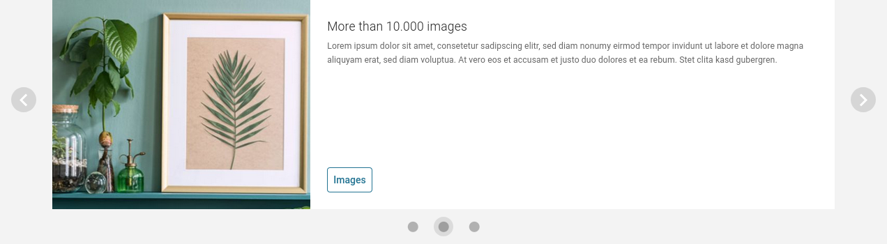

| Key | Type |
|---|---|
| `smintio-ui-generic-category-slider-1` | `ui-type-category-chooser` |

*Additional properties come from the shared mixins:* `SBottomGapProps`, `SHtmlProps`, `SImageProps`, `STextsProps`, `SUiComponentColorsProps`

#### Props

| Prop name | Type | Default | Description |
|---|---|---|---|
| `optionsType` | `string` | `"categories"` | **Type**    *Allowed values:* `"categories", "assets"` |
| `categories` | `ICategory[]` |  | **Categories**    The categories to display to the user.    *Values offered by:* `CategoryResourceAllowedValuesProvider`    *Used IF:* `optionsType Equal "categories"` |
| `assetsReference` | `IAssetsReferenceModel` |  | **Assets to display**    Choose individual assets, a folder or configure an asset search.    *Values offered by:* `AssetsReferenceAllowedValuesProvider`    *Used IF:* `optionsType Equal "assets"` |
| `maxNumberAssets` | `number` |  | **Maximum number of assets to display**    *Min value:* `1`    *Max value:* `50`    *Used IF:* `optionsType Equal "assets"` |
| `assetDetailPage` | `IPageReference` |  | **Asset detail page**    Choose a reference to the customizable detail page for file based assets.    *Used IF:* `optionsType Equal "assets"` |
| `pressReleaseDetailPage` | `IPageReference` |  | **Press release detail page**    Choose a reference to the customizable detail page for press releases.    *Used IF:* `optionsType Equal "assets"` |
| `otherDetailPage` | `IPageReference` |  | **Detail page for composite assets**    Choose a reference to the customizable detail page for composite assets.    *Used IF:* `optionsType Equal "assets"` |
| `placeholderImage` | `IImage` |  | **Placeholder image**    The placeholder image will be displayed, if there is no assets from the data source that can be displayed.    *Values offered by:* `ImageResourceAllowedValuesProvider`    *Used IF:* `optionsType Equal "assets"` |
| `imageHeightLimit` | `string` | `"one_row"` | **Image height limit**    *Allowed values:* `"half_row", "three_quarter_row", "one_row", "one_and_a_half_rows", "two_rows"` |
| `imageSize` | `string` | `"cover"` | **Image display mode**    *Allowed values:* `"cover", "contain"`    *Used IF:* `optionsType Equal "assets"` |
| `imageColor` | `string (color)` |  | **Image gap color**    If the image does not cover the whole display area, this color will be used to fill that resulting gap.    *Used IF:* `optionsType Equal "assets"`    *Used IF:* `imageSize Equal "contain"` |
| `imageViewport` | `string` | `"center"` | **Image viewport**    *Allowed values:* `"topleft", "center"`    *Used IF:* `optionsType Equal "assets"`    *Used IF:* `imageSize Equal "cover"` |
| `headerAttributes` | `IMetadataAttributeModel[]` |  | **Header attributes**    Please select the metadata attributes that contain the header text. If you give no setting, defaults will be used.    *Values offered by:* `MetadataAttributeAllowedValuesProvider`    *Used IF:* `optionsType Equal "assets"` |
| `capitalizeHeaderText` | `boolean` | `false` | **Capitalize header text**    *Used IF:* `optionsType Equal "assets"` |
| `displayMultipleHeaderTexts` | `boolean` | `false` | **Display multiple header texts**    If more than one header text is found, display all texts instead of just the one first found.    *Used IF:* `optionsType Equal "assets"` |
| `headerSeparationText` | `string` |  | **Text for separating multiple header texts**    *Used IF:* `optionsType Equal "assets"`    *Used IF:* `displayMultipleHeaderTexts Equal true` |
| `subHeaderAttributes` | `IMetadataAttributeModel[]` |  | **Sub header attributes**    Please select the metadata attributes that contain the sub header text.    *Values offered by:* `MetadataAttributeAllowedValuesProvider`    *Used IF:* `optionsType Equal "assets"` |
| `capitalizeSubHeaderText` | `boolean` | `false` | **Capitalize sub header text**    *Used IF:* `optionsType Equal "assets"` |
| `displayMultipleSubHeaderTexts` | `boolean` | `false` | **Display multiple sub header texts**    If more than one sub header text is found, display all texts instead of just the one first found.    *Used IF:* `optionsType Equal "assets"` |
| `subHeaderSeparationText` | `string` |  | **Text for separating multiple sub header texts**    *Used IF:* `optionsType Equal "assets"`    *Used IF:* `displayMultipleSubHeaderTexts Equal true` |
| `continuousTextAttributes` | `IMetadataAttributeModel[]` |  | **Continuous text attributes**    Please select the metadata attributes that contain the continuous text. If you give no setting, defaults will be used.    *Values offered by:* `MetadataAttributeAllowedValuesProvider`    *Used IF:* `optionsType Equal "assets"` |
| `displayMultipleContinuousTexts` | `boolean` | `false` | **Display multiple continuous texts**    If more than one continuous text is found, display all texts instead of just the one first found.    *Used IF:* `optionsType Equal "assets"` |
| `continuousTextSeparationText` | `string` |  | **Text for separating multiple continuous texts**    *Used IF:* `optionsType Equal "assets"`    *Used IF:* `displayMultipleContinuousTexts Equal true` |
| `linkText` | `ILocalizedStringsModel` | `"text_see_more_details"` | **Link text**    *Values offered by:* `StringResourceAllowedValuesProvider`    *Advanced setting*    *Used IF:* `optionsType Equal "assets"` |
| `categoriesShadow` | `string` | `"none"` | **Shadow**    *Allowed values:* `"none", "light", "strong"` |
| `categoriesRoundedCorners` | `string` | `"none"` | **Rounded corners**    *Allowed values:* `"none", "small", "medium", "large", "xlarge", "xxlarge"` |
| `cycle` | `boolean` | `true` | **Automatic sliding**    Determines if the carousel should automatically slide through the categories. |
| `intervalInSeconds` | `number` | `10` | **Sliding interval**    The interval in seconds to wait before sliding to the next category.    *Min value:* `1`    *Max value:* `300`    *Used IF:* `cycle Equal true` |
| `titleContinuousTextGap` | `string` | `"default"` | **Gap between header area and continuous text**    *Allowed values:* `"default", "small", "medium", "large"` |
| `sliderWidth` | `number` | `100` | **Width (desktop)**    *Allowed values:* `50, 58, 66, 75, 83, 92, 100, 105, 110, 120` |
| `sliderWidthMobile` | `number` | `-1` | **Width (mobile)**    *Allowed values:* `-1, 50, 58, 66, 75, 83, 92, 100, 105, 110, 120` |
| `sliderAlignment` | `string` | `"center"` | **Alignment**    *Allowed values:* `"left", "center", "right"` |

---

### Comments view

This component displays comments for collections, share links or assets.

| Key | Type |
|---|---|
| `smintio-ui-generic-collection-comments-1` | `ui-type-collection-comments` |

*Additional properties come from the shared mixins:* `SCssProps`

#### Props

| Prop name | Type | Default | Description |
|---|---|---|---|
| `noCommentsPresentText` | `ILocalizedStringsModel` | `"text_no_comments_present"` | **No comments present text**    *Values offered by:* `StringResourceAllowedValuesProvider`    *Advanced setting* |
| `enterMessageText` | `ILocalizedStringsModel` | `"text_enter_message"` | **Enter message text**    *Values offered by:* `StringResourceAllowedValuesProvider`    *Advanced setting* |
| `anonymousUserNameText` | `ILocalizedStringsModel` | `"text_anonymous_user_name"` | **User name text**    *Values offered by:* `StringResourceAllowedValuesProvider`    *Advanced setting* |
| `guestText` | `ILocalizedStringsModel` | `"text_guest"` | **Guest text**    *Values offered by:* `StringResourceAllowedValuesProvider`    *Advanced setting* |
| `editText` | `ILocalizedStringsModel` | `"button_edit"` | **Edit button text**    *Values offered by:* `StringResourceAllowedValuesProvider`    *Advanced setting* |
| `cancelEditText` | `ILocalizedStringsModel` | `"button_cancel"` | **Cancel edit button text**    *Values offered by:* `StringResourceAllowedValuesProvider`    *Advanced setting* |
| `buttonDeleteText` | `ILocalizedStringsModel` | `"button_delete"` | **Delete comment button text**    *Values offered by:* `StringResourceAllowedValuesProvider`    *Advanced setting* |
| `deleteButtonDeleteText` | `ILocalizedStringsModel` | `"button_delete"` | **Delete button text**    *Values offered by:* `StringResourceAllowedValuesProvider`    *Advanced setting* |
| `deleteButtonCancelText` | `ILocalizedStringsModel` | `"button_cancel"` | **Cancel button text**    *Values offered by:* `StringResourceAllowedValuesProvider`    *Advanced setting* |

---

### Collection details

This component displays the details and the content of a collection.

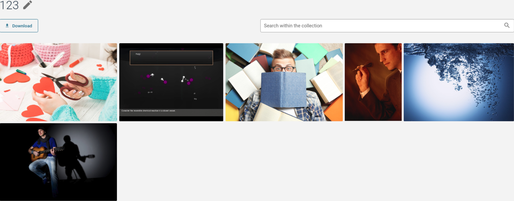

| Key | Type |
|---|---|
| `smintio-ui-generic-collection-details-1` | `ui-type-collection-details` |

*Additional properties come from the shared mixins:* `SCssProps`, `SDownloadProps`, `SQuickViewProps`, `SShareProps`

#### Props

| Prop name | Type | Default | Description |
|---|---|---|---|
| `searchBarText` | `ILocalizedStringsModel` | `"text_collection_search_bar"` | **Hint search bar input**    The hint for the search bar input field.    *Values offered by:* `StringResourceAllowedValuesProvider`    *Advanced setting* |
| `noViewPermissionText` | `ILocalizedStringsModel` | `"text_no_view_permission"` | **No view permission text**    *Values offered by:* `StringResourceAllowedValuesProvider`    *Advanced setting* |
| `noCollectedAssetsFoundText` | `ILocalizedStringsModel` | `"text_no_collected_assets_found"` | **No collected assets found text**    *Values offered by:* `StringResourceAllowedValuesProvider`    *Advanced setting* |
| `assetDetailPage` | `IPageReference` |  | **Asset detail page**    Choose a reference to the customizable detail page for file based assets. |
| `pressReleaseDetailPage` | `IPageReference` |  | **Press release detail page**    Choose a reference to the customizable detail page for press releases. |
| `otherDetailPage` | `IPageReference` |  | **Detail page for composite assets**    Choose a reference to the customizable detail page for composite assets. |
| `view` | `string` | `"gallery"` | **View**    Please select, which types of view should be used to display the assets.    *Allowed values:* `"gallery", "cards"` |
| `numberOfAssetsRowDesktop` | `number` | `4` | **Number of assets in a row (desktop)**    *Allowed values:* `3, 4`    *Used IF:* `view Equal "cards"` |
| `approximateAssetHeight` | `string` | `"default"` | **Asset row height**    The asset viewer adjusts the asset height automatically for the assets to nicely match to the layout. However, you can give an approximate target asset height value here, and the algorithm will try to match it as good as possible.    *Allowed values:* `"low", "default", "high"` |
| `galleryItemShadow` | `string` | `"none"` | **Shadow**    *Allowed values:* `"none", "light", "strong"` |
| `muted` | `boolean` | `true` | **Mute videos and audio files** |
| `previewBackgroundColor` | `string` |  | **Background color**    *Used IF:* `view Equal "cards"` |
| `previewGap` | `string` | `"default"` | **Gap within area**    *Allowed values:* `"none", "default", "medium", "large", "xlarge", "xxlarge"`    *Used IF:* `view Equal "cards"` |
| `metadataAttributeDisplayList` | `IMetadataAttributeModel[]` |  | **Attributes to display**    Please select all the metadata attributes that the user should see. If you specify no attributes, only the basic attributes of the asset will be displayed.    *Values offered by:* `MetadataAttributeAllowedValuesProvider`    *Used IF:* `view Equal "cards"` |
| `attributesGap` | `string` | `"default"` | **Gap within area**    *Allowed values:* `"default", "medium", "large", "xlarge", "xxlarge"`    *Used IF:* `view Equal "cards"` |
| `masonryGap` | `string` | `"medium"` | **Asset gap**    *Allowed values:* `"small", "medium", "large", "xlarge"` |
| `buttonClearSelectionText` | `ILocalizedStringsModel` | `"button_clear_selection"` | **Clear selection button text**    *Values offered by:* `StringResourceAllowedValuesProvider`    *Advanced setting* |
| `actionBarButtonCancelText` | `ILocalizedStringsModel` | `"button_cancel"` | **Action bar cancel button text**    *Values offered by:* `StringResourceAllowedValuesProvider`    *Advanced setting* |
| `buttonOpenDetailsInNewWindow` | `ILocalizedStringsModel` | `"button_open_details_in_new_window"` | **Open in new window button text**    *Values offered by:* `StringResourceAllowedValuesProvider`    *Advanced setting* |
| `buttonOpenQuickView` | `ILocalizedStringsModel` | `"button_open_quick_view"` | **Open in quick view button text**    *Values offered by:* `StringResourceAllowedValuesProvider`    *Advanced setting* |
| `buttonEditNameText` | `ILocalizedStringsModel` | `"button_edit_name"` | **Edit name button text**    *Values offered by:* `StringResourceAllowedValuesProvider`    *Advanced setting* |
| `editNameDoneText` | `ILocalizedStringsModel` | `"text_edit_name_done"` | **Done text**    *Values offered by:* `StringResourceAllowedValuesProvider`    *Advanced setting* |
| `buttonUsersText` | `ILocalizedStringsModel` | `"button_users"` | **Users button text**    *Values offered by:* `StringResourceAllowedValuesProvider`    *Advanced setting* |
| `buttonAddUsersText` | `ILocalizedStringsModel` | `"button_add_users"` | **Add users button text**    *Values offered by:* `StringResourceAllowedValuesProvider`    *Advanced setting* |
| `buttonListUsersText` | `ILocalizedStringsModel` | `"button_list_users"` | **Show users button text**    *Values offered by:* `StringResourceAllowedValuesProvider`    *Advanced setting* |
| `usersDialogTitleText` | `ILocalizedStringsModel` | `"text_users_dialog_title"` | **Users dialog title**    *Values offered by:* `StringResourceAllowedValuesProvider`    *Advanced setting* |
| `filterUsersInputText` | `ILocalizedStringsModel` | `"text_filter_users_input"` | **Search for users input text**    *Values offered by:* `StringResourceAllowedValuesProvider`    *Advanced setting* |
| `noUsersFoundCollectionText` | `ILocalizedStringsModel` | `"text_no_users_found_collection"` | **No users present text**    *Values offered by:* `StringResourceAllowedValuesProvider`    *Advanced setting* |
| `noUsersMatchSearchText` | `ILocalizedStringsModel` | `"text_no_users_match_search"` | **No search result text**    *Values offered by:* `StringResourceAllowedValuesProvider`    *Advanced setting* |
| `userGroupText` | `ILocalizedStringsModel` | `"text_user_group"` | **User group text**    *Values offered by:* `StringResourceAllowedValuesProvider`    *Advanced setting* |
| `newUserEmailsInputText` | `ILocalizedStringsModel` | `"text_new_user_emails_input"` | **Email addresses input text**    *Values offered by:* `StringResourceAllowedValuesProvider`    *Advanced setting* |
| `emailRequiredValidationText` | `ILocalizedStringsModel` | `"text_validation_email_required"` | **Email required text**    *Values offered by:* `StringResourceAllowedValuesProvider`    *Advanced setting* |
| `emailInvalidValidationText` | `ILocalizedStringsModel` | `"text_validation_email_invalid"` | **Email invalid text**    *Values offered by:* `StringResourceAllowedValuesProvider`    *Advanced setting* |
| `newUserBrowseUserGroupsInputText` | `ILocalizedStringsModel` | `"text_browse_user_groups"` | **Browse user groups text**    *Values offered by:* `StringResourceAllowedValuesProvider`    *Advanced setting* |
| `userGroupRequiredValidationText` | `ILocalizedStringsModel` | `"text_user_group_required"` | **User group required text**    *Values offered by:* `StringResourceAllowedValuesProvider`    *Advanced setting* |
| `newUserBrowseUsersInputText` | `ILocalizedStringsModel` | `"text_browse_users"` | **Browse users text**    *Values offered by:* `StringResourceAllowedValuesProvider`    *Advanced setting* |
| `userRequiredValidationText` | `ILocalizedStringsModel` | `"text_user_required"` | **User required text**    *Values offered by:* `StringResourceAllowedValuesProvider`    *Advanced setting* |
| `noInvitationsAreBeingSentText` | `ILocalizedStringsModel` | `"text_no_invitations_are_being_sent"` | **No invitations are being sent text**    *Values offered by:* `StringResourceAllowedValuesProvider`    *Advanced setting* |
| `loadingText` | `ILocalizedStringsModel` | `"text_loading"` | **Loading text**    *Values offered by:* `StringResourceAllowedValuesProvider`    *Advanced setting* |
| `noRecordsFoundText` | `ILocalizedStringsModel` | `"text_no_records_found"` | **No records found text**    *Values offered by:* `StringResourceAllowedValuesProvider`    *Advanced setting* |
| `newUserPermissionInputText` | `ILocalizedStringsModel` | `"text_new_user_permission_input"` | **Permission input text**    *Values offered by:* `StringResourceAllowedValuesProvider`    *Advanced setting* |
| `ownerPermissionText` | `ILocalizedStringsModel` | `"text_permission_owner"` | **Owner permission type text**    *Values offered by:* `StringResourceAllowedValuesProvider`    *Advanced setting* |
| `modifyPermissionText` | `ILocalizedStringsModel` | `"text_permission_modify"` | **Modify permission type text**    *Values offered by:* `StringResourceAllowedValuesProvider`    *Advanced setting* |
| `readOnlyPermissionText` | `ILocalizedStringsModel` | `"text_permission_read_only"` | **Read only permission type text**    *Values offered by:* `StringResourceAllowedValuesProvider`    *Advanced setting* |
| `removePermissionText` | `ILocalizedStringsModel` | `"text_permission_remove"` | **Remove permission type text**    *Values offered by:* `StringResourceAllowedValuesProvider`    *Advanced setting* |
| `permissionRequiredValidationText` | `ILocalizedStringsModel` | `"text_validation_permission_required"` | **Permission required text**    *Values offered by:* `StringResourceAllowedValuesProvider`    *Advanced setting* |
| `invitationSentTooltipText` | `ILocalizedStringsModel` | `"text_invitation_sent_tooltip"` | **Invitation sent tooltip text**    *Values offered by:* `StringResourceAllowedValuesProvider`    *Advanced setting* |
| `invitationAcceptedTooltipText` | `ILocalizedStringsModel` | `"text_invitation_accepted_tooltip"` | **Invitation accepted tooltip text**    *Values offered by:* `StringResourceAllowedValuesProvider`    *Advanced setting* |
| `invitationDeclinedTooltipText` | `ILocalizedStringsModel` | `"text_invitation_declined_tooltip"` | **Invitation declined tooltip text**    *Values offered by:* `StringResourceAllowedValuesProvider`    *Advanced setting* |
| `newUserMessageInputText` | `ILocalizedStringsModel` | `"text_new_user_message_input"` | **Message input text**    *Values offered by:* `StringResourceAllowedValuesProvider`    *Advanced setting* |
| `buttonSavePermissionsText` | `ILocalizedStringsModel` | `"button_save_permissions"` | **Save button text**    *Values offered by:* `StringResourceAllowedValuesProvider`    *Advanced setting* |
| `buttonCloseText` | `ILocalizedStringsModel` | `"button_close"` | **Close button text**    *Values offered by:* `StringResourceAllowedValuesProvider`    *Advanced setting* |
| `usersSuccessfullyAddedText` | `ILocalizedStringsModel` | `"text_users_successfully_added"` | **Users successfully added text**    *Values offered by:* `StringResourceAllowedValuesProvider`    *Advanced setting* |
| `usersPermissionsSuccessfullyUpdatedText` | `ILocalizedStringsModel` | `"text_users_permissions_successfully_updated"` | **Users successfully updated text**    *Values offered by:* `StringResourceAllowedValuesProvider`    *Advanced setting* |
| `usersPermissionsSuccessfullyRemovedText` | `ILocalizedStringsModel` | `"text_users_permissions_successfully_removed"` | **Users successfully removed text**    *Values offered by:* `StringResourceAllowedValuesProvider`    *Advanced setting* |
| `permissionsSuccessfullySavedText` | `ILocalizedStringsModel` | `"text_permissions_successfully_saved"` | **Changes successfully saved text**    *Values offered by:* `StringResourceAllowedValuesProvider`    *Advanced setting* |
| `buttonDeleteCollectionText` | `ILocalizedStringsModel` | `"button_delete_collection"` | **Delete collection button text**    *Values offered by:* `StringResourceAllowedValuesProvider`    *Advanced setting* |
| `deleteCollectionButtonDeleteText` | `ILocalizedStringsModel` | `"button_delete_collection"` | **Delete button text**    *Values offered by:* `StringResourceAllowedValuesProvider`    *Advanced setting* |
| `deleteButtonCancelText` | `ILocalizedStringsModel` | `"button_cancel"` | **Cancel button text**    *Values offered by:* `StringResourceAllowedValuesProvider`    *Advanced setting* |
| `deleteCollectionDoneText` | `ILocalizedStringsModel` | `"text_delete_collection_done"` | **Done text**    *Values offered by:* `StringResourceAllowedValuesProvider`    *Advanced setting* |
| `buttonRemoveAssetsText` | `ILocalizedStringsModel` | `"button_remove_asset"` | **Remove assets button text**    *Values offered by:* `StringResourceAllowedValuesProvider`    *Advanced setting* |
| `removeAssetsDoneText` | `ILocalizedStringsModel` | `"text_remove_asset_done"` | **Done text**    *Values offered by:* `StringResourceAllowedValuesProvider`    *Advanced setting* |
| `buttonRateText` | `ILocalizedStringsModel` | `"button_rate"` | **Rate button text**    *Values offered by:* `StringResourceAllowedValuesProvider`    *Advanced setting* |
| `ratingDoneText` | `ILocalizedStringsModel` | `"rating_done_text"` | **Done text**    *Values offered by:* `StringResourceAllowedValuesProvider`    *Advanced setting* |
| `ratingFilterLabelText` | `ILocalizedStringsModel` | `"label_rating_filter"` | **Rating filter text**    *Values offered by:* `StringResourceAllowedValuesProvider`    *Advanced setting* |
| `noRatingText` | `ILocalizedStringsModel` | `"no_rating_text"` | **No rating filter text**    *Values offered by:* `StringResourceAllowedValuesProvider`    *Advanced setting* |
| `clearRatingText` | `ILocalizedStringsModel` | `"clear_rating_text"` | **Clear rating text**    *Values offered by:* `StringResourceAllowedValuesProvider`    *Advanced setting* |
| `greenText` | `ILocalizedStringsModel` | `"green_rating_text"` | **Green rating text**    *Values offered by:* `StringResourceAllowedValuesProvider`    *Advanced setting* |
| `orangeText` | `ILocalizedStringsModel` | `"orange_rating_text"` | **Orange rating text**    *Values offered by:* `StringResourceAllowedValuesProvider`    *Advanced setting* |
| `redText` | `ILocalizedStringsModel` | `"red_rating_text"` | **Red rating text**    *Values offered by:* `StringResourceAllowedValuesProvider`    *Advanced setting* |
| `buttonCollectionCommentsText` | `ILocalizedStringsModel` | `"button_collection_comments"` | **Collection comments button text**    *Values offered by:* `StringResourceAllowedValuesProvider`    *Advanced setting* |
| `buttonAssetCommentsText` | `ILocalizedStringsModel` | `"button_asset_comments"` | **Asset comments button text**    *Values offered by:* `StringResourceAllowedValuesProvider`    *Advanced setting* |

---

### Collections overview

This component displays an overview of all collections of the user.

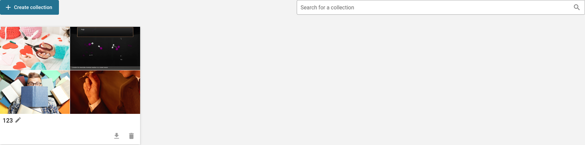

| Key | Type |
|---|---|
| `smintio-ui-generic-collections-overview-1` | `ui-type-collections-overview` |

*Additional properties come from the shared mixins:* `SCssProps`, `SDownloadProps`, `SShareProps`

#### Props

| Prop name | Type | Default | Description |
|---|---|---|---|
| `searchBarText` | `ILocalizedStringsModel` | `"text_collections_search_bar"` | **Hint search bar input**    The hint for the search bar input field.    *Values offered by:* `StringResourceAllowedValuesProvider`    *Advanced setting* |
| `noCollectionsFoundText` | `ILocalizedStringsModel` | `"text_no_collections_found"` | **No collections found text**    *Values offered by:* `TextResourceAllowedValuesProvider`    *Advanced setting* |
| `collectionDetailPage` | `IPageReference` | `"collection_details_page"` | **Collection detail page**    Choose a reference to the customizable collection detail page. |
| `buttonEditNameText` | `ILocalizedStringsModel` | `"button_edit_name"` | **Edit name button text**    *Values offered by:* `StringResourceAllowedValuesProvider`    *Advanced setting* |
| `buttonCreateCollectionText` | `ILocalizedStringsModel` | `"button_create_collection"` | **Create collection button text**    *Values offered by:* `StringResourceAllowedValuesProvider`    *Advanced setting* |
| `createNewCollectionText` | `ILocalizedStringsModel` | `"text_new_collection"` | **New collection text**    *Values offered by:* `StringResourceAllowedValuesProvider`    *Advanced setting* |
| `createCollectionNameText` | `ILocalizedStringsModel` | `"text_collection_name"` | **Collection name input text**    *Values offered by:* `StringResourceAllowedValuesProvider`    *Advanced setting* |
| `createButtonSaveText` | `ILocalizedStringsModel` | `"button_save"` | **Save button text**    *Values offered by:* `StringResourceAllowedValuesProvider`    *Advanced setting* |
| `createButtonCancelText` | `ILocalizedStringsModel` | `"button_cancel"` | **Cancel button text**    *Values offered by:* `StringResourceAllowedValuesProvider`    *Advanced setting* |
| `createDoneText` | `ILocalizedStringsModel` | `"text_create_collection_done"` | **Done text**    *Values offered by:* `StringResourceAllowedValuesProvider`    *Advanced setting* |
| `buttonDeleteCollectionText` | `ILocalizedStringsModel` | `"button_delete_collection"` | **Delete collection button text**    *Values offered by:* `StringResourceAllowedValuesProvider`    *Advanced setting* |
| `deleteButtonDeleteText` | `ILocalizedStringsModel` | `"button_delete_collection"` | **Delete button text**    *Values offered by:* `StringResourceAllowedValuesProvider`    *Advanced setting* |
| `deleteButtonCancelText` | `ILocalizedStringsModel` | `"button_cancel"` | **Cancel button text**    *Values offered by:* `StringResourceAllowedValuesProvider`    *Advanced setting* |
| `deleteDoneText` | `ILocalizedStringsModel` | `"text_delete_collection_done"` | **Done text**    *Values offered by:* `StringResourceAllowedValuesProvider`    *Advanced setting* |

---

### Color indicator with text

This component displays a color indicator with text to the left or to the right.

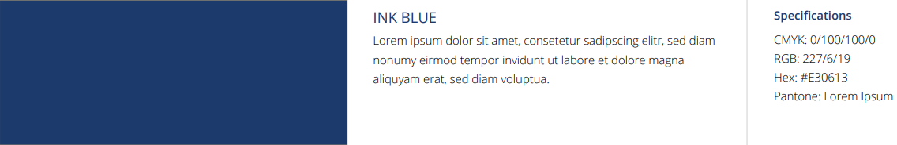

| Key | Type |
|---|---|
| `smintio-ui-generic-color-1` | `ui-type-text-with-color` |

*Additional properties come from the shared mixins:* `SBottomGapProps`, `SCiHubProps`, `SHtmlProps`, `STextProps`, `SUiComponentColorsProps`

#### Props

| Prop name | Type | Default | Description |
|---|---|---|---|
| `color` | `string (color)` |  | **Color** |
| `colorPosition` | `string` | `"left"` | **Color position (desktop)**    *Allowed values:* `"left", "right"` |
| `colorShadow` | `string` | `"none"` | **Shadow**    *Allowed values:* `"none", "light", "strong"` |
| `colorSpecificationText` | `ILocalizedStringsModel` | `"text_color_specification"` | **Color specification header**    *Values offered by:* `StringResourceAllowedValuesProvider`    *Advanced setting* |
| `hexText` | `ILocalizedStringsModel` | `"text_color_hex"` | **Hexadecimal value text**    *Values offered by:* `StringResourceAllowedValuesProvider`    *Advanced setting* |
| `rgbaText` | `ILocalizedStringsModel` | `"text_color_rgba"` | **RGBA value text**    *Values offered by:* `StringResourceAllowedValuesProvider`    *Advanced setting* |
| `cmykText` | `ILocalizedStringsModel` | `"text_color_cmyk"` | **CMYK value text**    By default, the CMYK value is being derived from the RGB color. As this cross-color-space derivation does not work accurately very often, you can override the automatically derived CMYK value with a custom text here.    *Values offered by:* `StringResourceAllowedValuesProvider`    *Advanced setting* |
| `additionalColorText` | `ILocalizedStringsModel` |  | **Additional color text** |
| `additionalColorText2` | `ILocalizedStringsModel` |  | **Additional color text 2** |
| `colorTextGap` | `string` | `"medium"` | **Gap between color and text (desktop)**    *Allowed values:* `"default", "medium", "large"` |
| `contentVerticalAlignment` | `string` | `"top"` | **Vertical alignment of content**    *Allowed values:* `"top", "middle", "bottom"` |

---

### Error display

| Key | Type |
|---|---|
| `smintio-ui-generic-display-server-error-1` | `ui-type-error-form` |

*Additional properties come from the shared mixins:* `SCssProps`

This component has no own configuration properties.

---

### Document

This component displays a document.

| Key | Type |
|---|---|
| `smintio-ui-generic-document-1` | `ui-type-document` |

*Additional properties come from the shared mixins:* `SBottomGapProps`, `SDownloadProps`, `SHtmlProps`, `SQuickViewProps`, `SRememberProps`, `SShareProps`, `SUiComponentColorsProps`

#### Props

| Prop name | Type | Default | Description |
|---|---|---|---|
| `assetIdentifier` | `IAssetIdentifier` |  | **Document asset to display**    *Values offered by:* `AssetIdAllowedValuesProvider` |
| `displayAssetName` | `boolean` | `false` | **Display document name below document** |
| `allowAssetUserInteraction` | `boolean` | `false` | **Allow user interaction with the asset (collect, share & download)** |
| `documentHeightLimit` | `string` | `"two_rows"` | **Height limit**    *Allowed values:* `"one_row", "one_and_a_half_rows", "two_rows", "unlimited"` |
| `documentShadow` | `string` | `"none"` | **Shadow**    *Allowed values:* `"none", "light", "strong"` |
| `placeholderImage` | `IImage` |  | **Placeholder image**    The placeholder image will be displayed, if the asset from the data source cannot be displayed.    *Values offered by:* `ImageResourceAllowedValuesProvider` |
| `documentWidth` | `number` | `75` | **Width (desktop)**    *Allowed values:* `50, 58, 66, 75, 83, 92, 100, 105, 110, 120` |
| `documentWidthMobile` | `number` | `-1` | **Width (mobile)**    *Allowed values:* `-1, 50, 58, 66, 75, 83, 92, 100, 105, 110, 120` |
| `documentAlignment` | `string` | `"center"` | **Alignment**    *Allowed values:* `"left", "center", "right"` |

---

### Footer

This component displays a page footer.

| Key | Type |
|---|---|
| `smintio-ui-generic-footer-1` | `ui-type-footer` |

*Additional properties come from the shared mixins:* `SCssProps`, `SMenuItemsProps`

#### Props

| Prop name | Type | Default | Description |
|---|---|---|---|
| `copyrightText` | `ILocalizedStringsModel` | `"footer_text_copyright"` | **Copyright text**    *Values offered by:* `StringResourceAllowedValuesProvider` |
| `menuItems` | `IMenuItem[]` |  | **Menu items**    The menu items to display.    *Values offered by:* `MenuItemResourceAllowedValuesProvider` |

---

### Header

This component displays a page header.

| Key | Type |
|---|---|
| `smintio-ui-generic-header-1` | `ui-type-header` |

*Additional properties come from the shared mixins:* `SCssProps`, `SMenuItemsProps`, `STextsProps`

#### Props

| Prop name | Type | Default | Description |
|---|---|---|---|
| `separatorStyle` | `string` | `"border"` | **Header style**    *Allowed values:* `"elevation", "border", "elevation-and-border", "none"` |
| `headerHeight` | `string` | `"medium"` | **Height**    *Allowed values:* `"low", "medium", "tall"` |
| `overrideHeaderLogo` | `IImage` |  | **Adjust logo**    By default, throughout all your portal the centrally defined portal logo will be used. If you want to locally adjust the logo, you can do so here.    *Values offered by:* `ImageResourceAllowedValuesProvider` |
| `logoClickLinkType` | `string` | `"main"` | **Link type for logo click**    When a user clicks a logo, you can either send the user to a Smint.io Portals page or to a web address (absolute or relative URL). If you do not want to provide any link, choose <i>No link</i>.    *Allowed values:* `"none", "main", "page", "url"` |
| `pageForLogoClick` | `IPageReference` |  | **Target page for logo click**    Please select the Smint.io Portals page, that you want the logo to link to.    *Used IF:* `logoClickLinkType Equal "page"` |
| `queryParameters` | `ILocalizedStringsModel` |  | **Query parameters**    Please enter the query parameters, that should be appended to the effective URL of the logo click page.    *Used IF:* `logoClickLinkType Equal "page"` |
| `logoClickUrl` | `ILocalizedStringsModel` |  | **Target web address (URL) for logo click**    Please enter the web address (absolute or relative URL) that you want the logo to link to.    *Required*    *Used IF:* `logoClickLinkType Equal "url"` |
| `openUrlInNewWindow` | `boolean` | `true` | **Open URL in new window**    *Used IF:* `logoClickLinkType Equal "url"` |
| `buttonStyle` | `string` | `"solid"` | **Button style**    Here you can change the style of the login and logout buttons.    *Allowed values:* `"solid", "outlined"` |
| `menuItemsLeft` | `IMenuItem[]` |  | **Menu items to the left**    The menu items to display to the left.    *Values offered by:* `MenuItemResourceAllowedValuesProvider` |
| `menuItemsRight` | `IMenuItem[]` |  | **Menu items to the right**    The menu items to display to the right.    *Values offered by:* `MenuItemResourceAllowedValuesProvider` |
| `maxSubMenuDepth` | `string` | `"1"` | **Maximum menu depth**    Menus can have many sub menu levels. Here you can specify how many sub menu levels will be shown at a maximum.    *Allowed values:* `"0", "1", "2", "3", "none"` |
| `hideManageUserAccount` | `boolean` | `false` | **Hide manage user account menu item** |
| `useShortLanguagesNames` | `boolean` | `false` | **Use short language names**    Use short character codes for language chooser (eg. EN, DE). |
| `loginButtonText` | `ILocalizedStringsModel` | `"header_button_login"` | **Login button text**    *Values offered by:* `StringResourceAllowedValuesProvider`    *Advanced setting* |
| `logoutButtonText` | `ILocalizedStringsModel` | `"header_button_logout"` | **Logout button text**    *Values offered by:* `StringResourceAllowedValuesProvider`    *Advanced setting* |
| `manageAccountLinkText` | `ILocalizedStringsModel` | `"text_manage_account"` | **Manage account link text**    *Values offered by:* `StringResourceAllowedValuesProvider`    *Advanced setting* |

---

### Image

This component displays an image.

| Key | Type |
|---|---|
| `smintio-ui-generic-image-1` | `ui-type-image` |

*Additional properties come from the shared mixins:* `SBottomGapProps`, `SHtmlProps`, `SImageProps`, `SLinkProps`, `SUiComponentColorsProps`

#### Props

| Prop name | Type | Default | Description |
|---|---|---|---|
| `imageSource` | `string` | `"resource"` | **Type**    *Allowed values:* `"asset", "resource"` |
| `image` | `IImage` |  | **Image to display from resources**    *Values offered by:* `ImageResourceAllowedValuesProvider`    *Used IF:* `imageSource Equal "resource"` |
| `assetIdentifier` | `IAssetIdentifier` |  | **Image asset to display**    *Values offered by:* `AssetIdAllowedValuesProvider`    *Used IF:* `imageSource Equal "asset"` |
| `imageHeightLimit` | `string` | `"one_row"` | **Height limit**    *Allowed values:* `"half_row", "three_quarters_row", "one_row", "one_and_a_half_rows", "two_rows", "unlimited"` |
| `imageDisplayMode` | `string` | `"contained"` | **Display mode**    *Allowed values:* `"contained", "cut_to_fit"` |
| `imageShadow` | `string` | `"none"` | **Shadow**    *Allowed values:* `"none", "light", "strong"` |
| `enableLightbox` | `boolean` | `false` | **Enable lightbox** |
| `placeholderImage` | `IImage` |  | **Placeholder image**    The placeholder image will be displayed, if the asset from the data source cannot be displayed.    *Values offered by:* `ImageResourceAllowedValuesProvider`    *Used IF:* `imageSource Equal "asset"` |
| `linkType` | `string` | `"none"` | **Link type**    You can either link this category to a Smint.io Portals page or to a web address (absolute or relative URL). If you do not want to provide any link, choose <i>No link</i>.    *Allowed values:* `"none", "page", "url"` |
| `page` | `IPageReference` |  | **Target page**    Please select the Smint.io Portals page, that you want to link to.    *Required*    *Used IF:* `linkType Equal "page"` |
| `queryParameters` | `ILocalizedStringsModel` |  | **Query parameters**    Please enter the query parameters, that should be appended to the effective URL of the target page.    *Used IF:* `linkType Equal "page"` |
| `url` | `ILocalizedStringsModel` |  | **Target web address (URL)**    Please enter the web address (absolute or relative URL) that you want to link to.    *Required*    *Used IF:* `linkType Equal "url"` |
| `imageWidth` | `number` | `75` | **Width (desktop)**    *Allowed values:* `50, 58, 66, 75, 83, 92, 100, 105, 110, 120` |
| `imageWidthMobile` | `number` | `-1` | **Width (mobile)**    *Allowed values:* `-1, 50, 58, 66, 75, 83, 92, 100, 105, 110, 120` |
| `imageAlignment` | `string` | `"center"` | **Alignment**    *Allowed values:* `"left", "center", "right"` |

---

### Image with text

This component displays an image with text to the left or to the right.

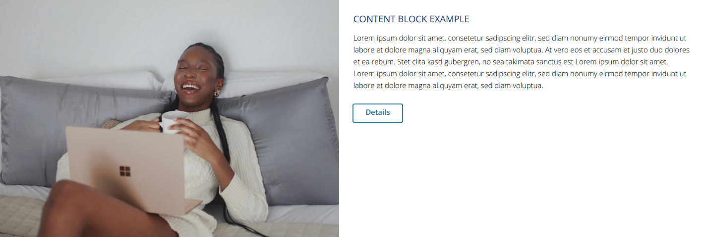

| Key | Type |
|---|---|
| `smintio-ui-generic-image-with-text-1` | `ui-type-image-with-text` |

*Additional properties come from the shared mixins:* `SAssetProps`, `SBottomGapProps`, `SDownloadProps`, `SHtmlProps`, `SImageProps`, `SLinkButtonProps`, `SQuickViewProps`, `SRememberProps`, `SSecondaryLinkButtonProps`, `SShareProps`, `STextProps`, `SUiComponentColorsProps`

#### Props

| Prop name | Type | Default | Description |
|---|---|---|---|
| `imageSource` | `string` | `"resource"` | **Type**    *Allowed values:* `"asset", "resource"` |
| `image` | `IImage` |  | **Image to display from resources**    *Values offered by:* `ImageResourceAllowedValuesProvider`    *Used IF:* `imageSource Equal "resource"` |
| `assetIdentifier` | `IAssetIdentifier` |  | **Image asset to display**    *Values offered by:* `AssetIdAllowedValuesProvider`    *Used IF:* `imageSource Equal "asset"` |
| `allowAssetUserInteraction` | `boolean` | `false` | **Allow user interaction with the asset (e.g. collect & download, visit asset detail page)**    *Used IF:* `imageSource Equal "asset"` |
| `imagePosition` | `string` | `"left"` | **Position (desktop)**    *Allowed values:* `"left", "right"` |
| `imagePositionMobile` | `string` | `"top"` | **Position (mobile)**    *Allowed values:* `"top", "bottom"` |
| `imageWidth` | `number` | `50` | **Width (desktop)**    *Allowed values:* `25, 33, 50, 66, 75` |
| `imageWidthMobile` | `number` | `100` | **Width (mobile)**    *Allowed values:* `-1, 25, 33, 50, 66, 75, 83, 92, 100` |
| `imageHeightLimit` | `string` | `"one_row"` | **Height limit**    *Allowed values:* `"one_row", "one_and_a_half_rows", "two_rows", "unlimited"` |
| `imageDisplayMode` | `string` | `"contained"` | **Display mode**    *Allowed values:* `"contained", "cut_to_fit"` |
| `imageShadow` | `string` | `"none"` | **Shadow**    *Allowed values:* `"none", "light", "strong"` |
| `gapAroundImage` | `string` | `"none"` | **Gap around image**    *Allowed values:* `"none", "small", "medium", "large"` |
| `enableLightbox` | `boolean` | `false` | **Enable lightbox** |
| `placeholderImage` | `IImage` |  | **Placeholder image**    The placeholder image will be displayed, if the asset from the data source cannot be displayed.    *Values offered by:* `ImageResourceAllowedValuesProvider`    *Used IF:* `imageSource Equal "asset"` |
| `imageTextGap` | `string` | `"medium"` | **Gap between image and text (desktop)**    *Allowed values:* `"default", "medium", "large"` |
| `contentVerticalAlignment` | `string` | `"top"` | **Vertical alignment of content**    *Allowed values:* `"top", "middle", "bottom"` |
| `buttonOpenDetailsInNewWindow` | `ILocalizedStringsModel` | `"button_open_details_in_new_window"` | **Open in new window button text**    *Values offered by:* `StringResourceAllowedValuesProvider`    *Advanced setting* |
| `buttonOpenQuickView` | `ILocalizedStringsModel` | `"button_open_quick_view"` | **Open in quick view button text**    *Values offered by:* `StringResourceAllowedValuesProvider`    *Advanced setting* |
| `noViewPermissionText` | `ILocalizedStringsModel` | `"text_no_view_permission"` | **No view permission text**    *Values offered by:* `StringResourceAllowedValuesProvider`    *Advanced setting* |
| `assetDetailPage` | `IPageReference` |  | **Asset detail page**    Choose a reference to the customizable asset detail page.    *Used IF:* `imageSource Equal "asset"`    *Used IF:* `allowAssetUserInteraction Equal true` |
| `width` | `number` | `100` | **Width (desktop)**    *Allowed values:* `25, 33, 50, 66, 75, 100` |
| `widthMobile` | `number` | `-1` | **Width (mobile)**    *Allowed values:* `-1, 25, 33, 50, 66, 75, 100` |
| `position` | `string` | `"center"` | **Alignment**    *Allowed values:* `"left", "center", "right"` |
| `linkStyle` | `string` | `"default"` | **Link style**    *Allowed values:* `"default", "solid"` |

---

### Menu item chooser

This component displays a column-based menu item chooser for one or more menu items and sub menu items.

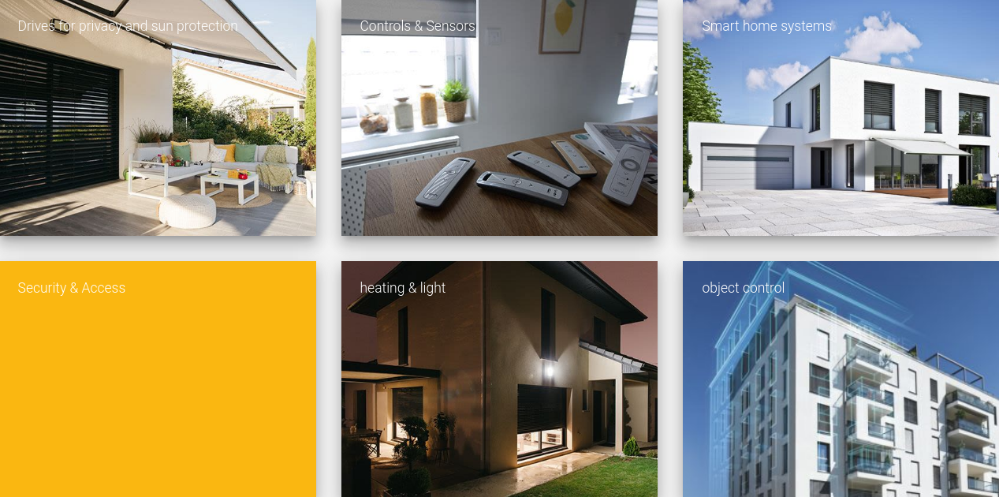

| Key | Type |
|---|---|
| `smintio-ui-generic-menu-item-chooser-1` | `ui-type-category-chooser` |

*Additional properties come from the shared mixins:* `SBackgroundProps`, `SBottomGapProps`, `SEffectsProps`, `SHtmlProps`, `SMenuItemsProps`, `SUiComponentColorsProps`

#### Props

| Prop name | Type | Default | Description |
|---|---|---|---|
| `menuItems` | `IMenuItem[]` |  | **Menu items**    The menu items to display to the user.    *Values offered by:* `MenuItemResourceAllowedValuesProvider` |
| `showMenuItemFilter` | `boolean` | `false` | **Show menu item filter**    If you check this option, the top level of menu items will be interpreted as filter items, that are above the menu item chooser. |
| `alwaysShowSubMenuItems` | `boolean` | `false` | **Always show sub menu items**    By default, sub menu items are only shown if the user interacts with the parent menu item. However, you can turn on this option to always show the sub menu items. |
| `colorScheme` | `string` | `"category-viewer"` | **Color scheme**    *Allowed values:* `"category-viewer", "solid-button"` |
| `onlyDisplayBackground` | `boolean` | `false` | **Only display background** |
| `backgroundOnHover` | `string` | `"solid_color"` | **Change background on hover**    *Allowed values:* `"off", "solid_color", "image"` |
| `zoomOnHover` | `string` | `"none"` | **Zoom on hover**    *Allowed values:* `"none", "light", "strong"` |
| `numberOfMenuItemsRowDesktop` | `number` | `3` | **Number of menu items in a row (desktop)**    *Allowed values:* `3, 4, 5, 6, 7, 8` |
| `menuItemAspectRatio` | `string` | `"default"` | **Menu item aspect ratio**    *Allowed values:* `"1_to_1", "3_to_2", "4_to_3", "16_to_9", "default"` |
| `menuInnerGap` | `string` | `"none"` | **Gap within menu item**    *Allowed values:* `"none", "small", "medium", "large", "xlarge", "xxlarge"` |
| `menuGap` | `string` | `"small"` | **Gap between menu items**    *Allowed values:* `"no-gap", "xsmall", "small", "medium", "large"` |
| `menusShadow` | `string` | `"none"` | **Shadow**    *Allowed values:* `"none", "light", "strong"` |
| `menusRoundedCorners` | `string` | `"none"` | **Rounded corners**    *Allowed values:* `"none", "small", "medium", "large", "xlarge", "xxlarge"` |
| `alignment` | `string` | `"left"` | **Horizontal alignment of content**    *Allowed values:* `"left", "center", "right"` |
| `contentVerticalAlignment` | `string` | `"top"` | **Vertical alignment of content**    *Allowed values:* `"top", "middle", "bottom"` |
| `chooserWidth` | `number` | `100` | **Width (desktop)**    *Allowed values:* `50, 58, 66, 75, 83, 92, 100, 105, 110, 120` |
| `chooserWidthMobile` | `number` | `-1` | **Width (mobile)**    *Allowed values:* `-1, 50, 58, 66, 75, 83, 92, 100, 105, 110, 120` |
| `chooserAlignment` | `string` | `"center"` | **Alignment**    *Allowed values:* `"left", "center", "right"` |

---

### Page title

This component displays a page title and subtitle.

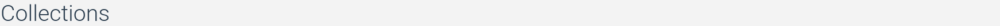

| Key | Type |
|---|---|
| `smintio-ui-generic-page-title-1` | `ui-type-page-title` |

*Additional properties come from the shared mixins:* `SBottomGapProps`, `SHtmlProps`, `SUiComponentColorsProps`

#### Props

| Prop name | Type | Default | Description |
|---|---|---|---|
| `headerText` | `ILocalizedStringsModel` |  | **Header** |
| `subHeaderText` | `ILocalizedStringsModel` |  | **Sub header** |
| `continuousText` | `ILocalizedStringsModel` |  | **Continuous text** |
| `alignment` | `string` | `"left"` | **Alignment**    *Allowed values:* `"left", "center", "right"` |

---

### Request access form

This component displays a request access form.

| Key | Type |
|---|---|
| `smintio-ui-generic-request-access-form-1` | `ui-type-request-access-form` |

*Additional properties come from the shared mixins:* `SCssProps`, `STextsProps`

#### Props

| Prop name | Type | Default | Description |
|---|---|---|---|
| `taskManagement` | `ITaskManagement` |  | **Task handling data source**    The data source to use for handling the download request. |
| `requestRequestAccessTaskHandlerId` | `string` |  | **Request access process**    Please choose the desired process for handling the access request.    *Values offered by:* `RequestAccessTaskHandlerAllowedValuesProvider` |
| `organizationRequired` | `boolean` | `false` | **Organization name is required**    *Required* |
| `organizationText` | `ILocalizedStringsModel` | `"text_organization"` | **Organization name input text**    *Values offered by:* `StringResourceAllowedValuesProvider`    *Advanced setting*    *Used IF:* `organizationRequired Equal true` |
| `customIdentifierRequired` | `boolean` | `false` | **Custom identifier is required**    *Required* |
| `customIdentifierText` | `ILocalizedStringsModel` | `"text_custom_identifier"` | **Custom identifier input text**    *Values offered by:* `StringResourceAllowedValuesProvider`    *Advanced setting*    *Used IF:* `customIdentifierRequired Equal true` |
| `phoneNumberRequired` | `boolean` | `false` | **Phone number is required**    *Required* |
| `phoneNumberText` | `ILocalizedStringsModel` | `"text_phone_number"` | **Phone number input text**    *Values offered by:* `StringResourceAllowedValuesProvider`    *Advanced setting*    *Used IF:* `phoneNumberRequired Equal true` |
| `acceptGdprText` | `ILocalizedStringsModel` | `"accept_gdpr_request_access_text"` | **Accept GDPR text**    *Values offered by:* `StringResourceAllowedValuesProvider` |
| `requestRequestAccessCustomFormId` | `string` |  | **Custom form**    Please select the custom form that should be used for the access request.    *Values offered by:* `CustomFormAllowedValuesProvider` |
| `buttonCancelText` | `ILocalizedStringsModel` | `"button_cancel"` | **Cancel button text**    *Values offered by:* `StringResourceAllowedValuesProvider`    *Advanced setting* |
| `confirmationText` | `ILocalizedStringsModel` | `"text_request_access_confirmation"` | **Confirmation text**    This text will be shown, when the access request has been sent.    *Values offered by:* `TextResourceAllowedValuesProvider` |
| `buttonBackText` | `ILocalizedStringsModel` | `"button_back"` | **Back button text**    *Values offered by:* `StringResourceAllowedValuesProvider`    *Advanced setting* |

---

### Request download form

This component displays a request download form.

| Key | Type |
|---|---|
| `smintio-ui-generic-request-download-form-1` | `ui-type-request-download-form` |

*Additional properties come from the shared mixins:* `SCssProps`, `STextsProps`

#### Props

| Prop name | Type | Default | Description |
|---|---|---|---|
| `taskManagement` | `ITaskManagement` |  | **Task handling data source**    The data source to use for handling the download request. |
| `requestRequestDownloadTaskHandlerId` | `string` |  | **Request download process**    Please choose the desired process for handling the download request.    *Values offered by:* `RequestDownloadTaskHandlerAllowedValuesProvider` |
| `requestRequestDownloadCustomFormId` | `string` |  | **Custom form**    Please select the custom form that should be used for the download request.    *Values offered by:* `CustomFormAllowedValuesProvider`    *Used IF:* `requestRequestDownloadTaskHandlerId OneOf [         "th-smintio-tasks-approval_process_request_download_task",         "th-smintio-tasks-simple_form_request_download_task",     ]` |
| `downloadButtonCancelText` | `ILocalizedStringsModel` | `"button_cancel"` | **Cancel button text**    *Values offered by:* `StringResourceAllowedValuesProvider`    *Advanced setting* |
| `requestIsBeingProcessedText` | `ILocalizedStringsModel` | `"text_request_is_being_processed"` | **Request is being processed text**    This text will be shown, when the download request has been sent, but the user needs to wait until the request has been processed.    *Values offered by:* `TextResourceAllowedValuesProvider` |
| `downloadDownloadImmediatelyDoneText` | `ILocalizedStringsModel` | `"text_download_immediately_done"` | **Download immediately done text**    This text will be shown, when the download request has been granted, and the download will start immediately.    *Values offered by:* `StringResourceAllowedValuesProvider`    *Advanced setting* |
| `downloadSendDownloadLinkDoneText` | `ILocalizedStringsModel` | `"text_download_send_download_link_done"` | **Send download link done text**    This text will be shown, when the download request has been granted, and the download link will be sent by email.    *Values offered by:* `StringResourceAllowedValuesProvider`    *Advanced setting* |
| `buttonBackText` | `ILocalizedStringsModel` | `"button_back"` | **Back button text**    *Values offered by:* `StringResourceAllowedValuesProvider`    *Advanced setting* |

---

### Generic request form

This component displays a generic request form.

| Key | Type |
|---|---|
| `smintio-ui-generic-request-generic-form-1` | `ui-type-request-generic-form` |

*Additional properties come from the shared mixins:* `SCssProps`, `STextsProps`

#### Props

| Prop name | Type | Default | Description |
|---|---|---|---|
| `taskManagement` | `ITaskManagement` |  | **Task handling data source**    The data source to use for handling the download request. |
| `requestRequestGenericTaskHandlerId` | `string` |  | **Generic request process**    Please choose the desired process for handling the generic request.    *Values offered by:* `RequestGenericTaskHandlerAllowedValuesProvider` |
| `acceptGdprText` | `ILocalizedStringsModel` | `"accept_gdpr_request_generic_text"` | **Accept GDPR text**    *Values offered by:* `StringResourceAllowedValuesProvider` |
| `requestRequestGenericCustomFormId` | `string` |  | **Custom form**    Please select the custom form that should be used for the generic request.    *Values offered by:* `CustomFormAllowedValuesProvider`    *Used IF:* `requestRequestGenericTaskHandlerId Equal "th-smintio-tasks-request_generic_task"` |
| `buttonCancelText` | `ILocalizedStringsModel` | `"button_cancel"` | **Cancel button text**    *Values offered by:* `StringResourceAllowedValuesProvider`    *Advanced setting* |
| `confirmationText` | `ILocalizedStringsModel` | `"text_request_generic_confirmation"` | **Confirmation text**    This text will be shown, when the generic request has been sent.    *Values offered by:* `TextResourceAllowedValuesProvider` |
| `buttonCloseText` | `ILocalizedStringsModel` | `"button_close"` | **Close button text**    *Values offered by:* `StringResourceAllowedValuesProvider`    *Advanced setting* |

---

### Request permission form

This component displays a request permission form.

| Key | Type |
|---|---|
| `smintio-ui-generic-request-permission-form-1` | `ui-type-request-permission-form` |

*Additional properties come from the shared mixins:* `SCssProps`, `STextsProps`

#### Props

| Prop name | Type | Default | Description |
|---|---|---|---|
| `taskManagement` | `ITaskManagement` |  | **Task handling data source**    The data source to use for handling the download request. |
| `requestRequestPermissionTaskHandlerId` | `string` |  | **Request permission process**    Please choose the desired process for handling the permission request.    *Values offered by:* `RequestPermissionTaskHandlerAllowedValuesProvider` |
| `requestRequestPermissionCustomFormId` | `string` |  | **Custom form**    Please select the custom form that should be used for the permission request.    *Values offered by:* `CustomFormAllowedValuesProvider` |
| `buttonCancelText` | `ILocalizedStringsModel` | `"button_cancel"` | **Cancel button text**    *Values offered by:* `StringResourceAllowedValuesProvider`    *Advanced setting* |
| `confirmationText` | `ILocalizedStringsModel` | `"text_request_permission_confirmation"` | **Confirmation text**    This text will be shown, when the permission request has been sent.    *Values offered by:* `TextResourceAllowedValuesProvider` |
| `buttonBackText` | `ILocalizedStringsModel` | `"button_back"` | **Back button text**    *Values offered by:* `StringResourceAllowedValuesProvider`    *Advanced setting* |

---

### Search bar

This component displays a search bar for assets.

| Key | Type |
|---|---|
| `smintio-ui-generic-search-bar-1` | `ui-type-search-bar` |

*Additional properties come from the shared mixins:* `SCssProps`

#### Props

| Prop name | Type | Default | Description |
|---|---|---|---|
| `searchBarText` | `ILocalizedStringsModel` | `"text_search_bar"` | **Hint for the search bar**    The hint for the search bar input field.    *Values offered by:* `StringResourceAllowedValuesProvider` |
| `searchSuggestionsEnabled` | `boolean` | `false` | **Enable search suggestions**    Check this box if you want to provide search suggestions to the user. Please note that this functionality only works if it is supported by the data source! |
| `searchSuggestionsDataSource` | `IAssetsSearch` |  | **Data source for search suggestions**    The data source to query the search suggestions from.    *Used IF:* `searchSuggestionsEnabled Equal true` |
| `searchPage` | `IPageReference` |  | **Search page**    The page that will be opened when the user confirms the search bar input. |
| `queryParameters` | `ILocalizedStringsModel` |  | **Query parameters**    Please enter the query parameters, that should be appended to the effective URL of the search page. |

---

### Share link details

This component displays the details and the content of a share link.

| Key | Type |
|---|---|
| `smintio-ui-generic-share-details-1` | `ui-type-share-details` |

*Additional properties come from the shared mixins:* `SCssProps`, `SDownloadProps`, `SQuickViewProps`

#### Props

| Prop name | Type | Default | Description |
|---|---|---|---|
| `searchBarText` | `ILocalizedStringsModel` | `"text_share_search_bar"` | **Hint search bar input**    The hint for the search bar input field.    *Values offered by:* `StringResourceAllowedValuesProvider`    *Advanced setting* |
| `noViewPermissionText` | `ILocalizedStringsModel` | `"text_no_view_permission"` | **No view permission text**    *Values offered by:* `StringResourceAllowedValuesProvider`    *Advanced setting* |
| `noCollectedAssetsFoundText` | `ILocalizedStringsModel` | `"text_no_collected_assets_found"` | **No collected assets found text**    *Values offered by:* `StringResourceAllowedValuesProvider`    *Advanced setting* |
| `assetDetailPage` | `IPageReference` |  | **Asset detail page**    Choose a reference to the customizable detail page for file based assets. |
| `pressReleaseDetailPage` | `IPageReference` |  | **Press release detail page**    Choose a reference to the customizable detail page for press releases. |
| `otherDetailPage` | `IPageReference` |  | **Detail page for composite assets**    Choose a reference to the customizable detail page for composite assets. |
| `view` | `string` | `"gallery"` | **View**    Please select, which types of view should be used to display the assets.    *Allowed values:* `"gallery", "cards"` |
| `numberOfAssetsRowDesktop` | `number` | `4` | **Number of assets in a row (desktop)**    *Allowed values:* `3, 4`    *Used IF:* `view Equal "cards"` |
| `approximateAssetHeight` | `string` | `"default"` | **Asset row height**    The asset viewer adjusts the asset height automatically for the assets to nicely match to the layout. However, you can give an approximate target asset height value here, and the algorithm will try to match it as good as possible.    *Allowed values:* `"low", "default", "high"` |
| `galleryItemShadow` | `string` | `"none"` | **Shadow**    *Allowed values:* `"none", "light", "strong"` |
| `muted` | `boolean` | `true` | **Mute videos and audio files** |
| `previewBackgroundColor` | `string` |  | **Background color**    *Used IF:* `view Equal "cards"` |
| `previewGap` | `string` | `"default"` | **Gap within area**    *Allowed values:* `"none", "default", "medium", "large", "xlarge", "xxlarge"`    *Used IF:* `view Equal "cards"` |
| `metadataAttributeDisplayList` | `IMetadataAttributeModel[]` |  | **Attributes to display**    Please select all the metadata attributes that the user should see. If you specify no attributes, only the basic attributes of the asset will be displayed.    *Values offered by:* `MetadataAttributeAllowedValuesProvider`    *Used IF:* `view Equal "cards"` |
| `attributesGap` | `string` | `"default"` | **Gap within area**    *Allowed values:* `"default", "medium", "large", "xlarge", "xxlarge"`    *Used IF:* `view Equal "cards"` |
| `masonryGap` | `string` | `"medium"` | **Asset gap**    *Allowed values:* `"small", "medium", "large", "xlarge"` |
| `buttonClearSelectionText` | `ILocalizedStringsModel` | `"button_clear_selection"` | **Clear selection button text**    *Values offered by:* `StringResourceAllowedValuesProvider`    *Advanced setting* |
| `actionBarButtonCancelText` | `ILocalizedStringsModel` | `"button_cancel"` | **Action bar cancel button text**    *Values offered by:* `StringResourceAllowedValuesProvider`    *Advanced setting* |
| `buttonOpenDetailsInNewWindow` | `ILocalizedStringsModel` | `"button_open_details_in_new_window"` | **Open in new window button text**    *Values offered by:* `StringResourceAllowedValuesProvider`    *Advanced setting* |
| `buttonOpenQuickView` | `ILocalizedStringsModel` | `"button_open_quick_view"` | **Open in quick view button text**    *Values offered by:* `StringResourceAllowedValuesProvider`    *Advanced setting* |
| `buttonRemoveAssetsText` | `ILocalizedStringsModel` | `"button_remove_asset"` | **Remove assets button text**    *Values offered by:* `StringResourceAllowedValuesProvider`    *Advanced setting* |
| `removeAssetsDoneText` | `ILocalizedStringsModel` | `"text_remove_asset_done"` | **Done text**    *Values offered by:* `StringResourceAllowedValuesProvider`    *Advanced setting* |
| `shareShareCreatedByText` | `ILocalizedStringsModel` | `"text_share_created_by"` | **Share link created by text**    *Values offered by:* `StringResourceAllowedValuesProvider`    *Advanced setting* |
| `buttonRateText` | `ILocalizedStringsModel` | `"button_rate"` | **Rate button text**    *Values offered by:* `StringResourceAllowedValuesProvider`    *Advanced setting* |
| `ratingDoneText` | `ILocalizedStringsModel` | `"rating_done_text"` | **Done text**    *Values offered by:* `StringResourceAllowedValuesProvider`    *Advanced setting* |
| `ratingFilterLabelText` | `ILocalizedStringsModel` | `"label_rating_filter"` | **Rating filter text**    *Values offered by:* `StringResourceAllowedValuesProvider`    *Advanced setting* |
| `noRatingText` | `ILocalizedStringsModel` | `"no_rating_text"` | **No rating filter text**    *Values offered by:* `StringResourceAllowedValuesProvider`    *Advanced setting* |
| `clearRatingText` | `ILocalizedStringsModel` | `"clear_rating_text"` | **Clear rating text**    *Values offered by:* `StringResourceAllowedValuesProvider`    *Advanced setting* |
| `greenText` | `ILocalizedStringsModel` | `"green_rating_text"` | **Green rating text**    *Values offered by:* `StringResourceAllowedValuesProvider`    *Advanced setting* |
| `orangeText` | `ILocalizedStringsModel` | `"orange_rating_text"` | **Orange rating text**    *Values offered by:* `StringResourceAllowedValuesProvider`    *Advanced setting* |
| `redText` | `ILocalizedStringsModel` | `"red_rating_text"` | **Red rating text**    *Values offered by:* `StringResourceAllowedValuesProvider`    *Advanced setting* |
| `buttonShareCommentsText` | `ILocalizedStringsModel` | `"button_share_comments"` | **Share link comments button text**    *Values offered by:* `StringResourceAllowedValuesProvider`    *Advanced setting* |
| `buttonAssetCommentsText` | `ILocalizedStringsModel` | `"button_asset_comments"` | **Asset comments button text**    *Values offered by:* `StringResourceAllowedValuesProvider`    *Advanced setting* |

---

### Share links overview

This component displays an overview of all share links of the user.

| Key | Type |
|---|---|
| `smintio-ui-generic-shared-links-1` | `ui-type-shared-links` |

*Additional properties come from the shared mixins:* `SCssProps`, `SShareProps`

#### Props

| Prop name | Type | Default | Description |
|---|---|---|---|
| `searchBarText` | `ILocalizedStringsModel` | `"text_shared_links_search_bar"` | **Hint search bar input**    The hint for the search bar input field.    *Values offered by:* `StringResourceAllowedValuesProvider`    *Advanced setting* |
| `deleteButtonDeleteText` | `ILocalizedStringsModel` | `"button_delete_shared_link"` | **Delete button text**    *Values offered by:* `StringResourceAllowedValuesProvider`    *Advanced setting* |
| `deleteButtonCancelText` | `ILocalizedStringsModel` | `"button_cancel"` | **Cancel button text**    *Values offered by:* `StringResourceAllowedValuesProvider`    *Advanced setting* |
| `deleteSharedLinkDoneText` | `ILocalizedStringsModel` | `"text_delete_shared_link_done"` | **Delete share link done text**    *Values offered by:* `StringResourceAllowedValuesProvider`    *Advanced setting* |
| `buttonEditText` | `ILocalizedStringsModel` | `"button_edit"` | **Edit button text**    *Values offered by:* `StringResourceAllowedValuesProvider`    *Advanced setting* |
| `noSharedLinksFoundText` | `ILocalizedStringsModel` | `"text_no_shared_links_found"` | **No share links found text**    *Values offered by:* `TextResourceAllowedValuesProvider`    *Advanced setting* |
| `buttonCopyLinkText` | `ILocalizedStringsModel` | `"button_copy_shared_link"` | **Copy share link button text**    *Values offered by:* `StringResourceAllowedValuesProvider`    *Advanced setting* |
| `buttonMoreActionsText` | `ILocalizedStringsModel` | `"button_more_actions"` | **More actions button text**    *Values offered by:* `StringResourceAllowedValuesProvider`    *Advanced setting* |
| `buttonCopyPasswordText` | `ILocalizedStringsModel` | `"button_copy_password"` | **Copy password button text**    *Values offered by:* `StringResourceAllowedValuesProvider`    *Advanced setting* |
| `copyPasswordDoneText` | `ILocalizedStringsModel` | `"copy_password_done_text"` | **Copy password done text**    *Values offered by:* `StringResourceAllowedValuesProvider`    *Advanced setting* |
| `dateIsValidText` | `ILocalizedStringsModel` | `"text_date_is_valid"` | **Is valid text**    *Values offered by:* `StringResourceAllowedValuesProvider`    *Advanced setting* |
| `dateIsExpiredText` | `ILocalizedStringsModel` | `"text_date_is_expired"` | **Is expired text**    *Values offered by:* `StringResourceAllowedValuesProvider`    *Advanced setting* |
| `doesNotHaveExpirationDateText` | `ILocalizedStringsModel` | `"text_does_not_have_expiration"` | **No expiration date set text**    *Values offered by:* `StringResourceAllowedValuesProvider`    *Advanced setting* |
| `noEmailsText` | `ILocalizedStringsModel` | `"text_no_email_recipients"` | **No email addresses text**    *Values offered by:* `StringResourceAllowedValuesProvider`    *Advanced setting* |

---

### Side menu

This component displays a multi level side menu.

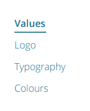

| Key | Type |
|---|---|
| `smintio-ui-generic-side-menu-1` | `ui-type-side-menu` |

*Additional properties come from the shared mixins:* `SCssProps`, `SLayoutProps`, `SMenuItemsProps`, `SUiComponentColorsProps`

#### Props

| Prop name | Type | Default | Description |
|---|---|---|---|
| `menuItems` | `IMenuItem[]` |  | **Menu items**    The menu items to display.    *Values offered by:* `MenuItemResourceAllowedValuesProvider` |
| `minWidth` | `number` |  | **Minimum width in pixels**    *Min value:* `0` |
| `verticalAlignment` | `string` | `"middle"` | **Vertical alignment**    *Allowed values:* `"top", "middle"` |

---

### Text block

This component displays a text block with header, sub header and continuous text.

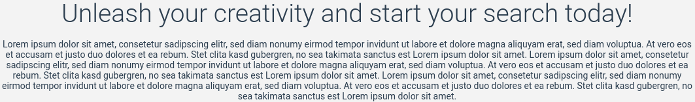

| Key | Type |
|---|---|
| `smintio-ui-generic-text-1` | `ui-type-text` |

*Additional properties come from the shared mixins:* `SBottomGapProps`, `SHtmlProps`, `SLinkButtonProps`, `STextProps`, `SUiComponentColorsProps`

#### Props

| Prop name | Type | Default | Description |
|---|---|---|---|
| `textWidth` | `number` | `100` | **Width (desktop)**    *Allowed values:* `25, 33, 50, 66, 75, 100` |
| `textWidthMobile` | `number` | `-1` | **Width (mobile)**    *Allowed values:* `-1, 25, 33, 50, 66, 75, 100` |
| `textPosition` | `string` | `"center"` | **Alignment**    *Allowed values:* `"left", "center", "right"` |

---

### Text block with up to 3 columns

This component displays a text block with up to 3 columns.

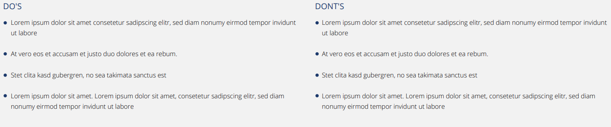

| Key | Type |
|---|---|
| `smintio-ui-generic-text-columns-1` | `ui-type-text` |

*Additional properties come from the shared mixins:* `SBottomGapProps`, `SHtmlProps`, `SUiComponentColorsProps`

#### Props

| Prop name | Type | Default | Description |
|---|---|---|---|
| `numberOfColumns` | `number` | `3` | **Number of columns**    *Allowed values:* `1, 2, 3` |
| `useSingleHeader` | `boolean` | `false` | **Use same header for all columns** |
| `headerText` | `ILocalizedStringsModel` |  | **Header**    *Used IF:* `useSingleHeader Equal true` |
| `subHeaderText` | `ILocalizedStringsModel` |  | **Sub header**    *Used IF:* `useSingleHeader Equal true` |
| `alignment` | `string` | `"left"` | **Alignment**    *Allowed values:* `"left", "center", "right"`    *Used IF:* `useSingleHeader Equal true` |
| `headerTextC1` | `ILocalizedStringsModel` |  | **Header**    *Used IF:* `useSingleHeader Equal false` |
| `subHeaderTextC1` | `ILocalizedStringsModel` |  | **Sub header**    *Used IF:* `useSingleHeader Equal false` |
| `continuousTextC1` | `ILocalizedStringsModel` |  | **Continuous text** |
| `headerTextC2` | `ILocalizedStringsModel` |  | **Header**    *Used IF:* `numberOfColumns GreaterThanOrEqual 2`    *Used IF:* `useSingleHeader Equal false` |
| `subHeaderTextC2` | `ILocalizedStringsModel` |  | **Sub header**    *Used IF:* `numberOfColumns GreaterThanOrEqual 2`    *Used IF:* `useSingleHeader Equal false` |
| `continuousTextC2` | `ILocalizedStringsModel` |  | **Continuous text**    *Used IF:* `numberOfColumns GreaterThanOrEqual 2` |
| `headerTextC3` | `ILocalizedStringsModel` |  | **Header**    *Used IF:* `numberOfColumns Equal 3`    *Used IF:* `useSingleHeader Equal false` |
| `subHeaderTextC3` | `ILocalizedStringsModel` |  | **Sub header**    *Used IF:* `numberOfColumns Equal 3`    *Used IF:* `useSingleHeader Equal false` |
| `continuousTextC3` | `ILocalizedStringsModel` |  | **Continuous text**    *Used IF:* `numberOfColumns Equal 3` |
| `alignmentC1` | `string` | `"left"` | **Alignment**    *Allowed values:* `"left", "center", "right"` |
| `alignmentC2` | `string` | `"left"` | **Alignment**    *Allowed values:* `"left", "center", "right"`    *Used IF:* `numberOfColumns GreaterThanOrEqual 2` |
| `alignmentC3` | `string` | `"left"` | **Alignment**    *Allowed values:* `"left", "center", "right"`    *Used IF:* `numberOfColumns Equal 3` |
| `columnGap` | `string` | `"default"` | **Gap between columns**    *Allowed values:* `"default", "medium", "large"` |

---

### Asset upload form

This component displays an upload form for assets.

| Key | Type |
|---|---|
| `smintio-ui-generic-upload-assets-form-1` | `ui-type-upload-form` |

*Additional properties come from the shared mixins:* `SCssProps`, `SDataSourceProps`, `STextsProps`

#### Props

| Prop name | Type | Default | Description |
|---|---|---|---|
| `assetsUpload` | `IAssetsUpload` |  | **Upload assets data source**    The data source to use to upload the assets. |
| `taskManagement` | `ITaskManagement` |  | **Task handling data source**    The data source to use for handling the asset upload. |
| `uploadAssetsTaskHandlerId` | `string` |  | **Asset upload process**    Please choose the desired process for handling the asset upload.    *Values offered by:* `UploadAssetsTaskHandlerAllowedValuesProvider` |
| `uploadAssetsButtonCancelText` | `ILocalizedStringsModel` | `"button_cancel"` | **Cancel button text**    *Values offered by:* `StringResourceAllowedValuesProvider`    *Advanced setting* |
| `uploadAssetsIsBeingReviewedText` | `ILocalizedStringsModel` | `"text_upload_assets_is_being_reviewed"` | **Upload is being reviewed text**    This text will be shown, when the asset upload has been sent, but the asset upload neeeds to be reviewed first.    *Values offered by:* `TextResourceAllowedValuesProvider` |
| `uploadAssetsImmediatelyDoneText` | `ILocalizedStringsModel` | `"text_upload_assets_immediately_done"` | **Upload done text**    This text will be shown, when the asset upload has been completed immediately.    *Values offered by:* `StringResourceAllowedValuesProvider`    *Advanced setting* |
| `uploadFormFailedToLoadText` | `ILocalizedStringsModel` | `"text_upload_form_failed_to_load"` | **Upload form failed to load text**    *Values offered by:* `StringResourceAllowedValuesProvider`    *Advanced setting* |
| `uploadDataSourceNotEnabledText` | `ILocalizedStringsModel` | `"text_upload_data_source_not_configured"` | **Upload assets data source not configured text**    *Values offered by:* `StringResourceAllowedValuesProvider`    *Advanced setting* |
| `assetUploadsInProgressText` | `ILocalizedStringsModel` | `"text_asset_uploads_in_progress"` | **Number of asset uploads in progress text**    *Values offered by:* `StringResourceAllowedValuesProvider`    *Advanced setting* |
| `assetUploadsSuccessfullyFinishedText` | `ILocalizedStringsModel` | `"text_asset_uploads_successfully_finished"` | **Number of assets successfully uploaded text**    *Values offered by:* `StringResourceAllowedValuesProvider`    *Advanced setting* |
| `assetUploadsFailedText` | `ILocalizedStringsModel` | `"text_asset_uploads_failed"` | **Number of failed asset uploads**    *Values offered by:* `StringResourceAllowedValuesProvider`    *Advanced setting* |
| `maxFileCountReachedText` | `ILocalizedStringsModel` | `"text_max_file_count_reached"` | **Maximum file count reached text**    *Values offered by:* `StringResourceAllowedValuesProvider`    *Advanced setting* |
| `imageWidthTooSmallText` | `ILocalizedStringsModel` | `"text_image_not_wide_enough"` | **Image not wide enough text**    *Values offered by:* `StringResourceAllowedValuesProvider`    *Advanced setting* |
| `imageHeightTooSmallText` | `ILocalizedStringsModel` | `"text_image_not_tall_enough"` | **Image not tall enough text**    *Values offered by:* `StringResourceAllowedValuesProvider`    *Advanced setting* |
| `imageWidthTooLargeText` | `ILocalizedStringsModel` | `"text_image_too_wide"` | **Image too wide text**    *Values offered by:* `StringResourceAllowedValuesProvider`    *Advanced setting* |
| `imageHeightTooLargeText` | `ILocalizedStringsModel` | `"text_image_too_tall"` | **Image too tall text**    *Values offered by:* `StringResourceAllowedValuesProvider`    *Advanced setting* |
| `imageCannotBeDecodedText` | `ILocalizedStringsModel` | `"text_image_cannot_be_decoded"` | **Image could not be decoded text**    *Values offered by:* `StringResourceAllowedValuesProvider`    *Advanced setting* |
| `uploadFailedText` | `ILocalizedStringsModel` | `"text_file_upload_failed"` | **The file upload failed text**    *Values offered by:* `StringResourceAllowedValuesProvider`    *Advanced setting* |
| `imageFileSizeExceededText` | `ILocalizedStringsModel` | `"text_file_size_exceeded"` | **Image file size exceeded text**    *Values offered by:* `StringResourceAllowedValuesProvider`    *Advanced setting* |
| `videoFileSizeExceededText` | `ILocalizedStringsModel` | `"text_file_size_exceeded"` | **Video file size exceeded text**    *Values offered by:* `StringResourceAllowedValuesProvider`    *Advanced setting* |
| `audioFileSizeExceededText` | `ILocalizedStringsModel` | `"text_file_size_exceeded"` | **Audio file size exceeded text**    *Values offered by:* `StringResourceAllowedValuesProvider`    *Advanced setting* |
| `documentFileSizeExceededText` | `ILocalizedStringsModel` | `"text_file_size_exceeded"` | **Document file size exceeded text**    *Values offered by:* `StringResourceAllowedValuesProvider`    *Advanced setting* |
| `fileSizeExceededText` | `ILocalizedStringsModel` | `"text_file_size_exceeded"` | **File size exceeded text**    *Values offered by:* `StringResourceAllowedValuesProvider`    *Advanced setting* |
| `imagesNotAllowedText` | `ILocalizedStringsModel` | `"text_file_type_not_allowed"` | **Image upload not allowed text**    *Values offered by:* `StringResourceAllowedValuesProvider`    *Advanced setting* |
| `videosNotAllowedText` | `ILocalizedStringsModel` | `"text_file_type_not_allowed"` | **Video upload not allowed text**    *Values offered by:* `StringResourceAllowedValuesProvider`    *Advanced setting* |
| `audioFilesNotAllowedText` | `ILocalizedStringsModel` | `"text_file_type_not_allowed"` | **Audio file upload not allowed text**    *Values offered by:* `StringResourceAllowedValuesProvider`    *Advanced setting* |
| `documentsNotAllowedText` | `ILocalizedStringsModel` | `"text_file_type_not_allowed"` | **Document upload not allowed text**    *Values offered by:* `StringResourceAllowedValuesProvider`    *Advanced setting* |
| `fileTypeNotAllowedText` | `ILocalizedStringsModel` | `"text_file_type_not_allowed"` | **File type not allowed text**    *Values offered by:* `StringResourceAllowedValuesProvider`    *Advanced setting* |
| `buttonCloseText` | `ILocalizedStringsModel` | `"button_close"` | **Close button text**    *Values offered by:* `StringResourceAllowedValuesProvider`    *Advanced setting* |

---

### Video

This component displays a video.

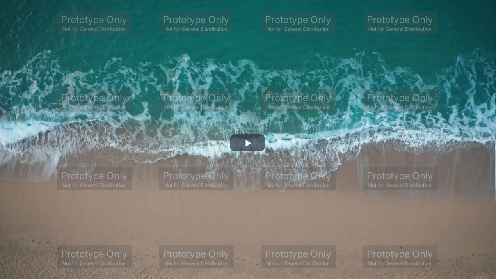

| Key | Type |
|---|---|
| `smintio-ui-generic-video-1` | `ui-type-video` |

*Additional properties come from the shared mixins:* `SBottomGapProps`, `SDownloadProps`, `SHtmlProps`, `SRememberProps`, `SShareProps`, `SUiComponentColorsProps`

#### Props

| Prop name | Type | Default | Description |
|---|---|---|---|
| `videoType` | `string` | `"resource"` | **Type**    *Allowed values:* `"asset", "resource", "youtube"` |
| `videoResource` | `IVideo` |  | **Video from resources**    *Values offered by:* `VideoResourceAllowedValuesProvider`    *Used IF:* `videoType Equal "resource"` |
| `assetIdentifier` | `IAssetIdentifier` |  | **Video asset**    *Values offered by:* `AssetIdAllowedValuesProvider`    *Used IF:* `videoType Equal "asset"` |
| `youtubeVideoIdentifier` | `string` |  | **YouTube video identifier**    *Used IF:* `videoType Equal "youtube"` |
| `displayAssetName` | `boolean` | `false` | **Display video name below video**    *Used IF:* `videoType Equal "asset"` |
| `allowAssetUserInteraction` | `boolean` | `false` | **Allow user interaction with the asset (collect, share & download)**    *Used IF:* `videoType Equal "asset"` |
| `videoShadow` | `string` | `"none"` | **Shadow**    *Allowed values:* `"none", "light", "strong"` |
| `videoPosterImage` | `IImage` |  | **Video poster image**    *Values offered by:* `ImageResourceAllowedValuesProvider`    *Used IF:* `videoType NotEqual "youtube"` |
| `autoPlayVideo` | `boolean` | `false` | **Auto play video** |
| `muteVideo` | `boolean` | `false` | **Initially mute video**    *Used IF:* `autoPlayVideo Equal false` |
| `showVideoControls` | `boolean` | `true` | **Show video controls**    *Used IF:* `autoPlayVideo Equal true`    *Used IF:* `videoType NotEqual "youtube"` |
| `loopVideo` | `boolean` | `false` | **Loop video** |
| `ignorePlayerSize` | `boolean` | `false` | **Do not consider the player display size for streaming optimization**    When streaming a video, by default the video resolution will be optimized to the available bandwidth and the player display size. If you want to consider only the available bandwidth for the selection process, please enable this option.    *Used IF:* `videoType NotEqual "youtube"` |
| `videoWidth` | `number` | `75` | **Width (desktop)**    *Allowed values:* `50, 58, 66, 75, 83, 92, 100, 105, 110, 120` |
| `videoWidthMobile` | `number` | `-1` | **Width (mobile)**    *Allowed values:* `-1, 50, 58, 66, 75, 83, 92, 100, 105, 110, 120` |
| `videoAlignment` | `string` | `"center"` | **Alignment**    *Allowed values:* `"left", "center", "right"` |

---

## Section components

### End of section

This component ends a section.

| Key | Type |
|---|---|
| `smintio-ui-generic-section-end-1` | `ui-type-section` |

This component has no own configuration properties.

---

### Start conditional section

This component starts a conditional section.

| Key | Type |
|---|---|
| `smintio-ui-generic-section-start-conditional-1` | `ui-type-section` |

*Additional properties come from the shared mixins:* `SBottomGapProps`, `SHtmlProps`, `SUiComponentColorsProps`

#### Props

| Prop name | Type | Default | Description |
|---|---|---|---|
| `showOnlyIfAttributeList` | `IMetadataAttributeModel[]` |  | **Only show with attributes (asset context required)**    If you only want to show this section if an asset is present, that has a certain metadata attribute set to certain values, please select the metadata attributes that should be analyzed. If at least one of the attribute values is set to at least one of the values given in the setting &lt;i&gt;Only show with attribute values&lt;/i&gt;, or - if no such value is given, at least one of the attribute values is set to any non-empty and non-false value - the section will be rendered.    *Values offered by:* `MetadataAttributeAllowedValuesProvider` |
| `showOnlyIfAttributeValues` | `string[]` |  | **Only show with attribute values**    Please give optional attribute values (see help for &lt;i&gt;Only show with attributes&lt;/i&gt; for more information). |
| `showOnlyIfAttributeInverted` | `boolean` |  | **Invert condition**    If you check this box, the above condition must NOT be satisfied for the section to be shown |
| `showOnlyIfMemberOfUserGroupUuids` | `string[]` |  | **Show only when member of portal user groups**    Render the section only if the user is member of one of these portal user groups.    *Values offered by:* `PortalUserGroupAllowedValuesProvider` |
| `showOnlyIfMemberOfUserGroupUuidsInverted` | `boolean` |  | **Invert condition**    If you check this box, the above condition must NOT be satisfied for the section to be shown |
| `widthDesktop` | `number` | `100` | **Width (desktop)**    *Allowed values:* `50, 66, 75, 100` |
| `widthMobile` | `number` | `-1` | **Width (mobile)**    *Allowed values:* `-1, 50, 66, 75, 100` |
| `position` | `string` | `"center"` | **Alignment**    *Allowed values:* `"left", "center", "right"` |

---

### Start expansion panel section

This component starts an expansion panel section.

| Key | Type |
|---|---|
| `smintio-ui-generic-section-start-expansion-panel-1` | `ui-type-section` |

*Additional properties come from the shared mixins:* `SBottomGapProps`, `SHtmlProps`, `SUiComponentColorsProps`

#### Props

| Prop name | Type | Default | Description |
|---|---|---|---|
| `headerText` | `ILocalizedStringsModel` |  | **Panel text** |
| `headerAlignment` | `string` | `"left"` | **Alignment of text**    *Allowed values:* `"left", "center", "right"` |
| `expandedByDefault` | `boolean` |  | **Expanded by default**    Check this to make the expansion panel expanded by default. |
| `gapWithinFlap` | `string` | `"default"` | **Gap within flap**    *Allowed values:* `"default", "medium", "large", "xlarge"` |
| `gapWithinContentArea` | `string` | `"default"` | **Gap within content area**    *Allowed values:* `"none", "default", "medium", "large", "xlarge", "xxlarge"` |
| `border` | `number` | `1` | **Border**    *Allowed values:* `0, 1, 2, 3, 4` |
| `borderColor` | `string` |  | **Border color**    *Used IF:* `border GreaterThanOrEqual 1` |
| `withinPanelBackgroundColor` | `string` |  | **Background color** |
| `shadow` | `string` | `"none"` | **Shadow**    *Allowed values:* `"none", "light", "strong"` |
| `widthDesktop` | `number` | `100` | **Width (desktop)**    *Allowed values:* `50, 66, 75, 100` |
| `widthMobile` | `number` | `-1` | **Width (mobile)**    *Allowed values:* `-1, 50, 66, 75, 100` |
| `position` | `string` | `"center"` | **Alignment**    *Allowed values:* `"left", "center", "right"` |

---

### Start tab panel section

This component starts an panel section with tabs.

| Key | Type |
|---|---|
| `smintio-ui-generic-section-start-tab-panel-1` | `ui-type-section` |

*Additional properties come from the shared mixins:* `SBottomGapProps`, `SHtmlProps`, `STextsProps`, `SUiComponentColorsProps`

#### Props

| Prop name | Type | Default | Description |
|---|---|---|---|
| `numberOfTabs` | `number` | `1` | **Number of tabs**    *Allowed values:* `1, 2, 3, 4, 5, 6, 7, 8` |
| `tab1Text` | `ILocalizedStringsModel` |  | **Tab 1 text** |
| `tab2Text` | `ILocalizedStringsModel` |  | **Tab 2 text**    *Used IF:* `numberOfTabs GreaterThan 1` |
| `tab3Text` | `ILocalizedStringsModel` |  | **Tab 3 text**    *Used IF:* `numberOfTabs GreaterThan 2` |
| `tab4Text` | `ILocalizedStringsModel` |  | **Tab 4 text**    *Used IF:* `numberOfTabs GreaterThan 3` |
| `tab5Text` | `ILocalizedStringsModel` |  | **Tab 5 text**    *Used IF:* `numberOfTabs GreaterThan 4` |
| `tab6Text` | `ILocalizedStringsModel` |  | **Tab 6 text**    *Used IF:* `numberOfTabs GreaterThan 5` |
| `tab7Text` | `ILocalizedStringsModel` |  | **Tab 7 text**    *Used IF:* `numberOfTabs GreaterThan 6` |
| `tab8Text` | `ILocalizedStringsModel` |  | **Tab 8 text**    *Used IF:* `numberOfTabs GreaterThan 7` |
| `grow` | `boolean` | `false` | **Grow tabs to full width** |
| `textAlignment` | `string` | `"left"` | **Alignment of text**    *Allowed values:* `"left", "center", "right"` |
| `gapWithinTab` | `string` | `"default"` | **Gap within tab**    *Allowed values:* `"default", "medium", "large", "xlarge"` |
| `gapWithinContentArea` | `string` | `"default"` | **Gap within content area**    *Allowed values:* `"none", "default", "medium", "large", "xlarge", "xxlarge"` |
| `border` | `number` | `1` | **Border**    *Allowed values:* `0, 1, 2, 3, 4` |
| `borderColor` | `string` |  | **Border color**    *Used IF:* `border GreaterThanOrEqual 1` |
| `withinPanelBackgroundColor` | `string` |  | **Background color** |
| `shadow` | `string` | `"none"` | **Shadow**    *Allowed values:* `"none", "light", "strong"` |
| `widthDesktop` | `number` | `100` | **Width (desktop)**    *Allowed values:* `50, 66, 75, 100` |
| `widthMobile` | `number` | `-1` | **Width (mobile)**    *Allowed values:* `-1, 50, 66, 75, 100` |
| `position` | `string` | `"center"` | **Alignment**    *Allowed values:* `"left", "center", "right"` |

---

### Start table section

This component starts a table section.

| Key | Type |
|---|---|
| `smintio-ui-generic-section-start-table-1` | `ui-type-section` |

*Additional properties come from the shared mixins:* `SBottomGapProps`, `SHtmlProps`, `SUiComponentColorsProps`

#### Props

| Prop name | Type | Default | Description |
|---|---|---|---|
| `numberOfColumns` | `number` | `3` | **Number of columns**    *Allowed values:* `1, 2, 3, 4` |
| `firstRowIsHeader` | `boolean` | `false` | **First row is header**    *Used IF:* `numberOfColumns GreaterThan 1` |
| `firstColumnIsRowDescription` | `boolean` | `false` | **First column is row description**    *Used IF:* `numberOfColumns GreaterThan 1` |
| `topLeftCellIsEmpty` | `boolean` | `false` | **Top left cell is empty**    *Used IF:* `numberOfColumns GreaterThan 1` |
| `widthDesktopC1` | `number` | `0` | **Width (desktop)**    *Allowed values:* `0, 12, 11, 10, 9, 8, 7, 6, 5, 4, 3, 2, 1` |
| `widthMobileC1` | `number` | `0` | **Width (mobile)**    *Allowed values:* `0, 12, 11, 10, 9, 8, 7, 6, 5, 4, 3, 2, 1, -1` |
| `withinCellGapC1` | `string` | `"default"` | **Gap within cells**    *Allowed values:* `"none", "default", "medium", "large", "xlarge", "xxlarge"` |
| `cellContentVerticalAlignmentC1` | `string` | `"top"` | **Vertical alignment of cell content**    *Allowed values:* `"top", "middle", "bottom"` |
| `widthDesktopC2` | `number` | `0` | **Width (desktop)**    *Allowed values:* `0, 12, 11, 10, 9, 8, 7, 6, 5, 4, 3, 2, 1`    *Used IF:* `numberOfColumns GreaterThanOrEqual 2` |
| `widthMobileC2` | `number` | `0` | **Width (mobile)**    *Allowed values:* `0, 12, 11, 10, 9, 8, 7, 6, 5, 4, 3, 2, 1, -1`    *Used IF:* `numberOfColumns GreaterThanOrEqual 2` |
| `withinCellGapC2` | `string` | `"default"` | **Gap within cells**    *Allowed values:* `"none", "default", "medium", "large", "xlarge", "xxlarge"`    *Used IF:* `numberOfColumns GreaterThanOrEqual 2` |
| `cellContentVerticalAlignmentC2` | `string` | `"top"` | **Vertical alignment of cell content**    *Allowed values:* `"top", "middle", "bottom"`    *Used IF:* `numberOfColumns GreaterThanOrEqual 2` |
| `widthDesktopC3` | `number` | `0` | **Width (desktop)**    *Allowed values:* `0, 12, 11, 10, 9, 8, 7, 6, 5, 4, 3, 2, 1`    *Used IF:* `numberOfColumns GreaterThanOrEqual 3` |
| `widthMobileC3` | `number` | `0` | **Width (mobile)**    *Allowed values:* `0, 12, 11, 10, 9, 8, 7, 6, 5, 4, 3, 2, 1, -1`    *Used IF:* `numberOfColumns GreaterThanOrEqual 3` |
| `withinCellGapC3` | `string` | `"default"` | **Gap within cells**    *Allowed values:* `"none", "default", "medium", "large", "xlarge", "xxlarge"`    *Used IF:* `numberOfColumns GreaterThanOrEqual 3` |
| `cellContentVerticalAlignmentC3` | `string` | `"top"` | **Vertical alignment of cell content**    *Allowed values:* `"top", "middle", "bottom"`    *Used IF:* `numberOfColumns GreaterThanOrEqual 3` |
| `widthDesktopC4` | `number` | `0` | **Width (desktop)**    *Allowed values:* `0, 12, 11, 10, 9, 8, 7, 6, 5, 4, 3, 2, 1`    *Used IF:* `numberOfColumns Equal 4` |
| `widthMobileC4` | `number` | `0` | **Width (mobile)**    *Allowed values:* `0, 12, 11, 10, 9, 8, 7, 6, 5, 4, 3, 2, 1, -1`    *Used IF:* `numberOfColumns Equal 4` |
| `withinCellGapC4` | `string` | `"default"` | **Gap within cells**    *Allowed values:* `"none", "default", "medium", "large", "xlarge", "xxlarge"`    *Used IF:* `numberOfColumns Equal 4` |
| `cellContentVerticalAlignmentC4` | `string` | `"top"` | **Vertical alignment of cell content**    *Allowed values:* `"top", "middle", "bottom"`    *Used IF:* `numberOfColumns Equal 4` |
| `outerBorder` | `number` | `1` | **Outer border**    *Allowed values:* `0, 1, 2, 3, 4` |
| `horizontalBorders` | `number` | `1` | **Horizontal borders**    *Allowed values:* `0, 1, 2, 3, 4` |
| `verticalBorders` | `number` | `1` | **Vertical borders**    *Allowed values:* `0, 1, 2, 3, 4` |
| `outerBorderColor` | `string` |  | **Outer border color**    *Used IF:* `outerBorder GreaterThanOrEqual 1` |
| `horizontalBordersColor` | `string` |  | **Horizontal borders color**    *Used IF:* `horizontalBorders GreaterThanOrEqual 1` |
| `verticalBordersColor` | `string` |  | **Vertical borders color**    *Used IF:* `verticalBorders GreaterThanOrEqual 1` |
| `shadow` | `string` | `"none"` | **Shadow**    *Allowed values:* `"none", "light", "strong"` |
| `widthDesktop` | `number` | `100` | **Width (desktop)**    *Allowed values:* `50, 66, 75, 100` |
| `widthMobile` | `number` | `-1` | **Width (mobile)**    *Allowed values:* `-1, 50, 66, 75, 100` |
| `position` | `string` | `"center"` | **Alignment**    *Allowed values:* `"left", "center", "right"` |

---

## Login and account components

### Accept terms form

| Key | Type |
|---|---|
| `smintio-ui-generic-account-accept-terms-form-1` | `ui-type-account-accept-terms-form` |

*Additional properties come from the shared mixins:* `SCssProps`, `SLinksProps`, `STextsProps`

#### Props

| Prop name | Type | Default | Description |
|---|---|---|---|
| `acceptTermsAndConditionsHeaderText` | `ILocalizedStringsModel` | `"accept_terms_text_header"` | **Header**    *Values offered by:* `StringResourceAllowedValuesProvider` |
| `acceptTermsAndConditionsContinuousText` | `ILocalizedStringsModel` | `"accept_terms_text_continuous"` | **Continuous text**    *Values offered by:* `TextResourceAllowedValuesProvider` |
| `acceptTermsAndConditionsText` | `ILocalizedStringsModel` | `"accept_terms_and_conditions_text"` | **Accept terms and conditions checkbox text**    *Values offered by:* `StringResourceAllowedValuesProvider` |
| `acceptTermsAndConditionsLinkText` | `ILocalizedStringsModel` | `"text_terms_and_conditions"` | **Accept terms and conditions link text**    *Values offered by:* `StringResourceAllowedValuesProvider` |
| `acceptPrivacyPolicyText` | `ILocalizedStringsModel` | `"accept_privacy_policy_text"` | **Accept privacy policy checkbox text**    *Values offered by:* `StringResourceAllowedValuesProvider` |
| `acceptPrivacyPolicyLinkText` | `ILocalizedStringsModel` | `"text_privacy_policy"` | **Accept privacy policy link text**    *Values offered by:* `StringResourceAllowedValuesProvider` |
| `submitButtonText` | `ILocalizedStringsModel` | `"button_submit"` | **Submit button text**    *Values offered by:* `StringResourceAllowedValuesProvider`    *Advanced setting* |
| `cancelButtonText` | `ILocalizedStringsModel` | `"button_cancel"` | **Cancel button text**    *Values offered by:* `StringResourceAllowedValuesProvider`    *Advanced setting* |
| `termsAndConditionsPage` | `IPageReference` | `"terms_and_conditions_page"` | **Terms and conditions page** |
| `privacyPolicyPage` | `IPageReference` | `"privacy_policy_page"` | **Privacy policy page** |

---

### Access denied display

| Key | Type |
|---|---|
| `smintio-ui-generic-account-access-denied-1` | `ui-type-account-access-denied-form` |

*Additional properties come from the shared mixins:* `SCssProps`

This component has no own configuration properties.

---

### Confirm email address form

| Key | Type |
|---|---|
| `smintio-ui-generic-account-confirm-email-1` | `ui-type-account-confirm-email-form` |

*Additional properties come from the shared mixins:* `SCssProps`, `STextsProps`

#### Props

| Prop name | Type | Default | Description |
|---|---|---|---|
| `emailConfirmedHeaderText` | `ILocalizedStringsModel` | `"text_email_confirmed_header"` | **Header**    *Values offered by:* `StringResourceAllowedValuesProvider`    *Advanced setting* |
| `emailConfirmedContinuousText` | `ILocalizedStringsModel` | `"text_email_confirmed_continuous"` | **Continuous text**    *Values offered by:* `TextResourceAllowedValuesProvider`    *Advanced setting* |
| `goToMainPageButtonText` | `ILocalizedStringsModel` | `"button_go_to_main_page"` | **Go to main page button text**    *Values offered by:* `StringResourceAllowedValuesProvider`    *Advanced setting* |
| `loginButtonText` | `ILocalizedStringsModel` | `"button_login"` | **Login button text**    *Values offered by:* `StringResourceAllowedValuesProvider`    *Advanced setting* |

---

### Cookie consent banner

| Key | Type |
|---|---|
| `smintio-ui-generic-account-cookie-consent-1` | `ui-type-account-cookie-consent` |

*Additional properties come from the shared mixins:* `SCssProps`, `SLinkProps`, `STextsProps`

#### Props

| Prop name | Type | Default | Description |
|---|---|---|---|
| `cookieConsentText` | `ILocalizedStringsModel` | `"cookie_consent_text"` | **Cookie consent text**    *Values offered by:* `TextResourceAllowedValuesProvider` |
| `cookieConsentLinkText` | `ILocalizedStringsModel` | `"text_privacy_policy"` | **Cookie consent link text**    *Values offered by:* `TextResourceAllowedValuesProvider` |
| `acceptButtonText` | `ILocalizedStringsModel` | `"button_accept"` | **Accept button text**    *Values offered by:* `StringResourceAllowedValuesProvider`    *Advanced setting* |
| `declineButtonText` | `ILocalizedStringsModel` | `"button_decline"` | **Decline button text**    *Values offered by:* `StringResourceAllowedValuesProvider`    *Advanced setting* |
| `privacyPolicyPage` | `IPageReference` | `"privacy_policy_page"` | **Privacy policy page** |

---

### Email confirmation message sent display

| Key | Type |
|---|---|
| `smintio-ui-generic-account-email-confirmation-sent-1` | `ui-type-account-email-confirmation-sent-form` |

*Additional properties come from the shared mixins:* `SCssProps`, `STextsProps`

#### Props

| Prop name | Type | Default | Description |
|---|---|---|---|
| `emailConfirmationSentHeaderText` | `ILocalizedStringsModel` | `"text_email_confirmation_sent_header"` | **Header**    *Values offered by:* `StringResourceAllowedValuesProvider`    *Advanced setting* |
| `emailConfirmationSentContinuousText` | `ILocalizedStringsModel` | `"text_email_confirmation_sent_continuous"` | **Continuous text**    *Values offered by:* `TextResourceAllowedValuesProvider`    *Advanced setting* |
| `goToLoginPageButtonText` | `ILocalizedStringsModel` | `"button_go_to_login_page"` | **Go to login page button text**    *Values offered by:* `StringResourceAllowedValuesProvider`    *Advanced setting* |

---

### Email address not yet confirmed display

| Key | Type |
|---|---|
| `smintio-ui-generic-account-email-not-confirmed-1` | `ui-type-account-email-not-confirmed-form` |

*Additional properties come from the shared mixins:* `SCssProps`, `STextsProps`

#### Props

| Prop name | Type | Default | Description |
|---|---|---|---|
| `emailNotConfirmedHeaderText` | `ILocalizedStringsModel` | `"text_email_not_confirmed_header"` | **Header**    *Values offered by:* `StringResourceAllowedValuesProvider`    *Advanced setting* |
| `emailNotConfirmedContinuousText` | `ILocalizedStringsModel` | `"text_email_not_confirmed_continuous"` | **Continuous text**    *Values offered by:* `TextResourceAllowedValuesProvider`    *Advanced setting* |
| `resendEmailConfirmationButtonText` | `ILocalizedStringsModel` | `"button_resend_email_confirmation"` | **Resend confirmation email button text**    *Values offered by:* `StringResourceAllowedValuesProvider`    *Advanced setting* |

---

### Forgot password form

| Key | Type |
|---|---|
| `smintio-ui-generic-account-forgot-password-1` | `ui-type-account-forgot-password-form` |

*Additional properties come from the shared mixins:* `SCssProps`, `STextsProps`

#### Props

| Prop name | Type | Default | Description |
|---|---|---|---|
| `forgotPasswordHeaderText` | `ILocalizedStringsModel` | `"text_forgot_password_header"` | **Header**    *Values offered by:* `StringResourceAllowedValuesProvider`    *Advanced setting* |
| `forgotPasswordContinuousText` | `ILocalizedStringsModel` | `"text_forgot_password_continuous"` | **Continuous text**    *Values offered by:* `TextResourceAllowedValuesProvider`    *Advanced setting* |
| `emailAddressText` | `ILocalizedStringsModel` | `"text_email_address"` | **Email address input text**    *Values offered by:* `StringResourceAllowedValuesProvider`    *Advanced setting* |
| `sendPasswordResetMessageButton` | `ILocalizedStringsModel` | `"button_send_password_reset_message"` | **Send password reset message button text**    *Values offered by:* `StringResourceAllowedValuesProvider`    *Advanced setting* |
| `goToLoginPageButtonText` | `ILocalizedStringsModel` | `"button_go_to_login_page"` | **To login page button text**    *Values offered by:* `StringResourceAllowedValuesProvider`    *Advanced setting* |

---

### Password reset message sent display

| Key | Type |
|---|---|
| `smintio-ui-generic-account-forgot-password-confirmation-1` | `ui-type-account-forgot-password-confirmation-form` |

*Additional properties come from the shared mixins:* `SCssProps`, `STextsProps`

#### Props

| Prop name | Type | Default | Description |
|---|---|---|---|
| `passwordResetMessageSentHeaderText` | `ILocalizedStringsModel` | `"text_password_reset_message_sent_header"` | **Header**    *Values offered by:* `StringResourceAllowedValuesProvider`    *Advanced setting* |
| `passwordResetMessageSentContinuousText` | `ILocalizedStringsModel` | `"text_password_reset_message_sent_continuous"` | **Continuous text**    *Values offered by:* `TextResourceAllowedValuesProvider`    *Advanced setting* |
| `goToLoginPageButtonText` | `ILocalizedStringsModel` | `"button_go_to_login_page"` | **Go to login page button text**    *Values offered by:* `StringResourceAllowedValuesProvider`    *Advanced setting* |

---

### Accept or decline invitation to collection form

| Key | Type |
|---|---|
| `smintio-ui-generic-account-invitation-collection-1` | `ui-type-account-invitation-collection-form` |

*Additional properties come from the shared mixins:* `SCssProps`

#### Props

| Prop name | Type | Default | Description |
|---|---|---|---|
| `collectionInvitationHeaderText` | `ILocalizedStringsModel` | `"collection_invitation_text_invitation_header"` | **Header**    *Values offered by:* `StringResourceAllowedValuesProvider`    *Advanced setting* |
| `collectionInvitationContinuousText` | `ILocalizedStringsModel` | `"collection_invitation_text_invitation_continuous"` | **Continuous text**    *Values offered by:* `TextResourceAllowedValuesProvider`    *Advanced setting* |
| `collectionInvitationMessageText` | `ILocalizedStringsModel` | `"collection_invitation_text_message"` | **Message input text**    *Values offered by:* `StringResourceAllowedValuesProvider`    *Advanced setting* |
| `acceptInvitationButtonText` | `ILocalizedStringsModel` | `"button_accept_invitation"` | **Accept button text**    *Values offered by:* `StringResourceAllowedValuesProvider`    *Advanced setting* |
| `declineInvitationButtonText` | `ILocalizedStringsModel` | `"button_decline_invitation"` | **Decline button text**    *Values offered by:* `StringResourceAllowedValuesProvider`    *Advanced setting* |
| `collectionInvitationAcceptedHeaderText` | `ILocalizedStringsModel` | `"collection_invitation_text_accepted_header"` | **Header**    *Values offered by:* `StringResourceAllowedValuesProvider`    *Advanced setting* |
| `collectionInvitationAcceptedContinuousText` | `ILocalizedStringsModel` | `"collection_invitation_text_accepted_continuous"` | **Continuous text**    *Values offered by:* `TextResourceAllowedValuesProvider`    *Advanced setting* |
| `goToCollectionButtonText` | `ILocalizedStringsModel` | `"button_go_to_collection"` | **Show collection button text**    *Values offered by:* `StringResourceAllowedValuesProvider`    *Advanced setting* |
| `collectionDetailPage` | `IPageReference` | `"collection_details_page"` | **Collection detail page**    Choose a reference to the customizable collection detail page. |
| `collectionInvitationDeclinedHeaderText` | `ILocalizedStringsModel` | `"collection_invitation_text_declined_header"` | **Header**    *Values offered by:* `StringResourceAllowedValuesProvider`    *Advanced setting* |
| `collectionInvitationDeclinedContinuousText` | `ILocalizedStringsModel` | `"collection_invitation_text_declined_continuous"` | **Continuous text**    *Values offered by:* `TextResourceAllowedValuesProvider`    *Advanced setting* |
| `goToMainPageButtonText` | `ILocalizedStringsModel` | `"button_go_to_main_page"` | **Go to main page button text**    *Values offered by:* `StringResourceAllowedValuesProvider`    *Advanced setting* |

---

### Login form

| Key | Type |
|---|---|
| `smintio-ui-generic-account-login-1` | `ui-type-account-login-form` |

*Additional properties come from the shared mixins:* `SCssProps`, `STextsProps`

#### Props

| Prop name | Type | Default | Description |
|---|---|---|---|
| `style` | `string` | `"default"` | **Style**    *Allowed values:* `"default", "choice"` |
| `loginHeaderText` | `ILocalizedStringsModel` | `"text_login_header"` | **Header**    *Values offered by:* `StringResourceAllowedValuesProvider` |
| `loginContinuousText` | `ILocalizedStringsModel` | `"text_login_continuous"` | **Continuous text**    *Values offered by:* `TextResourceAllowedValuesProvider` |
| `pinLoginContinuousText` | `ILocalizedStringsModel` | `"text_pin_login_continuous"` | **Continuous text for PIN-based login**    *Values offered by:* `TextResourceAllowedValuesProvider` |
| `chooseLoginMethodContinuousText` | `ILocalizedStringsModel` | `"text_choose_login_method"` | **How do you want to log in continuous text**    *Values offered by:* `TextResourceAllowedValuesProvider` |
| `emailAddressText` | `ILocalizedStringsModel` | `"text_email_address"` | **Email address input text**    *Values offered by:* `StringResourceAllowedValuesProvider`    *Advanced setting* |
| `passwordText` | `ILocalizedStringsModel` | `"text_password"` | **Password input text**    *Values offered by:* `StringResourceAllowedValuesProvider`    *Advanced setting* |
| `pinText` | `ILocalizedStringsModel` | `"text_pin"` | **PIN input text**    *Values offered by:* `StringResourceAllowedValuesProvider`    *Advanced setting* |
| `rememberLoginText` | `ILocalizedStringsModel` | `"text_remember_login"` | **Remember login checkbox text**    *Values offered by:* `StringResourceAllowedValuesProvider`    *Advanced setting* |
| `loginButtonText` | `ILocalizedStringsModel` | `"button_login"` | **Login button text**    *Values offered by:* `StringResourceAllowedValuesProvider`    *Advanced setting* |
| `forgotPasswordText` | `ILocalizedStringsModel` | `"text_forgot_password"` | **Forgot password link text**    *Values offered by:* `StringResourceAllowedValuesProvider`    *Advanced setting* |
| `createNewAccountText` | `ILocalizedStringsModel` | `"text_create_new_account"` | **Register new user account link text**    *Values offered by:* `StringResourceAllowedValuesProvider` |
| `loginThroughSsoText` | `ILocalizedStringsModel` | `"text_login_through_sso"` | **Login through Single Sign-On link text**    *Values offered by:* `StringResourceAllowedValuesProvider` |
| `continueWithEmailAndPasswordText` | `ILocalizedStringsModel` | `"text_continue_with_email_and_password"` | **Continue with e-mail and password text**    *Values offered by:* `StringResourceAllowedValuesProvider` |
| `continueWithPinText` | `ILocalizedStringsModel` | `"text_continue_with_pin"` | **Continue with PIN text**    *Values offered by:* `StringResourceAllowedValuesProvider` |
| `requestAccessText` | `ILocalizedStringsModel` | `"text_request_access"` | **Request access link text**    *Values offered by:* `StringResourceAllowedValuesProvider` |

---

### Logout confirmation form

| Key | Type |
|---|---|
| `smintio-ui-generic-account-logout-1` | `ui-type-account-logout-form` |

*Additional properties come from the shared mixins:* `SCssProps`

#### Props

| Prop name | Type | Default | Description |
|---|---|---|---|
| `logoutHeaderText` | `ILocalizedStringsModel` | `"logout_text_logout_header"` | **Header**    *Values offered by:* `StringResourceAllowedValuesProvider`    *Advanced setting* |
| `logoutContinuousText` | `ILocalizedStringsModel` | `"logout_text_logout_continuous"` | **Continuous text**    *Values offered by:* `TextResourceAllowedValuesProvider`    *Advanced setting* |
| `logoutButtonText` | `ILocalizedStringsModel` | `"header_button_logout"` | **Logout button text**    *Values offered by:* `StringResourceAllowedValuesProvider`    *Advanced setting* |
| `cancelButtonText` | `ILocalizedStringsModel` | `"button_cancel"` | **Cancel button text**    *Values offered by:* `StringResourceAllowedValuesProvider`    *Advanced setting* |
| `loggedOutHeaderText` | `ILocalizedStringsModel` | `"logout_text_logged_out_header"` | **Header**    *Values offered by:* `StringResourceAllowedValuesProvider`    *Advanced setting* |
| `loggedOutContinuousText` | `ILocalizedStringsModel` | `"logout_text_logged_out_continuous"` | **Continuous text**    *Values offered by:* `TextResourceAllowedValuesProvider`    *Advanced setting* |

---

### Manage account form

| Key | Type |
|---|---|
| `smintio-ui-generic-account-manage-1` | `ui-type-account-manage-form` |

*Additional properties come from the shared mixins:* `SCssProps`, `STextsProps`

#### Props

| Prop name | Type | Default | Description |
|---|---|---|---|
| `accountManageHeaderText` | `ILocalizedStringsModel` | `"text_account_manage_header"` | **Header**    *Values offered by:* `StringResourceAllowedValuesProvider`    *Advanced setting* |
| `accountManageContinuousText` | `ILocalizedStringsModel` | `"text_account_manage_continuous"` | **Continuous text**    *Values offered by:* `TextResourceAllowedValuesProvider`    *Advanced setting* |
| `selfManagementIsNotAllowedText` | `ILocalizedStringsModel` | `"text_self_management_is_not_allowed"` | **Change in self service is not allowed text**    This text will be shown, when a user can not change the user details, because the user account is externally managed.    *Values offered by:* `TextResourceAllowedValuesProvider`    *Advanced setting* |
| `selfManagementIsPartlyAllowedText` | `ILocalizedStringsModel` | `"text_self_management_is_partly_allowed"` | **Change in self service is partially allowed text**    This text will be shown, when changing of one or more of the user detail fields has been disabled for the login system.    *Values offered by:* `TextResourceAllowedValuesProvider`    *Advanced setting* |
| `changePasswordLinkText` | `ILocalizedStringsModel` | `"text_change_password"` | **Change password link text**    *Values offered by:* `StringResourceAllowedValuesProvider`    *Advanced setting* |
| `emailAddressText` | `ILocalizedStringsModel` | `"text_email_address"` | **Email address input text**    *Values offered by:* `StringResourceAllowedValuesProvider`    *Advanced setting* |
| `emailAddressConfirmedText` | `ILocalizedStringsModel` | `"text_email_address_confirmed"` | **Email address is confirmed text**    *Values offered by:* `StringResourceAllowedValuesProvider`    *Advanced setting* |
| `emailAddressNotConfirmedText` | `ILocalizedStringsModel` | `"text_email_address_not_confirmed"` | **Email address is not confirmed text**    *Values offered by:* `StringResourceAllowedValuesProvider`    *Advanced setting* |
| `resendConfirmationEmailText` | `ILocalizedStringsModel` | `"text_resend_confirmation_email"` | **Resend confirmation email link text**    *Values offered by:* `StringResourceAllowedValuesProvider`    *Advanced setting* |
| `firstnameText` | `ILocalizedStringsModel` | `"text_first_name"` | **First name input text**    *Values offered by:* `StringResourceAllowedValuesProvider`    *Advanced setting* |
| `lastnameText` | `ILocalizedStringsModel` | `"text_last_name"` | **Last name input text**    *Values offered by:* `StringResourceAllowedValuesProvider`    *Advanced setting* |
| `organizationText` | `ILocalizedStringsModel` | `"text_organization"` | **Organization input text**    *Values offered by:* `StringResourceAllowedValuesProvider`    *Advanced setting* |
| `customIdentifierText` | `ILocalizedStringsModel` | `"text_custom_identifier"` | **Custom identifier input text**    *Values offered by:* `StringResourceAllowedValuesProvider`    *Advanced setting* |
| `phoneNumberText` | `ILocalizedStringsModel` | `"text_phone_number"` | **Phone number input text**    *Values offered by:* `StringResourceAllowedValuesProvider`    *Advanced setting* |
| `saveButtonText` | `ILocalizedStringsModel` | `"button_save"` | **Save button text**    *Values offered by:* `StringResourceAllowedValuesProvider`    *Advanced setting* |

---

### Change password form

| Key | Type |
|---|---|
| `smintio-ui-generic-account-manage-change-password-1` | `ui-type-account-manage-change-password-form` |

*Additional properties come from the shared mixins:* `SCssProps`, `STextsProps`

#### Props

| Prop name | Type | Default | Description |
|---|---|---|---|
| `changePasswordHeaderText` | `ILocalizedStringsModel` | `"text_change_password_header"` | **Header**    *Values offered by:* `StringResourceAllowedValuesProvider`    *Advanced setting* |
| `changePasswordContinuousText` | `ILocalizedStringsModel` | `"text_change_password_continuous"` | **Continuous text**    *Values offered by:* `TextResourceAllowedValuesProvider`    *Advanced setting* |
| `currentPasswordText` | `ILocalizedStringsModel` | `"text_current_password"` | **Current password input text**    *Values offered by:* `StringResourceAllowedValuesProvider`    *Advanced setting* |
| `newPasswordText` | `ILocalizedStringsModel` | `"text_new_password"` | **New password input text**    *Values offered by:* `StringResourceAllowedValuesProvider`    *Advanced setting* |
| `manageAccountLinkText` | `ILocalizedStringsModel` | `"text_manage_account"` | **Manage account link text**    *Values offered by:* `StringResourceAllowedValuesProvider`    *Advanced setting* |
| `changePasswordNotPossible` | `ILocalizedStringsModel` | `"text_change_password_not_possible"` | **Change password not possible text**    *Values offered by:* `StringResourceAllowedValuesProvider`    *Advanced setting* |
| `changePasswordButtonText` | `ILocalizedStringsModel` | `"button_change_password"` | **Change password button text**    *Values offered by:* `StringResourceAllowedValuesProvider`    *Advanced setting* |

---

### Manage cookie consent

| Key | Type |
|---|---|
| `smintio-ui-generic-account-manage-cookie-consent-1` | `ui-type-account-manage-cookie-consent` |

*Additional properties come from the shared mixins:* `SBottomGapProps`, `SCssProps`, `STextProps`

#### Props

| Prop name | Type | Default | Description |
|---|---|---|---|
| `cookieConsentCurrentlyGrantedText` | `ILocalizedStringsModel` | `"cookie_consent_granted"` | **Cookie consent currently granted text**    *Values offered by:* `TextResourceAllowedValuesProvider`    *Advanced setting* |
| `cookieConsentCurrentlyDeclinedText` | `ILocalizedStringsModel` | `"cookie_consent_declined"` | **Cookie consent currently declined text**    *Values offered by:* `TextResourceAllowedValuesProvider`    *Advanced setting* |
| `acceptButtonText` | `ILocalizedStringsModel` | `"button_grant_permission"` | **Accept button text**    *Values offered by:* `StringResourceAllowedValuesProvider`    *Advanced setting* |
| `declineButtonText` | `ILocalizedStringsModel` | `"button_withdraw_permission"` | **Decline button text**    *Values offered by:* `StringResourceAllowedValuesProvider`    *Advanced setting* |
| `textWidth` | `number` | `100` | **Width**    *Allowed values:* `25, 33, 50, 66, 75, 100` |
| `textPosition` | `string` | `"center"` | **Alignment**    *Allowed values:* `"left", "center", "right"`    *Used IF:* `textWidth LessThan 100` |

---

### Registration form

| Key | Type |
|---|---|
| `smintio-ui-generic-account-register-1` | `ui-type-account-register-form` |

*Additional properties come from the shared mixins:* `SCssProps`, `SLinksProps`, `STextsProps`

#### Props

| Prop name | Type | Default | Description |
|---|---|---|---|
| `registerHeaderText` | `ILocalizedStringsModel` | `"text_register_header"` | **Header**    *Values offered by:* `StringResourceAllowedValuesProvider` |
| `registerContinuousText` | `ILocalizedStringsModel` | `"text_register_continuous"` | **Continuous text**    *Values offered by:* `TextResourceAllowedValuesProvider` |
| `emailAddressText` | `ILocalizedStringsModel` | `"text_email_address"` | **Email address input text**    *Values offered by:* `StringResourceAllowedValuesProvider`    *Advanced setting* |
| `passwordText` | `ILocalizedStringsModel` | `"text_password"` | **Password input text**    *Values offered by:* `StringResourceAllowedValuesProvider`    *Advanced setting* |
| `firstnameText` | `ILocalizedStringsModel` | `"text_first_name"` | **First name input text**    *Values offered by:* `StringResourceAllowedValuesProvider`    *Advanced setting* |
| `lastnameText` | `ILocalizedStringsModel` | `"text_last_name"` | **Last name input text**    *Values offered by:* `StringResourceAllowedValuesProvider`    *Advanced setting* |
| `organizationText` | `ILocalizedStringsModel` | `"text_organization"` | **Organization input text**    *Values offered by:* `StringResourceAllowedValuesProvider`    *Advanced setting* |
| `customIdentifierText` | `ILocalizedStringsModel` | `"text_custom_identifier"` | **Custom identifier input text**    *Values offered by:* `StringResourceAllowedValuesProvider`    *Advanced setting* |
| `phoneNumberText` | `ILocalizedStringsModel` | `"text_phone_number"` | **Phone number input text**    *Values offered by:* `StringResourceAllowedValuesProvider`    *Advanced setting* |
| `acceptTermsAndConditionsText` | `ILocalizedStringsModel` | `"accept_terms_and_conditions_text"` | **Accept terms and conditions checkbox text**    *Values offered by:* `StringResourceAllowedValuesProvider` |
| `acceptTermsAndConditionsLinkText` | `ILocalizedStringsModel` | `"text_terms_and_conditions"` | **Accept terms and conditions link text**    *Values offered by:* `StringResourceAllowedValuesProvider` |
| `acceptPrivacyPolicyText` | `ILocalizedStringsModel` | `"accept_privacy_policy_text"` | **Accept privacy policy checkbox text**    *Values offered by:* `StringResourceAllowedValuesProvider` |
| `acceptPrivacyPolicyLinkText` | `ILocalizedStringsModel` | `"text_privacy_policy"` | **Accept privacy policy link text**    *Values offered by:* `StringResourceAllowedValuesProvider` |
| `registerButtonText` | `ILocalizedStringsModel` | `"button_register"` | **Register button text**    *Values offered by:* `StringResourceAllowedValuesProvider`    *Advanced setting* |
| `doYouAlreadyHaveLoginText` | `ILocalizedStringsModel` | `"text_do_you_already_have_login"` | **Do you already have login link text**    *Values offered by:* `StringResourceAllowedValuesProvider`    *Advanced setting* |
| `termsAndConditionsPage` | `IPageReference` | `"terms_and_conditions_page"` | **Terms and conditions page** |
| `privacyPolicyPage` | `IPageReference` | `"privacy_policy_page"` | **Privacy policy page** |

---

### Reset password form

| Key | Type |
|---|---|
| `smintio-ui-generic-account-reset-password-1` | `ui-type-account-reset-password-form` |

*Additional properties come from the shared mixins:* `SCssProps`, `STextsProps`

#### Props

| Prop name | Type | Default | Description |
|---|---|---|---|
| `resetPasswordHeaderText` | `ILocalizedStringsModel` | `"text_reset_password_header"` | **Header**    *Values offered by:* `StringResourceAllowedValuesProvider`    *Advanced setting* |
| `resetPasswordContinuousText` | `ILocalizedStringsModel` | `"text_reset_password_continuous"` | **Continuous text**    *Values offered by:* `TextResourceAllowedValuesProvider`    *Advanced setting* |
| `emailAddressText` | `ILocalizedStringsModel` | `"text_email_address"` | **Email address input text**    *Values offered by:* `StringResourceAllowedValuesProvider`    *Advanced setting* |
| `newPasswordText` | `ILocalizedStringsModel` | `"text_new_password"` | **New password input text**    *Values offered by:* `StringResourceAllowedValuesProvider`    *Advanced setting* |
| `resetPasswordButtonText` | `ILocalizedStringsModel` | `"button_reset_password"` | **Reset password button text**    *Values offered by:* `StringResourceAllowedValuesProvider`    *Advanced setting* |
| `loginText` | `ILocalizedStringsModel` | `"button_go_to_login_page"` | **Go to login page text**    *Values offered by:* `StringResourceAllowedValuesProvider`    *Advanced setting* |

---

### Password has been reset display

| Key | Type |
|---|---|
| `smintio-ui-generic-account-reset-password-confirmation-1` | `ui-type-account-reset-password-confirmation-form` |

*Additional properties come from the shared mixins:* `SCssProps`, `STextsProps`

#### Props

| Prop name | Type | Default | Description |
|---|---|---|---|
| `passwordHasBeenResetHeaderText` | `ILocalizedStringsModel` | `"text_password_has_been_reset_header"` | **Header**    *Values offered by:* `StringResourceAllowedValuesProvider`    *Advanced setting* |
| `passwordHasBeenResetContinuousText` | `ILocalizedStringsModel` | `"text_password_has_been_reset_continuous"` | **Continuous text**    *Values offered by:* `TextResourceAllowedValuesProvider`    *Advanced setting* |
| `goToLoginPageButtonText` | `ILocalizedStringsModel` | `"button_go_to_login_page"` | **Go to login page button text**    *Values offered by:* `StringResourceAllowedValuesProvider`    *Advanced setting* |

---

## Media gallery components

### Action bar for asset details view

This component displays an action bar on the asset details page.

| Key | Type |
|---|---|
| `smintio-ui-media-gallery-asset-details-action-bar-1` | `ui-type-asset-details-action-bar` |

*Additional properties come from the shared mixins:* `SCssProps`, `SDownloadProps`, `SRememberProps`, `SShareProps`

#### Props

| Prop name | Type | Default | Description |
|---|---|---|---|
| `buttonPreviousText` | `ILocalizedStringsModel` | `"button_previous_asset"` | **Previous asset button text**    If the user visits the asset details page from a search result, the user can use this button to directly browse to the previous asset in the search result.    *Values offered by:* `StringResourceAllowedValuesProvider`    *Advanced setting* |
| `buttonNextText` | `ILocalizedStringsModel` | `"button_next_asset"` | **Next asset button text**    If the user visits the asset details page from a search result, the user can use this button to directly browse to the next asset in the search result.    *Values offered by:* `StringResourceAllowedValuesProvider`    *Advanced setting* |
| `buttonBackToSearchText` | `ILocalizedStringsModel` | `"button_back_to_search"` | **Back to search button text**    *Values offered by:* `StringResourceAllowedValuesProvider`    *Advanced setting* |
| `buttonBackText` | `ILocalizedStringsModel` | `"button_back"` | **Back button text**    *Values offered by:* `StringResourceAllowedValuesProvider`    *Advanced setting* |

---

### Metadata viewer for side panels

This metadata viewer is specifically designed for use in side panels. It is vertically oriented, as it displays one metadata attribute per row. The metadata viewer can be expanded and collapsed by the user.

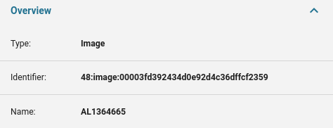

| Key | Type |
|---|---|
| `smintio-ui-media-gallery-asset-details-metadata-viewer-1` | `ui-type-asset-details-metadata-viewer` |

*Additional properties come from the shared mixins:* `SCssProps`

#### Props

| Prop name | Type | Default | Description |
|---|---|---|---|
| `headerText` | `ILocalizedStringsModel` |  | **Panel text** |
| `expandedByDefault` | `boolean` |  | **Expanded by default**    Check this to make the metadata viewer expansion panel expanded by default. |
| `metadataAttributeDisplayList` | `IMetadataAttributeModel[]` |  | **Attributes to display**    Please select all the metadata attributes that the user should see. If you specify no attributes, only the basic attributes of the asset will be displayed.    *Values offered by:* `MetadataAttributeAllowedValuesProvider` |

---

### Form based metadata viewer

This metadata viewer displays metadata attributes in a form-like manner. This is specifically useful if you want to nicely display numerous metadata attributes in the content section of an asset detail page.

| Key | Type |
|---|---|
| `smintio-ui-media-gallery-asset-details-metadata-viewer-2` | `ui-type-asset-details-metadata-viewer` |

*Additional properties come from the shared mixins:* `SBottomGapProps`, `SHtmlProps`, `STextsProps`, `SUiComponentColorsProps`

#### Props

| Prop name | Type | Default | Description |
|---|---|---|---|
| `metadataAttributeDisplayList` | `IMetadataAttributeModel[]` |  | **Attributes to display**    Please select all the metadata attributes that the user should see. If you specify no attributes, only the basic attributes of the asset will be displayed.    *Values offered by:* `MetadataAttributeAllowedValuesProvider` |
| `iterateDataObjectList` | `IMetadataAttributeModel` |  | **Iterate list of data objects**    If you want to iterate a list of data objects, please choose the appropriate metadata attribute here.    *Values offered by:* `DataObjectArrayMetadataAttributeAllowedValuesProvider` |
| `headerText` | `ILocalizedStringsModel` |  | **Header text** |
| `enableExpansionPanel` | `boolean` |  | **Enable expansion panel** |
| `headerText` | `ILocalizedStringsModel` |  | **Panel text**    *Used IF:* `enableExpansionPanel Equal true` |
| `expandedByDefault` | `boolean` |  | **Expanded by default**    Check this to make the metadata viewer expansion panel expanded by default.    *Used IF:* `enableExpansionPanel Equal true` |
| `showPlaceholder` | `boolean` | `false` | **Show placeholder if no attribute values are available** |
| `placeholderText` | `ILocalizedStringsModel` |  | **Placeholder text**    *Used IF:* `showPlaceholder Equal true` |
| `withinCellGap` | `string` | `"default"` | **Gap**    *Allowed values:* `"none", "default", "medium", "large"` |
| `widthDesktop` | `number` | `100` | **Width (desktop)**    *Allowed values:* `50, 66, 75, 100` |
| `widthMobile` | `number` | `-1` | **Width (mobile)**    *Allowed values:* `-1, 50, 66, 75, 100` |
| `position` | `string` | `"center"` | **Alignment**    *Allowed values:* `"left", "center", "right"` |

---

### Asset preview for asset details view

This component shows an asset preview on the asset detail page.

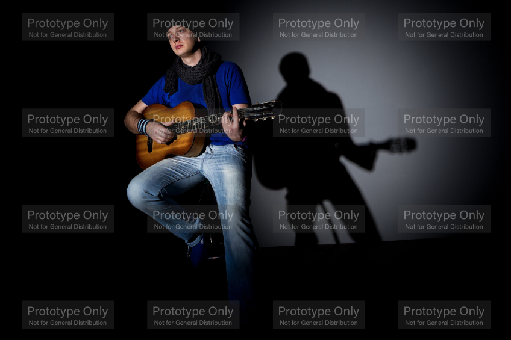

| Key | Type |
|---|---|
| `smintio-ui-media-gallery-asset-details-preview-1` | `ui-type-asset-details-preview` |

*Additional properties come from the shared mixins:* `SCssProps`, `SQuickViewProps`

This component has no own configuration properties.

---

### Metadata-based tag viewer for asset details view

This component shows metadata-based tags on the asset detail page.

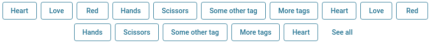

| Key | Type |
|---|---|
| `smintio-ui-media-gallery-asset-details-tag-viewer-1` | `ui-type-asset-details-tag-viewer` |

*Additional properties come from the shared mixins:* `SCssProps`, `STextsProps`

#### Props

| Prop name | Type | Default | Description |
|---|---|---|---|
| `keywordAttributeList` | `IMetadataAttributeModel[]` |  | **Tag attributes**    Please select all the metadata attributes that tags should be queried from. All the tags will then be added to one list in alphabetical order, duplicates being removed in the process.    *Values offered by:* `MetadataAttributeAllowedValuesProvider` |
| `automaticSplitting` | `boolean` | `true` | **Automatic splitting**    If automatic splitting is enabled, texts will be automatically split into individual keywords if separators (comma, semicolon) are being detected. |
| `buttonSeeAllText` | `ILocalizedStringsModel` | `"button_see_all"` | **See all button text**    This button can be used by the user to expand the tag viewer to show all available tags.    *Values offered by:* `StringResourceAllowedValuesProvider`    *Advanced setting* |

---

### Metadata-based text block for asset details view

This component displays a metadata-based text block with header, sub header and continuous text on the asset details page.

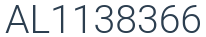

| Key | Type |
|---|---|
| `smintio-ui-media-gallery-asset-details-text-1` | `ui-type-asset-details-text` |

*Additional properties come from the shared mixins:* `SAssetDetailBottomGapProps`, `SHtmlProps`, `SUiComponentColorsProps`

#### Props

| Prop name | Type | Default | Description |
|---|---|---|---|
| `headerTextType` | `string` | `"none"` | **Source for header test**    *Allowed values:* `"none", "dynamic", "static"` |
| `nameAttribute` | `IMetadataAttributeModel[]` |  | **Header attributes**    Please select the metadata attributes that contain the header text. If you give no setting, defaults will be used.    *Values offered by:* `MetadataAttributeAllowedValuesProvider`    *Used IF:* `headerTextType Equal "dynamic"` |
| `capitalizeHeaderText` | `boolean` | `false` | **Capitalize header text**    *Used IF:* `headerTextType Equal "dynamic"` |
| `displayMultipleHeaderTexts` | `boolean` | `false` | **Display multiple header texts**    If more than one header text is found, display all texts instead of just the one first found.    *Used IF:* `headerTextType Equal "dynamic"` |
| `headerSeparationText` | `string` |  | **Text for separating multiple header texts**    *Used IF:* `headerTextType Equal "dynamic"`    *Used IF:* `displayMultipleHeaderTexts Equal true` |
| `headerText` | `ILocalizedStringsModel` |  | **Header**    *Used IF:* `headerTextType Equal "static"` |
| `subHeaderTextType` | `string` | `"none"` | **Source for sub header text**    *Allowed values:* `"none", "dynamic", "static"` |
| `subHeaderAttribute` | `IMetadataAttributeModel[]` |  | **Sub header attributes**    Please select the metadata attributes that contain the sub header text.    *Values offered by:* `MetadataAttributeAllowedValuesProvider`    *Used IF:* `subHeaderTextType Equal "dynamic"` |
| `capitalizeSubHeaderText` | `boolean` | `false` | **Capitalize sub header text**    *Used IF:* `subHeaderTextType Equal "dynamic"` |
| `displayMultipleSubHeaderTexts` | `boolean` | `false` | **Display multiple sub header texts**    If more than one sub header text is found, display all texts instead of just the one first found.    *Used IF:* `subHeaderTextType Equal "dynamic"` |
| `subHeaderSeparationText` | `string` |  | **Text for separating multiple sub header texts**    *Used IF:* `subHeaderTextType Equal "dynamic"`    *Used IF:* `displayMultipleSubHeaderTexts Equal true` |
| `subHeaderText` | `ILocalizedStringsModel` |  | **Sub header**    *Used IF:* `subHeaderTextType Equal "static"` |
| `continuousTextType` | `string` | `"none"` | **Source for continuous text**    *Allowed values:* `"none", "dynamic", "static"` |
| `descriptionAttribute` | `IMetadataAttributeModel[]` |  | **Continuous text attributes**    Please select the metadata attributes that contain the continuous text. If you give no setting, defaults will be used.    *Values offered by:* `MetadataAttributeAllowedValuesProvider`    *Used IF:* `continuousTextType Equal "dynamic"` |
| `displayMultipleContinuousTexts` | `boolean` | `false` | **Display multiple continuous texts**    If more than one continuous text is found, display all texts instead of just the one first found.    *Used IF:* `continuousTextType Equal "dynamic"` |
| `continuousTextSeparationText` | `string` |  | **Text for separating multiple continuous texts**    *Used IF:* `continuousTextType Equal "dynamic"`    *Used IF:* `displayMultipleContinuousTexts Equal true` |
| `continuousText` | `ILocalizedStringsModel` |  | **Continuous text**    *Used IF:* `continuousTextType Equal "static"` |
| `displayDescriptionNewlines` | `boolean` |  | **Display description newlines**    If you enable this setting, newlines contained in the description text will be displayed. Otherwise, newlines contained in the description will be ignored.    *Used IF:* `continuousTextType Equal "dynamic"` |
| `alignment` | `string` | `"center"` | **Text alignment**    *Allowed values:* `"left", "center", "right"` |
| `textWidth` | `number` | `100` | **Width (desktop)**    *Allowed values:* `25, 33, 50, 66, 75, 100` |
| `textWidthMobile` | `number` | `-1` | **Width (mobile)**    *Allowed values:* `-1, 25, 33, 50, 66, 75, 100` |
| `textPosition` | `string` | `"center"` | **Component alignment**    *Allowed values:* `"left", "center", "right"` |

---

### Collections quickview (Media center - Imagination)

This collections quickview component is best suited for media centers. It was originally designed for the Imagination media center.

")

| Key | Type |
|---|---|
| `smintio-ui-media-gallery-collections-quickview-1` | `ui-type-collections-quickview` |

*Additional properties come from the shared mixins:* `SAssetsProps`, `SCssProps`, `SDownloadProps`, `SShareProps`

#### Props

| Prop name | Type | Default | Description |
|---|---|---|---|
| `collectionText` | `ILocalizedStringsModel` | `"text_collection"` | **Collection text**    *Values offered by:* `StringResourceAllowedValuesProvider`    *Advanced setting* |
| `pleaseSelectCollectionText` | `ILocalizedStringsModel` | `"text_please_select_collection"` | **Please select a collection text**    *Values offered by:* `StringResourceAllowedValuesProvider`    *Advanced setting* |
| `noViewPermissionText` | `ILocalizedStringsModel` | `"text_no_view_permission"` | **No view permission text**    *Values offered by:* `StringResourceAllowedValuesProvider`    *Advanced setting* |
| `noCollectedAssetsFoundText` | `ILocalizedStringsModel` | `"text_no_collected_assets_found"` | **No collected assets found text**    *Values offered by:* `StringResourceAllowedValuesProvider`    *Advanced setting* |
| `assetDetailPage` | `IPageReference` |  | **Asset detail page**    Choose a reference to the customizable detail page for file based assets. |
| `pressReleaseDetailPage` | `IPageReference` |  | **Press release detail page**    Choose a reference to the customizable detail page for press releases. |
| `otherDetailPage` | `IPageReference` |  | **Detail page for composite assets**    Choose a reference to the customizable detail page for composite assets. |
| `muted` | `boolean` | `true` | **Mute videos and audio files** |
| `buttonCreateCollectionText` | `ILocalizedStringsModel` | `"button_create_collection"` | **Create collection button text**    *Values offered by:* `StringResourceAllowedValuesProvider`    *Advanced setting* |
| `createCollectionNameText` | `ILocalizedStringsModel` | `"text_collection_name"` | **Collection name input text**    *Values offered by:* `StringResourceAllowedValuesProvider`    *Advanced setting* |
| `createButtonSaveText` | `ILocalizedStringsModel` | `"button_save"` | **Save button text**    *Values offered by:* `StringResourceAllowedValuesProvider`    *Advanced setting* |
| `createButtonCancelText` | `ILocalizedStringsModel` | `"button_cancel"` | **Cancel button text**    *Values offered by:* `StringResourceAllowedValuesProvider`    *Advanced setting* |
| `createDoneText` | `ILocalizedStringsModel` | `"text_create_collection_done"` | **Done text**    *Values offered by:* `StringResourceAllowedValuesProvider`    *Advanced setting* |
| `buttonUsersText` | `ILocalizedStringsModel` | `"button_users"` | **Users button text**    *Values offered by:* `StringResourceAllowedValuesProvider`    *Advanced setting* |
| `buttonAddUsersText` | `ILocalizedStringsModel` | `"button_add_users"` | **Add users button text**    *Values offered by:* `StringResourceAllowedValuesProvider`    *Advanced setting* |
| `buttonListUsersText` | `ILocalizedStringsModel` | `"button_list_users"` | **Show users button text**    *Values offered by:* `StringResourceAllowedValuesProvider`    *Advanced setting* |
| `usersDialogTitleText` | `ILocalizedStringsModel` | `"text_users_dialog_title"` | **Users dialog title**    *Values offered by:* `StringResourceAllowedValuesProvider`    *Advanced setting* |
| `filterUsersInputText` | `ILocalizedStringsModel` | `"text_filter_users_input"` | **Search for users input text**    *Values offered by:* `StringResourceAllowedValuesProvider`    *Advanced setting* |
| `noUsersFoundCollectionText` | `ILocalizedStringsModel` | `"text_no_users_found_collection"` | **No users present text**    *Values offered by:* `StringResourceAllowedValuesProvider`    *Advanced setting* |
| `noUsersMatchSearchText` | `ILocalizedStringsModel` | `"text_no_users_match_search"` | **No search result text**    *Values offered by:* `StringResourceAllowedValuesProvider`    *Advanced setting* |
| `userGroupText` | `ILocalizedStringsModel` | `"text_user_group"` | **User group text**    *Values offered by:* `StringResourceAllowedValuesProvider`    *Advanced setting* |
| `newUserEmailsInputText` | `ILocalizedStringsModel` | `"text_new_user_emails_input"` | **Email addresses input text**    *Values offered by:* `StringResourceAllowedValuesProvider`    *Advanced setting* |
| `emailRequiredValidationText` | `ILocalizedStringsModel` | `"text_validation_email_required"` | **Email required text**    *Values offered by:* `StringResourceAllowedValuesProvider`    *Advanced setting* |
| `emailInvalidValidationText` | `ILocalizedStringsModel` | `"text_validation_email_invalid"` | **Email invalid text**    *Values offered by:* `StringResourceAllowedValuesProvider`    *Advanced setting* |
| `newUserBrowseUserGroupsInputText` | `ILocalizedStringsModel` | `"text_browse_user_groups"` | **Browse user groups text**    *Values offered by:* `StringResourceAllowedValuesProvider`    *Advanced setting* |
| `userGroupRequiredValidationText` | `ILocalizedStringsModel` | `"text_user_group_required"` | **User group required text**    *Values offered by:* `StringResourceAllowedValuesProvider`    *Advanced setting* |
| `newUserBrowseUsersInputText` | `ILocalizedStringsModel` | `"text_browse_users"` | **Browse users text**    *Values offered by:* `StringResourceAllowedValuesProvider`    *Advanced setting* |
| `userRequiredValidationText` | `ILocalizedStringsModel` | `"text_user_required"` | **User required text**    *Values offered by:* `StringResourceAllowedValuesProvider`    *Advanced setting* |
| `noInvitationsAreBeingSentText` | `ILocalizedStringsModel` | `"text_no_invitations_are_being_sent"` | **No invitations are being sent text**    *Values offered by:* `StringResourceAllowedValuesProvider`    *Advanced setting* |
| `loadingText` | `ILocalizedStringsModel` | `"text_loading"` | **Loading text**    *Values offered by:* `StringResourceAllowedValuesProvider`    *Advanced setting* |
| `noRecordsFoundText` | `ILocalizedStringsModel` | `"text_no_records_found"` | **No records found text**    *Values offered by:* `StringResourceAllowedValuesProvider`    *Advanced setting* |
| `newUserPermissionInputText` | `ILocalizedStringsModel` | `"text_new_user_permission_input"` | **Permission input text**    *Values offered by:* `StringResourceAllowedValuesProvider`    *Advanced setting* |
| `ownerPermissionText` | `ILocalizedStringsModel` | `"text_permission_owner"` | **Owner permission type text**    *Values offered by:* `StringResourceAllowedValuesProvider`    *Advanced setting* |
| `modifyPermissionText` | `ILocalizedStringsModel` | `"text_permission_modify"` | **Modify permission type text**    *Values offered by:* `StringResourceAllowedValuesProvider`    *Advanced setting* |
| `readOnlyPermissionText` | `ILocalizedStringsModel` | `"text_permission_read_only"` | **Read only permission type text**    *Values offered by:* `StringResourceAllowedValuesProvider`    *Advanced setting* |
| `removePermissionText` | `ILocalizedStringsModel` | `"text_permission_remove"` | **Remove permission type text**    *Values offered by:* `StringResourceAllowedValuesProvider`    *Advanced setting* |
| `permissionRequiredValidationText` | `ILocalizedStringsModel` | `"text_validation_permission_required"` | **Permission required text**    *Values offered by:* `StringResourceAllowedValuesProvider`    *Advanced setting* |
| `invitationSentTooltipText` | `ILocalizedStringsModel` | `"text_invitation_sent_tooltip"` | **Invitation sent tooltip text**    *Values offered by:* `StringResourceAllowedValuesProvider`    *Advanced setting* |
| `invitationAcceptedTooltipText` | `ILocalizedStringsModel` | `"text_invitation_accepted_tooltip"` | **Invitation accepted tooltip text**    *Values offered by:* `StringResourceAllowedValuesProvider`    *Advanced setting* |
| `invitationDeclinedTooltipText` | `ILocalizedStringsModel` | `"text_invitation_declined_tooltip"` | **Invitation declined tooltip text**    *Values offered by:* `StringResourceAllowedValuesProvider`    *Advanced setting* |
| `newUserMessageInputText` | `ILocalizedStringsModel` | `"text_new_user_message_input"` | **Message input text**    *Values offered by:* `StringResourceAllowedValuesProvider`    *Advanced setting* |
| `buttonSavePermissionsText` | `ILocalizedStringsModel` | `"button_save_permissions"` | **Save button text**    *Values offered by:* `StringResourceAllowedValuesProvider`    *Advanced setting* |
| `buttonCloseText` | `ILocalizedStringsModel` | `"button_close"` | **Close button text**    *Values offered by:* `StringResourceAllowedValuesProvider`    *Advanced setting* |
| `usersSuccessfullyAddedText` | `ILocalizedStringsModel` | `"text_users_successfully_added"` | **Users successfully added text**    *Values offered by:* `StringResourceAllowedValuesProvider`    *Advanced setting* |
| `usersPermissionsSuccessfullyUpdatedText` | `ILocalizedStringsModel` | `"text_users_permissions_successfully_updated"` | **Users successfully updated text**    *Values offered by:* `StringResourceAllowedValuesProvider`    *Advanced setting* |
| `usersPermissionsSuccessfullyRemovedText` | `ILocalizedStringsModel` | `"text_users_permissions_successfully_removed"` | **Users successfully removed text**    *Values offered by:* `StringResourceAllowedValuesProvider`    *Advanced setting* |
| `permissionsSuccessfullySavedText` | `ILocalizedStringsModel` | `"text_permissions_successfully_saved"` | **Changes successfully saved text**    *Values offered by:* `StringResourceAllowedValuesProvider`    *Advanced setting* |
| `buttonDeleteCollectionText` | `ILocalizedStringsModel` | `"button_delete_collection"` | **Delete collection button text**    *Values offered by:* `StringResourceAllowedValuesProvider`    *Advanced setting* |
| `deleteButtonDeleteText` | `ILocalizedStringsModel` | `"button_delete_collection"` | **Delete button text**    *Values offered by:* `StringResourceAllowedValuesProvider`    *Advanced setting* |
| `deleteButtonCancelText` | `ILocalizedStringsModel` | `"button_cancel"` | **Cancel button text**    *Values offered by:* `StringResourceAllowedValuesProvider`    *Advanced setting* |
| `deleteDoneText` | `ILocalizedStringsModel` | `"text_delete_collection_done"` | **Done text**    *Values offered by:* `StringResourceAllowedValuesProvider`    *Advanced setting* |
| `buttonRemoveAssetText` | `ILocalizedStringsModel` | `"button_remove_asset"` | **Remove asset button text**    *Values offered by:* `StringResourceAllowedValuesProvider`    *Advanced setting* |
| `removeAssetDoneText` | `ILocalizedStringsModel` | `"text_remove_asset_done"` | **Done text**    *Values offered by:* `StringResourceAllowedValuesProvider`    *Advanced setting* |

---

### Facet based search form (Media center - Imagination)

This facet based search form is best suited for media centers. It was originally designed for the Imagination media center.

")

| Key | Type |
|---|---|
| `smintio-ui-media-gallery-search-form-facet-1` | `ui-type-search-form` |

*Additional properties come from the shared mixins:* `SCssProps`, `STextsProps`

#### Props

| Prop name | Type | Default | Description |
|---|---|---|---|
| `headerText` | `ILocalizedStringsModel` |  | **Header text** |
| `applyChangeText` | `ILocalizedStringsModel` | `"text_apply_change"` | **Apply change text**    *Values offered by:* `StringResourceAllowedValuesProvider`    *Advanced setting* |
| `viewMoreText` | `ILocalizedStringsModel` | `"text_view_more"` | **View more text**    *Values offered by:* `StringResourceAllowedValuesProvider`    *Advanced setting* |
| `formItemAllowList` | `string[]` |  | **Allowed search fragments**    Please select all the search fragments that the user is allowed to search for. If you give none, the user is allowed to search for all available search fragments.    *Values offered by:* `FilterFragmentAllowedValuesProvider` |
| `formItemDenyList` | `string[]` |  | **Not allowed search fragments**    Optionally here you can specify search fragments, that the user dedicatedly is not allowed to search for.    *Values offered by:* `FilterFragmentAllowedValuesProvider` |
| `searchGroupsOfAdvancedMode` | `string[]` |  | **Advanced search fragments**    Here you can specify a list of advanced or rarely used search fragments. Those fragments will be    *Values offered by:* `SearchGroupAllowedValuesProvider` |
| `hideUncheckedValuesGroupIds` | `string[]` |  | **Hide choices by default for search fragments**    Only applies to multiple choice search fragments. Here you can specify a list of search fragments,    *Values offered by:* `SearchGroupAllowedValuesProvider` |
| `useBrowserSortingLegacyMode` | `boolean` | `false` | **Use legacy mode for in-browser sorting (not recommended!)**    This option enables the legacy mode for in-browser sorting. In the legacy mode, all search fragment options will by default be sorted in the browser, which causes problems if the browser has not yet loaded a complete list of all choices that should be considered for the sorting! |
| `formItemClientSideSortList` | `string[]` |  | If you want to sort values of search fragments alphabetically in the browser, give them here. We recommend that you only use this option, if adjusting the sort order is not possible in your data source, as only the data source has a complete list of all choices that should be considered for the sorting!    *Values offered by:* `FilterFragmentAllowedValuesProvider`    *Used IF:* `useBrowserSortingLegacyMode Equal false` |
| `formItemDoNotSortList` | `string[]` |  | **Non-sorted search fragments**    If you do not want to sort values of search fragments, you can specify that search fragments here.    *Values offered by:* `FilterFragmentAllowedValuesProvider`    *Used IF:* `useBrowserSortingLegacyMode Equal true` |
| `showAllowedValueResultCount` | `boolean` | `false` | **Show result count for values**    If you want to show the result count for values of search fragments, please check this option. |
| `searchDebounceMs` | `number` | `2000` | **Waiting time for multiselect (in ms)**    Please specify the waiting time in milliseconds that should elapse before the search result is updated after a change to a multiselect search fragment.    *Min value:* `0`    *Max value:* `10000` |

---

### Search result display (Media center - Imagination)

This search result display component is best suited for media centers. It was originally designed for the Imagination media center.

")

| Key | Type |
|---|---|
| `smintio-ui-media-gallery-search-result-1` | `ui-type-search-result` |

*Additional properties come from the shared mixins:* `SAssetsProps`, `SCssProps`, `SDownloadProps`, `SQuickViewProps`, `SRememberProps`, `SShareProps`

#### Props

| Prop name | Type | Default | Description |
|---|---|---|---|
| `availableViews` | `string[]` |  | **Available views**    Please select, which types of result view the user can choose from.    *Allowed values:* `"gallery", "cards"` |
| `numberOfAssetsRowDesktop` | `number` | `4` | **Number of assets in a row (desktop)**    *Allowed values:* `3, 4`    *Used IF:* `availableViews OneOf ["cards"]` |
| `approximateAssetHeight` | `string` | `"default"` | **Asset row height**    The asset viewer adjusts the asset height automatically for the assets to nicely match to the layout. However, you can give an approximate target asset height value here, and the algorithm will try to match it as good as possible.    *Allowed values:* `"low", "default", "high"` |
| `galleryItemShadow` | `string` | `"none"` | **Shadow**    *Allowed values:* `"none", "light", "strong"` |
| `muted` | `boolean` | `true` | **Mute videos and audio files** |
| `previewBackgroundColor` | `string` |  | **Background color**    *Used IF:* `availableViews OneOf ["cards"]` |
| `previewGap` | `string` | `"default"` | **Gap within area**    *Allowed values:* `"none", "default", "medium", "large", "xlarge", "xxlarge"`    *Used IF:* `availableViews OneOf ["cards"]` |
| `metadataAttributeDisplayList` | `IMetadataAttributeModel[]` |  | **Attributes to display**    Please select all the metadata attributes that the user should see. If you specify no attributes, only the basic attributes of the asset will be displayed.    *Values offered by:* `MetadataAttributeAllowedValuesProvider`    *Used IF:* `availableViews OneOf ["cards"]` |
| `attributesGap` | `string` | `"default"` | **Gap within area**    *Allowed values:* `"default", "medium", "large", "xlarge", "xxlarge"`    *Used IF:* `availableViews OneOf ["cards"]` |
| `assetGap` | `string` | `"small"` | **Asset gap**    *Allowed values:* `"small", "medium", "large", "xlarge"` |
| `buttonClearAllText` | `ILocalizedStringsModel` | `"button_clear_all"` | **Clear all button text**    The button allows the user to remove all currently applied search filters.    *Values offered by:* `StringResourceAllowedValuesProvider`    *Advanced setting* |
| `buttonClearSelectionText` | `ILocalizedStringsModel` | `"button_clear_selection"` | **Clear selection button text**    *Values offered by:* `StringResourceAllowedValuesProvider`    *Advanced setting* |
| `totalResultsText` | `ILocalizedStringsModel` | `"text_total_results"` | **Total results text**    This is the text that shows the amount of total search results. Here you can use i18n localization formatting to do conditional text output here.    *Values offered by:* `StringResourceAllowedValuesProvider`    *Advanced setting* |
| `buttonSelectText` | `ILocalizedStringsModel` | `"button_select"` | **Select button text**    *Values offered by:* `StringResourceAllowedValuesProvider`    *Advanced setting* |
| `buttonOptionsText` | `ILocalizedStringsModel` | `"button_options"` | **Options button text**    *Values offered by:* `StringResourceAllowedValuesProvider`    *Advanced setting* |
| `selectFirstNItemsText` | `ILocalizedStringsModel` | `"text_select_first_n_items"` | **Select number of items text**    *Values offered by:* `StringResourceAllowedValuesProvider`    *Advanced setting* |
| `selectVisibleItemsText` | `ILocalizedStringsModel` | `"text_select_visible_items"` | **Select visible items text**    *Values offered by:* `StringResourceAllowedValuesProvider`    *Advanced setting* |
| `galleryViewText` | `ILocalizedStringsModel` | `"text_gallery_view"` | **Gallery view text**    *Values offered by:* `StringResourceAllowedValuesProvider`    *Advanced setting* |
| `cardsViewText` | `ILocalizedStringsModel` | `"text_cards_view"` | **Cards view text**    *Values offered by:* `StringResourceAllowedValuesProvider`    *Advanced setting* |
| `buttonBulkActionsText` | `ILocalizedStringsModel` | `"button_bulk_actions"` | **Bulk actions text**    *Values offered by:* `StringResourceAllowedValuesProvider`    *Advanced setting* |
| `buttonCloseText` | `ILocalizedStringsModel` | `"button_close"` | **Close bulk actions text**    *Values offered by:* `StringResourceAllowedValuesProvider`    *Advanced setting* |
| `noViewPermissionText` | `ILocalizedStringsModel` | `"text_no_view_permission"` | **No view permission text**    *Values offered by:* `StringResourceAllowedValuesProvider`    *Advanced setting* |
| `noAssetsFoundText` | `ILocalizedStringsModel` | `"text_no_assets_found"` | **No assets found text**    *Values offered by:* `TextResourceAllowedValuesProvider`    *Advanced setting* |
| `buttonOpenDetailsInNewWindow` | `ILocalizedStringsModel` | `"button_open_details_in_new_window"` | **Open in new window button text**    *Values offered by:* `StringResourceAllowedValuesProvider`    *Advanced setting* |
| `buttonOpenQuickView` | `ILocalizedStringsModel` | `"button_open_quick_view"` | **Open in quick view button text**    *Values offered by:* `StringResourceAllowedValuesProvider`    *Advanced setting* |
| `assetDetailPage` | `IPageReference` |  | **Asset detail page**    Choose a reference to the customizable detail page for file based assets. |
| `pressReleaseDetailPage` | `IPageReference` |  | **Press release detail page**    Choose a reference to the customizable detail page for press releases. |
| `otherDetailPage` | `IPageReference` |  | **Detail page for composite assets**    Choose a reference to the customizable detail page for composite assets. |

---

## Press portal components

### Metadata based banner for asset details view

This component displays a metadata-based banner on the asset details page.

| Key | Type |
|---|---|
| `smintio-ui-press-portal-asset-details-banner-1` | `ui-type-asset-details-banner` |

*Additional properties come from the shared mixins:* `SCssProps`

#### Props

| Prop name | Type | Default | Description |
|---|---|---|---|
| `bannerHeight` | `number` | `"tall"` | **Height**    *Allowed values:* `"low", "medium", "tall", "very_tall", "maximum"` |
| `backgroundColor` | `string (color)` |  | **Color** |
| `backgroundPosition` | `string` | `"center"` | **Viewport**    *Allowed values:* `"top-left", "center"` |
| `backgroundBrightness` | `string` | `"light"` | **Darken asset**    *Allowed values:* `"none", "light", "strong"` |
| `bannerShadow` | `string` | `"none"` | **Shadow at the bottom**    *Allowed values:* `"none", "light", "strong"` |

---

### Metadata-based link block for asset details view

This component displays a metadata-based link block on the asset details page.

| Key | Type |
|---|---|
| `smintio-ui-press-portal-asset-details-link-1` | `ui-type-asset-details-text` |

*Additional properties come from the shared mixins:* `SAssetDetailBottomGapProps`, `SHtmlProps`, `SUiComponentColorsProps`

#### Props

| Prop name | Type | Default | Description |
|---|---|---|---|
| `linkAttribute` | `IMetadataAttributeModel[]` |  | **Link attributes**    Please select the metadata attributes that contain the links. All found links are shown.    *Values offered by:* `LinkMetadataAttributeAllowedValuesProvider` |
| `alignment` | `string` | `"left"` | **Alignment**    *Allowed values:* `"left", "center", "right"` |
| `textWidth` | `number` | `100` | **Width (desktop)**    *Allowed values:* `25, 33, 50, 66, 75, 100` |
| `textWidthMobile` | `number` | `-1` | **Width (mobile)**    *Allowed values:* `-1, 25, 33, 50, 66, 75, 100` |
| `textPosition` | `string` | `"center"` | **Alignment**    *Allowed values:* `"left", "center", "right"` |

---

### Metadata-based quote block for asset details view

This component displays a metadata-based quote block on the asset details page.

| Key | Type |
|---|---|
| `smintio-ui-press-portal-asset-details-quote-1` | `ui-type-asset-details-text` |

*Additional properties come from the shared mixins:* `SAssetDetailBottomGapProps`, `SHtmlProps`, `SUiComponentColorsProps`

#### Props

| Prop name | Type | Default | Description |
|---|---|---|---|
| `quoteTextAttribute` | `IMetadataAttributeModel[]` |  | **Quote attributes**    Please select the metadata attributes that contain the quote text. The first match will be shown.    *Values offered by:* `TextMetadataAttributeAllowedValuesProvider` |
| `quoteOriginAttribute` | `IMetadataAttributeModel[]` |  | **Origin attributes**    Please select the metadata attributes that contain the origin of the quote. The first match will be shown.    *Values offered by:* `TextMetadataAttributeAllowedValuesProvider` |
| `alignment` | `string` | `"center"` | **Alignment**    *Allowed values:* `"left", "center", "right"` |
| `textWidth` | `number` | `50` | **Width (desktop)**    *Allowed values:* `25, 33, 50, 66, 75, 100` |
| `textWidthMobile` | `number` | `100` | **Width (mobile)**    *Allowed values:* `-1, 25, 33, 50, 66, 75, 100` |
| `textPosition` | `string` | `"center"` | **Alignment**    *Allowed values:* `"left", "center", "right"` |

---

### Press releases overview

This component shows an overview of multiple press releases.

| Key | Type |
|---|---|
| `smintio-ui-press-portal-press-releases-overview-1` | `ui-type-assets-preview` |

*Only available in portals of type:* `pressPortal`

*Additional properties come from the shared mixins:* `SBottomGapProps`, `SDownloadProps`, `SHtmlProps`, `SImageProps`, `SPressReleasesProps`, `SQuickViewProps`, `SRememberProps`, `SShareProps`, `STextsProps`, `SUiComponentColorsProps`

#### Props

| Prop name | Type | Default | Description |
|---|---|---|---|
| `pressReleasesReference` | `IAssetsReferenceModel` |  | **Press releases to display**    Choose individual press releases or configure an press release search.    *Values offered by:* `ResourceAssetsReferenceAllowedValuesProvider` |
| `maxNumberPressReleases` | `number` |  | **Maximum number of press releases to display**    *Min value:* `1`    *Max value:* `50` |
| `placeholderImage` | `IImage` |  | **Placeholder image**    The placeholder image will be displayed, if there is no press releases from the data source that can be displayed.    *Values offered by:* `ImageResourceAllowedValuesProvider` |
| `noViewPermissionText` | `ILocalizedStringsModel` | `"text_no_view_permission"` | **No view permission text**    *Values offered by:* `StringResourceAllowedValuesProvider`    *Advanced setting* |
| `buttonOpenDetailsInNewWindow` | `ILocalizedStringsModel` | `"button_open_details_in_new_window"` | **Open in new window button text**    *Values offered by:* `StringResourceAllowedValuesProvider`    *Advanced setting* |
| `buttonOpenQuickView` | `ILocalizedStringsModel` | `"button_open_quick_view"` | **Open in quick view button text**    *Values offered by:* `StringResourceAllowedValuesProvider`    *Advanced setting* |
| `buttonClearSelectionText` | `ILocalizedStringsModel` | `"button_clear_selection"` | **Clear selection button text**    *Values offered by:* `StringResourceAllowedValuesProvider`    *Advanced setting* |
| `allowAssetsUserInteraction` | `boolean` | `false` | **Allow user interaction with the assets (e.g. collect & download, share)** |
| `showLocationAndDate` | `boolean` | `true` | **Show location and date** |
| `imagePosition` | `string` | `"left"` | **Position (desktop)**    *Allowed values:* `"left", "right"` |
| `imageWidth` | `number` | `33` | **Width (desktop)**    *Allowed values:* `25, 33, 50, 66, 75` |
| `imageWidthMobile` | `number` | `100` | **Width (mobile)**    *Allowed values:* `-1, 25, 33, 50, 66, 75, 83, 92, 100` |
| `imageHeightLimit` | `string` | `"unlimited"` | **Height limit**    *Allowed values:* `"one_row", "one_and_a_half_rows", "two_rows", "unlimited"` |
| `imageDisplayMode` | `string` | `"contained"` | **Display mode**    *Allowed values:* `"contained", "cut_to_fit"` |
| `imageShadow` | `string` | `"none"` | **Shadow**    *Allowed values:* `"none", "light", "strong"` |
| `gapAroundImage` | `string` | `"none"` | **Gap around image**    *Allowed values:* `"none", "small", "medium", "large"` |
| `imagePlaceholderImage` | `IImage` |  | **Placeholder image**    The placeholder image will be displayed, if the asset from the data source cannot be displayed.    *Values offered by:* `ImageResourceAllowedValuesProvider` |
| `alignment` | `string` | `"left"` | **Alignment**    *Allowed values:* `"left", "center", "right"` |
| `readMore` | `ILocalizedStringsModel` | `"button_read_more"` | **Read more text**    *Values offered by:* `StringResourceAllowedValuesProvider`    *Max length:* `50`    *Required*    *Advanced setting* |
| `intermediateGap` | `string` | `"default"` | **Gap between press releases**    *Allowed values:* `"none", "small", "medium", "large", "xlarge", "xxlarge", "default"` |
| `imageTextGap` | `string` | `"medium"` | **Gap between image and text (desktop)**    *Allowed values:* `"default", "medium", "large"` |
| `contentVerticalAlignment` | `string` | `"middle"` | **Vertical alignment of content**    *Allowed values:* `"top", "middle", "bottom"` |
| `pressReleaseDetailPage` | `IPageReference` |  | **Press release detail page**    Choose a reference to the customizable press release detail page. |
| `width` | `number` | `100` | **Width (desktop)**    *Allowed values:* `25, 33, 50, 66, 75, 100` |
| `widthMobile` | `number` | `-1` | **Width (mobile)**    *Allowed values:* `-1, 25, 33, 50, 66, 75, 100` |
| `position` | `string` | `"center"` | **Alignment**    *Allowed values:* `"left", "center", "right"` |

---

Contributors
============

- Reinhard Holzner, Smint.io GmbH
- Yosif Velev, Smint.io GmbH
