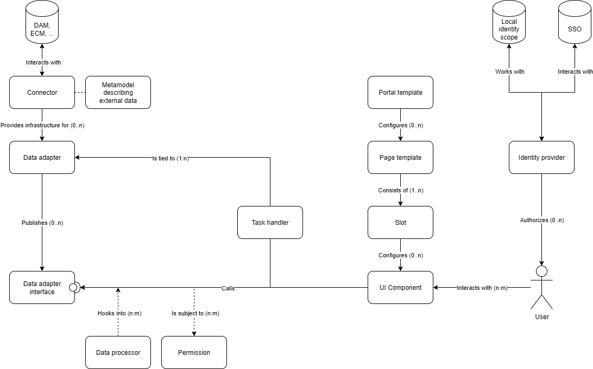

What are Smint.io Portals components?
=====================================

This README.md serves to clarify the general concept of Smint.io Portals components.

## Overview

When you create a Smint.io Portals portal, you're not just creating static HTML/JavaScript pages. 

Each Smint.io Portals portal is a *fully-fledged portal application* that runs on the *Smint.io Portals component framework*. Each portal consists of numerous *Smint.io Portals components* that can be configured and assembled like a Lego puzzle. The *Smint.io Portals component framework* provides administrators and users with a highly functional portal application that can be *customized to individual customer needs* at any time, without the need to hard-code content into a generic codebase.

Each *Smint.io Portals component* consists of different parts:
- The *Startup* class
- The *Configuration* class
- The component implementation
- Translatable resources (texts, ...)

### The *Startup* class

The *Startup* class of a Smint.io Portals component provides a static entry point into a Smint.io Portals component. It is discovered by the Smint.io Portals component framework at runtime and provides all necessary information we need to instantiate the component, for example:

- The name of the component
- A reference to the *Configuration* class of the component
- References to the translatable resources of the component
- Further component type specific information
- ...

Please note that there is no separate *Startup* class for Smint.io Portals frontend components. Smint.io Portals frontend components contain all the necessary information directly in the component's source code, added as annotations. When a Smint.io Portals frontend component is loaded, the system then generates the frontend component's *Startup* class on the fly.

[Here](../Examples/Backend/Connectors/Connector-SharePoint/SharepointConnectorStartup.cs) you find an example of a component's *Startup* class (this one is part of our *Microsoft SharePoint* connector)

### The *Configuration* class

The *Configuration* class of a Smint.io Portals component contains all settings that a user can adjust during component configuration in the Smint.io Portals backend.

When Smint.io Portals instantiates a component, it reads the user provided component configuration from the database and provides the component with a fully initialized instance of the *Configuration* class.

Please note that there is no separate *Configuration* class for Smint.io Portals frontend components. Smint.io Portals frontend components contain all the necessary information directly in the component's source code, added as annotations. When a Smint.io Portals frontend component is loaded, the system then generates the frontend component's *Configuration* class on the fly.

[Here](../Examples/Backend/Connectors/Connector-Picturepark/PictureparkConnectorConfiguration.cs) you find an example of a component's *Configuration* class (this one is part of our *Picturepark connector)

## SDKs

For each of the Smint.io Portals component types, there is a *Smint.io Portals SDK* that you can use to implement that component type yourself.

Access to the SDKs is restricted. Get in contact with [Smint.io](https://www.smint.io) and request access.
Access will be granted to either Smint.io Solution Partners or to all our Smint.io Portals Enterprise plan customers.

You will need an account with Microsoft Visual Studio cloud offerings (Azure DevOps), as the SDKs are hosted there.

## Smint.io Portals component diagram

## [Frontend components](../Examples/Frontend/)

### UI components

The most atomic part of a Smint.io Portal is the *Smint.io Portals UI component*. A UI component could, for example, be:

- A header bar
- A text block
- A search result display
- And so on

For sure you know this concept also from popular page builders like Wix.

### Page templates

The second level of structure on top of UI components is the *Smint.io page templates*. A page template
defines the structure of a Smint.io Portals page by defining and rendering so-called *slots* (do NOT confuse with Vue.js
slots, which is a completely different concept to Smint.io Portals slots). The typical slots of a page could for example
be:

- Header slot
- Left slot
- Right slot
- Content slot
- Footer slot

## [Backend components](../Examples/Backend/)

### Connector

### Data adapter

### Data processor

### Task handler

### Portal template

The topmost level of the structure of a Smint.io Portals portal is introduced by the *Smint.io portal
template*. A portal template combines and configures page templates for a complete portal experience. The portal
template itself does *NOT* render any output to the frontend itself, it is just being used when instantiating a new
Smint.io Portal from the portal template.

### Identity provider

## Questions

Please do not hesitate to contact us at [support@smint.io](mailto:support@smint.io) if you run into any issues.

Contributors
============

- Reinhard Holzner, Smint.io GmbH