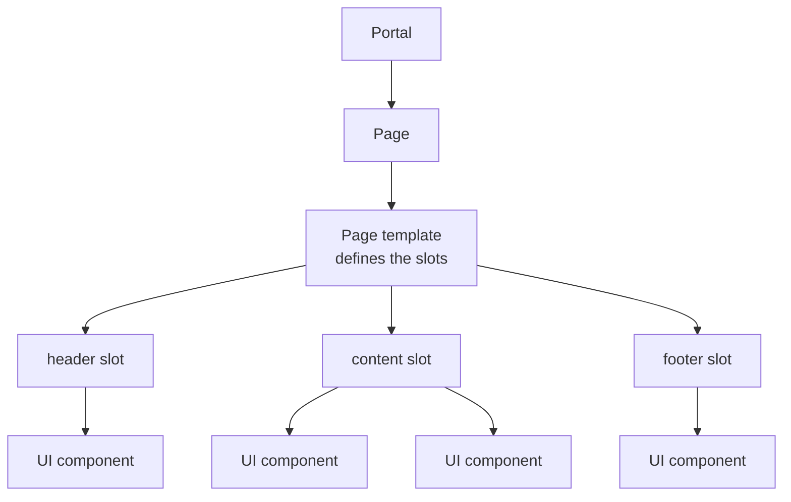
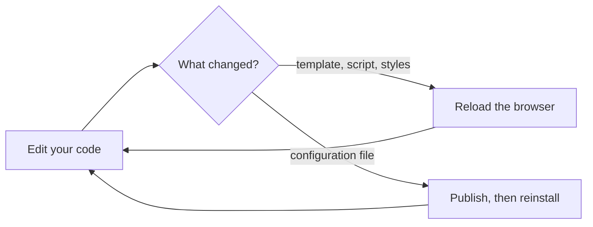

Developing Sminted UI frontend components
=========================================

Sminted UI is the current generation of Smint.io Portals frontend components, built with Vue 3.
This guide takes you from an empty folder to a component running in a portal.

Current version of this document is: 1.0.0 (as of 14th of September, 2026)

> **Preview.** Sminted UI is being rolled out. The concepts described here are settled, but
> individual APIs may still change between releases. Pin the package versions you build against,
> and get in touch before you commit to a large component.

1. [What you are building](#user-content-what-you-are-building)
1. [Before you start: the questions to answer](#user-content-before-you-start-the-questions-to-answer)
1. [Your first component](#user-content-your-first-component)
1. [The development loop](#user-content-the-development-loop)
1. [Where to go next](#user-content-where-to-go-next)
1. [Coming from Smint.io components (Vue 2)?](#user-content-coming-from-smintio-components-vue-2)

## What you are building

A Smint.io portal is not a set of hand-written pages. It is assembled, by an administrator, out of
components — and your component is one of the pieces they can place.



There are two kinds of frontend component, and you are building one of them:

- A **UI component** is one visible piece — a header, a text block, a gallery of assets. It fills
  the box the page gives it and knows nothing about the rest of the page.
- A **page template** defines the *shape* of a page: which slots exist, and which kinds of UI
  component are allowed in each. It arranges its slots and owns the spacing between them.

Everything an administrator can change about your component — its texts, its colours, which data
it shows — you declare yourself, in a configuration file. Smint.io Portals renders the settings
form from that declaration. You never build an admin screen.

## Before you start: the questions to answer

A few decisions are effectively permanent once a portal has been configured against your
component. Settle them before you write the first file.

| Question | Why it matters |
|---|---|
| **What component type is it?** | The type decides which page slots will accept your component. Pick from the published list — see [component types](sminted-ui-component-types.md). |
| **What is its id?** | The id identifies your component forever. It cannot be renamed without orphaning every administrator's saved configuration. |
| **What will the administrator be able to change?** | Every setting name is persisted the same way. Adding settings later is easy; renaming or removing one is not. |
| **Does it already exist?** | If you need an existing component plus one thing, ask us first. Extending is usually cheaper than maintaining a fork. |
| **Where does its data come from?** | Assets, a search, portal resources, or nothing at all — see [data binding](sminted-ui-data-binding.md). |

Prefix your ids with your own partner identifier so they cannot collide with anyone else's.

## Your first component

A component is a small npm package. This is the whole of it:

```text
sminted-ui-component-banner/
├── lang/
│   ├── en.json                       labels for the settings form
│   └── de.json                       every language kept in sync
├── src/
│   ├── smt-banner.vue                the component
│   ├── smt-banner.smintio.config.ts  what the administrator can configure
│   ├── smt-banner.types.ts           props, emits and slots for direct use
│   ├── smt-banner.tokens.ts          design tokens
│   ├── smt-banner.css                styling
│   ├── index.ts
│   ├── config.ts
│   └── tokens.ts
├── package.json
└── vite.config.ts
```

Three of those files carry the whole idea, and it is worth seeing them side by side.

**`smt-banner.smintio.config.ts`** — what the administrator sees:

```ts
import { config, metadata, propOption, resource } from '@smintio/sminted-ui-sdk/configs';
import type { InferProps } from '@smintio/sminted-ui-sdk/configs';

const styleGroup = 'banner-style';

const Config = () =>
  config()
    .uiComponent('ui-type-banner')
    .metadata(metadata().id('banner').title('title').description('description'))
    .group(styleGroup, (group) => group.title('groupStyle'))
    .prop('headline', resource().string(), (prop) => prop.display('headline').required())
    .prop('tone', (prop) =>
      prop
        .string<'default' | 'muted'>()
        .display('tone')
        .defaultValue('default')
        .group(styleGroup)
        .options([propOption('default').display('toneDefault'), propOption('muted').display('toneMuted')])
    )
    .build();

export default Config;

export type Props = InferProps<ReturnType<typeof Config>>;
```

**`lang/en.json`** — the words for that form:

```json
{
  "title": "Banner",
  "description": "A full width banner with a headline.",
  "groupStyle": "Style",
  "headline": "Headline",
  "tone": "Tone",
  "toneDefault": "Default",
  "toneMuted": "Muted"
}
```

**`smt-banner.vue`** — the component itself, receiving those settings as ordinary props:

```vue
<template>
  <div class="smt-banner">
    <h1>{{ l(headline) }}</h1>
  </div>
</template>

<script setup lang="ts">
import { useFilters } from '@smintio/sminted-ui-sdk';
import type { Props } from './smt-banner.smintio.config';
import './smt-banner.css';

const { headline } = defineProps<Props>();
const { l } = useFilters();
</script>
```

That is the shape of every Sminted UI component: **declare the settings, receive them as props,
render.** The build reads your configuration file and produces the manifest the portal uses to
draw the settings form.

Two conventions worth getting right from the start:

- The Vue file, the package and the config id all carry the same name —
  `smt-banner.vue`, `@smintio/sminted-ui-component-banner`, id `banner`.
- Keep the `.vue` file thin. It wires inputs to a template. Real logic belongs in composables
  under `src/composables/`, one concern per file.

## The development loop



This distinction catches everyone once. The **Portals Dev-Server** serves your working files to a
development portal, so code changes appear on reload with no publishing at all. But the settings
form is rendered from the manifest the portal already has — so **a change to
`*.smintio.config.ts` will not appear until the component is published again.**

If a setting you just added is not in the form, that is almost always why.

See [publishing](sminted-ui-publishing.md) for the full loop, and [TOOLS.md](../TOOLS.md) for the
dev server.

## Where to go next

| Document | Covers |
|---|---|
| [Component anatomy](sminted-ui-component-anatomy.md) | Every file in a component package and the one job it has |
| [Configuration reference](sminted-ui-config-reference.md) | Every kind of setting you can declare, and how |
| [Component types](sminted-ui-component-types.md) | The published `ui-type-*` ids and what each is for |
| [Page templates](sminted-ui-page-templates.md) | Building a page template and designing its slots |
| [Data binding](sminted-ui-data-binding.md) | Getting assets, searches and portal resources into your component |
| [Runtime services](sminted-ui-runtime-services.md) | Navigation, permissions, baskets, notifications, events |
| [Tokens and theming](sminted-ui-tokens-and-theming.md) | How your component picks up the portal's brand |
| [Localization](sminted-ui-localization.md) | Making every visible string translatable |
| [Publishing](sminted-ui-publishing.md) | Building, versioning, publishing and registering |

## Coming from Smint.io components (Vue 2)?

The system has not changed — the authoring technology has. Component types, page type contracts,
value types and the data adapter model are all carried across unchanged.

| Smint.io components (Vue 2) | Sminted UI (Vue 3) |
|---|---|
| Class decorators (`@ComponentProperty`, `@IsString`, `@FormGroup`) | one `*.smintio.config.ts` file built with a fluent API |
| Property mixins (`STextProps`, `SLinkButtonProps`, …) | shared configuration factories from `@smintio/sminted-ui-core-components` |
| Behaviour mixins (`SDownloadProps` + `<s-download-dialog>`) | dedicated page types the portal routes to |
| `resources/definition.ts` and the resource builder | `.setup(...)` in the configuration file |
| rollup + the Publish CLI | Vite + the `smintedui` command line tool |
| Vue 2 Options API, `vue-property-decorator` | Vue 3 Composition API, `<script setup lang="ts">` |

The [Smint.io components documentation](../smintio-components/) remains the fullest description of
what each component type is expected to do, and of the settings the shipped components expose. It
is worth reading before you design a Sminted UI component of the same type.

## Questions

Please do not hesitate to contact us at [support@smint.io](mailto:support@smint.io) if you run
into any issues.

Contributors
============

- Reinhard Holzner, Smint.io GmbH
