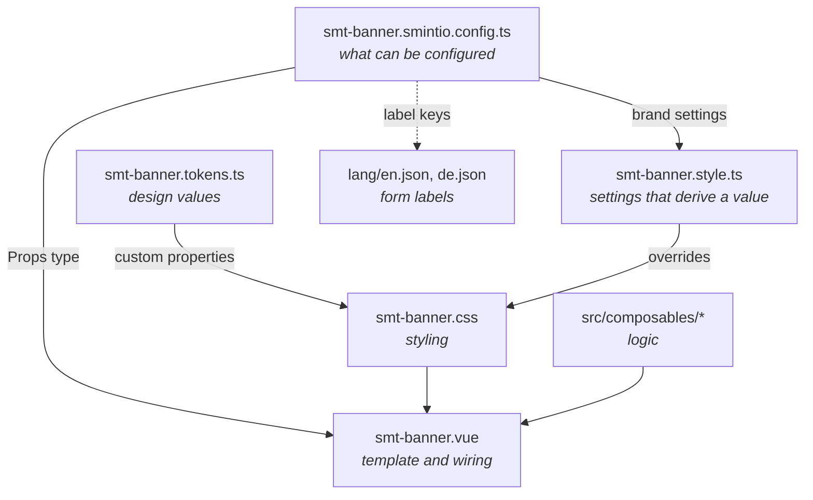
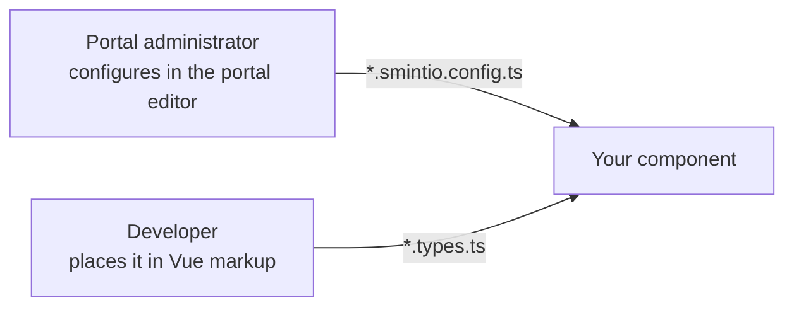

Anatomy of a Sminted UI component
=================================

Every Sminted UI component is an npm package with the same small set of files. Each file has
exactly one job, and keeping those jobs separate is what keeps components readable as they grow.

Current version of this document is: 1.0.0 (as of 14th of September, 2026)

1. [The package](#user-content-the-package)
1. [The files, one job each](#user-content-the-files-one-job-each)
1. [Naming](#user-content-naming)
1. [How the pieces fit together](#user-content-how-the-pieces-fit-together)
1. [Keeping the component file thin](#user-content-keeping-the-component-file-thin)
1. [Two audiences, two sets of props](#user-content-two-audiences-two-sets-of-props)

## The package

```text
sminted-ui-component-<name>/
├── lang/
│   ├── en.json                      labels for the settings form — required
│   └── de.json                      every supported language, kept in sync
├── src/
│   ├── composables/
│   │   └── use-<concern>.ts         the real logic, one concern per file
│   ├── smt-<name>.vue               template and wiring
│   ├── smt-<name>.smintio.config.ts what an administrator can configure
│   ├── smt-<name>.types.ts          props, emits and slots for direct use in markup
│   ├── smt-<name>.tokens.ts         design tokens and variants
│   ├── smt-<name>.css               styling, consuming the tokens
│   ├── smt-<name>.style.ts          optional — settings that derive a style value
│   ├── index.ts                     the component and its public types
│   ├── config.ts                    re-export of the configuration
│   └── tokens.ts                    re-export of the token definitions
├── package.json
├── tsconfig.json
└── vite.config.ts
```

`vite.config.ts` is a single call — the build details are supplied for you:

```ts
import { smintedUiComponentConfig } from '@smintio/sminted-ui-devtools';

export default smintedUiComponentConfig({
  libName: 'SmintedUiBanner',
  packagePath: import.meta.dirname,
  entry: ['src/index.ts', 'src/config.ts', 'src/tokens.ts'],
});
```

## The files, one job each

### `smt-<name>.smintio.config.ts` — the administrator's surface

The settings an administrator can change, declared with the configuration API. This file also
produces the `Props` type your component receives.

Blurring this file with styling is the most common mistake. It describes *what can be configured*,
never *how something looks*.

Full detail: [configuration reference](sminted-ui-config-reference.md).

### `smt-<name>.types.ts` — the developer's surface

Props, emits and slots for someone placing your component directly in Vue markup, plus the
component's event-bus namespace. This is a different audience from the administrator, and a
different set of props — see [below](#user-content-two-audiences-two-sets-of-props).

```ts
export const BANNER_NAMESPACE = 'smt-banner';

export interface SmtBannerProps {
  active?: boolean;
}

export interface SmtBannerEmits {
  toggle: [active: boolean];
}
```

### `smt-<name>.tokens.ts` — design values

Every design value your component uses, as a named token. Tokens are never raw numbers copied out
of a design file: they point at the portal's semantic values, so that when a portal is re-branded,
your component follows.

A setting that merely picks between prepared looks — `shape`, `variant` — is a token *variant* and
belongs here, not in the configuration file.

Full detail: [tokens and theming](sminted-ui-tokens-and-theming.md).

### `smt-<name>.css` — styling

Ordinary CSS that reads your tokens. Every custom property is read at the point it is used, with a
sensible fallback:

```css
.smt-banner {
  background: var(--smt-banner-surface, var(--smt-color-surface));
}
```

That fallback chain is what lets a portal override your component's look at any level — globally,
per page, or on one instance — without you doing anything.

### `smt-<name>.style.ts` — optional

Only needed when a setting has to *compute* a style value rather than simply select one. Most
components never need this file — a setting that picks between prepared looks is a token variant,
and colours come from the portal's style through tokens rather than from calculations.

Each mapping must be additive: if the setting is unset, emit nothing, so the token default stands.

### `smt-<name>.vue` — the wiring

The template, and the smallest amount of script needed to feed it.

### The barrels

```ts
// index.ts
export type { SmtBannerEmits, SmtBannerProps } from './smt-banner.types';
export { default } from './smt-banner.vue';

// config.ts
export { default } from './smt-banner.smintio.config';
```

## Naming

One name runs through the whole package.

| Thing | Pattern | Example |
|---|---|---|
| folder | `sminted-ui-component-<name>` | `sminted-ui-component-banner` |
| package | `@smintio/sminted-ui-component-<name>` | `@smintio/sminted-ui-component-banner` |
| Vue component | `smt-<name>.vue` | `smt-banner.vue` |
| build `libName` | `SmintedUi<Name>` | `SmintedUiBanner` |
| config `id` | `<name>` | `banner` |

Page templates follow the same idea with their own prefix — see
[page templates](sminted-ui-page-templates.md).

## How the pieces fit together



Read it as two independent chains that meet in the component: a **configuration** chain, which
carries what the administrator chose, and a **styling** chain, which carries what the portal's
brand says. `style.ts` is the only sanctioned bridge between them.

## Keeping the component file thin

The `.vue` file wires inputs to a template. When it starts doing more, move the work out:

- **Logic** goes into a composable in `src/composables/`, one concern per file.
- **A distinct visual section** becomes a child component — props in, events out.
- **Anything that already exists** in `@smintio/sminted-ui-core-components` is used, not rewritten.
  That package holds the shared building blocks — links, icons, images, buttons, dialogs, galleries
  — and the accessibility behaviour that goes with them.

A composable that talks to the portal runtime and is not specific to your component is worth
raising into shared code rather than keeping private.

## Two audiences, two sets of props

This trips people up, so it is worth stating plainly. Your component has two kinds of user:



- The **administrator** never writes code. They get the settings form generated from
  `*.smintio.config.ts`. These props arrive already resolved — localized strings picked, resources
  looked up, page references ready to navigate to.
- The **developer** embedding your component directly gets the props, emits and slots declared in
  `*.types.ts`.

Keep them separate. Declaring something in `*.types.ts` does not make it configurable in a portal,
and a setting that only makes sense to a developer does not belong in the administrator's form.

Contributors
============

- Reinhard Holzner, Smint.io GmbH
