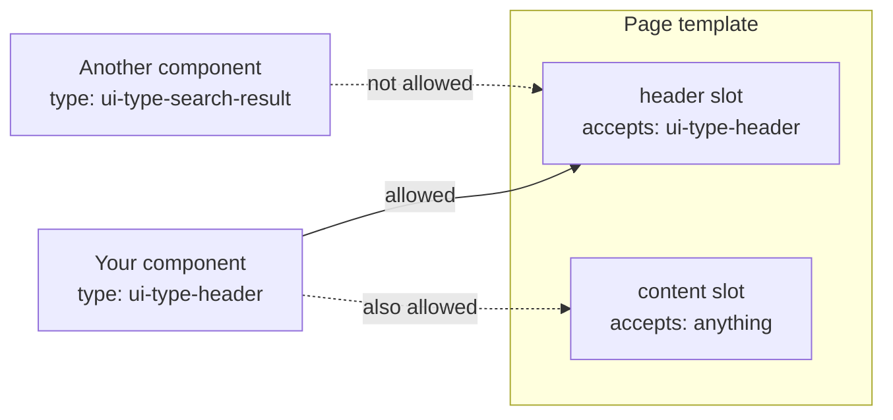

Component types
===============

Every frontend component declares a *type*. The type is a promise about what the component does,
and it is what lets an administrator place it — or stops them placing it somewhere it will not
work.

Current version of this document is: 1.0.0 (as of 14th of September, 2026)

1. [Why types exist](#user-content-why-types-exist)
1. [Declaring your type](#user-content-declaring-your-type)
1. [UI component types](#user-content-ui-component-types)
1. [Page types](#user-content-page-types)
1. [Slots: the composition contract](#user-content-slots-the-composition-contract)
1. [Choosing a type](#user-content-choosing-a-type)

## Why types exist

A page template does not name the components it will host — it could not, because it is written
long before anyone builds a portal with it. Instead it says *what kind* of component each of its
slots accepts.



So the type is the join between the two halves of the system. Declare the type that matches what
your component actually is, and it will show up wherever that kind of component belongs.

These ids are shared with the previous component generation. A `ui-type-header` written with
Sminted UI and one written with Smint.io components are interchangeable from the portal's point of
view.

## Declaring your type

```ts
config().uiComponent('ui-type-header')      // a UI component
config().pageTemplate('page-type-generic')  // a page template
```

The list of ids is fixed. Pick the closest match; new ids are a platform change, because the
portal backend and editor have to know about them too. Talk to us if nothing fits.

## UI component types

**General purpose**

| Type | For |
|---|---|
| `ui-type-header` | The page header — branding, navigation, account |
| `ui-type-footer` | The page footer |
| `ui-type-banner` | A prominent banner, usually at the top of a page |
| `ui-type-page-title` | A page title and subtitle |
| `ui-type-text` | A block of text |
| `ui-type-text-with-color` | Text paired with a colour value |
| `ui-type-side-menu` | A multi-level menu down the side of a page |
| `ui-type-category-chooser` | A set of options, each with an image and a label |
| `ui-type-image`, `ui-type-image-with-text` | An image, optionally with text beside it |
| `ui-type-video`, `ui-type-document` | A video or a document |
| `ui-type-location` | A location |
| `ui-type-custom` | Anything that fits none of the above |
| `ui-type-section` | Grouping and layout of other components |

**Searching and browsing assets**

| Type | For |
|---|---|
| `ui-type-search-form` | The filter and facet form beside a search |
| `ui-type-search-bar` | A free text search box |
| `ui-type-search-result` | The result list of a search |
| `ui-type-assets-preview` | A set of assets shown as a gallery or grid |

**Asset detail pages**

| Type | For |
|---|---|
| `ui-type-asset-details-preview` | The main preview of the asset |
| `ui-type-asset-details-action-bar` | Download, share, next and previous |
| `ui-type-asset-details-text` | Text drawn from the asset's metadata |
| `ui-type-asset-details-metadata-viewer` | A list of metadata fields |
| `ui-type-asset-details-tag-viewer` | Keywords and tags |
| `ui-type-asset-details-banner` | A banner on the detail page |
| `ui-type-asset-details-related-assets` | Assets related to this one |

**Collections and sharing**

| Type | For |
|---|---|
| `ui-type-collections-overview` | All of a user's collections |
| `ui-type-collection-details` | One collection and its contents |
| `ui-type-collections-quickview` | A compact collection panel beside a search |
| `ui-type-collection-comments` | Comments on a collection, share or asset |
| `ui-type-shared-links` | A user's share links |
| `ui-type-share-details` | One share link and its contents |

**Requests and uploads**

`ui-type-request-access-form`, `ui-type-request-permission-form`,
`ui-type-request-download-form`, `ui-type-request-generic-form`, `ui-type-upload-form`

**Accounts and sign-in**

A full family covering sign-in, sign-out, registration, password reset, email confirmation, terms
acceptance, cookie consent and account management:
`ui-type-account-login-form`, `ui-type-account-logout-form`, `ui-type-account-register-form`,
`ui-type-account-forgot-password-form`, `ui-type-account-reset-password-form`,
`ui-type-account-confirm-email-form`, `ui-type-account-accept-terms-form`,
`ui-type-account-manage-form`, `ui-type-account-manage-change-password-form`,
`ui-type-account-cookie-consent`, `ui-type-account-access-denied-form`, and their confirmation
counterparts.

**Errors**

`ui-type-error-form`

## Page types

| Type | The page it defines |
|---|---|
| `page-type-main` | The portal's landing page |
| `page-type-generic` | A general content page |
| `page-type-assets-search` | Searching and browsing assets |
| `page-type-asset-details` | A single asset |
| `page-type-collections-overview`, `page-type-collection-details` | Collections |
| `page-type-shared-links`, `page-type-share-details` | Share links |
| `page-type-request-access`, `page-type-request-permission`, `page-type-request-download` | Request forms |
| `page-type-download`, `page-type-share`, `page-type-collect` | The download, share and collect actions |
| `page-type-generic-dialog` | A dialog rather than a page |
| `page-type-imprint`, `page-type-privacy-policy`, `page-type-terms-and-conditions` | Legal pages |
| `page-type-account-*` | The sign-in and account pages, one per step |
| `page-type-error` | The error page |

`page-type-download`, `page-type-share` and `page-type-collect` are worth noting: in Sminted UI
these actions are pages the portal routes to, not dialogs a component opens for itself. See
[runtime services](sminted-ui-runtime-services.md).

## Slots: the composition contract

A slot is a named place in a page template where components go. Four controls shape it:

```ts
.slot('header', (slot) => slot.allowed('ui-type-header').maxItems(1))
.slot('content', (slot) => slot.minItems(1))
.slot('right', (slot) => slot.denied('ui-type-header', 'ui-type-footer'))
.slot('extras')
```

| Control | Meaning |
|---|---|
| `allowed(...)` | Only these types may be placed here |
| `denied(...)` | These types may not |
| `minItems(n)` | The page is incomplete without at least *n* |
| `maxItems(n)` | No more than *n* |

Guidance:

- Restrict a slot that has a real contract — a header slot, a form slot. Leave a genuinely open
  slot open.
- Put `minItems(1)` on the slot that carries the page's purpose. A collection details page without
  its collection component is broken, and it is far better for the administrator to be told that
  while configuring than for a visitor to find an empty page.
- Do not over-restrict. Every type you leave out is a component nobody can place, including
  components that do not exist yet.

Note that these are *Smint.io Portals slots*, which is a different concept from Vue's own slots.
They happen to be implemented with Vue slots, but what they mean is "a place an administrator can
put components".

## Choosing a type

Ask what the component *is*, not what it contains. A component that shows a gallery of assets is
`ui-type-assets-preview` even if it also has a heading; a component that is mostly a heading is
`ui-type-text`.

Reach for `ui-type-custom` only when nothing fits. A custom component can be placed in open slots,
but it will not appear where a typed slot expects a specific kind of component — which is usually
exactly where you wanted it.

If you are building the Sminted UI equivalent of an existing component, read what that type is
expected to do in the
[Smint.io components type reference](../smintio-components/smintio-frontend-component-types.md) and
the [page type contracts](../smintio-components/smintio-page-type-contracts.md) first. Those
documents describe the same contracts in more detail than anything else available.

Contributors
============

- Reinhard Holzner, Smint.io GmbH
