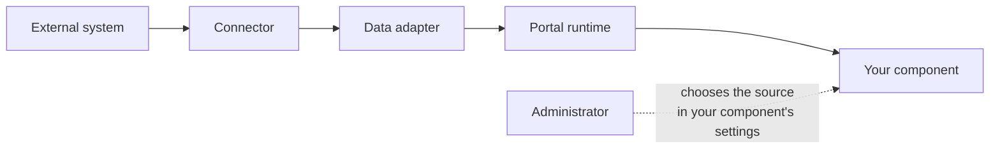
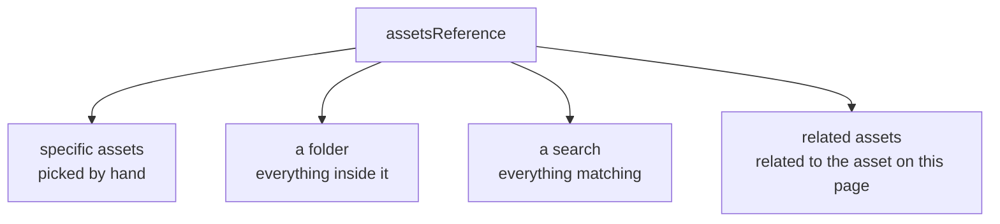

Getting data into your component
================================

Your component does not talk to an external system. It declares what kind of data it wants, an
administrator points that at a source, and the portal delivers it.

Current version of this document is: 1.0.0 (as of 14th of September, 2026)

1. [How data reaches a component](#user-content-how-data-reaches-a-component)
1. [Asking for assets](#user-content-asking-for-assets)
1. [Asking for a searchable source](#user-content-asking-for-a-searchable-source)
1. [Asking for metadata fields](#user-content-asking-for-metadata-fields)
1. [Linking to another page](#user-content-linking-to-another-page)
1. [Permissions](#user-content-permissions)
1. [Loading, empty and error states](#user-content-loading-empty-and-error-states)
1. [Custom data adapter interfaces](#user-content-custom-data-adapter-interfaces)

## How data reaches a component



A **connector** talks to an external system. A **data adapter** exposes that system through a
standard set of interfaces. Your component declares that it needs one of those interfaces, and the
administrator picks which configured source fills it.

This is why the same component works against SharePoint, Picturepark or any other connected system
without knowing which — and why you never write API calls, URLs or credentials into a component.

Backend detail, if you are also building the other half:
[BACKEND-COMPONENTS.md](../BACKEND-COMPONENTS.md) and the
[asset data model](../data-adapters/smintio-asset-data-model.md).

## Asking for assets

`assetsReference()` is the setting that says "the administrator chooses which assets this shows".

```ts
.prop('assetsReference', (prop) =>
  prop
    .assetsReference({ allowRelatedAssets: true })
    .display('assets')
    .description('assetsDesc')
    .group(assetsGroup)
)
.prop('maxNumberAssets', (prop) => prop.int().min(1).max(50).display('maxNumberAssets'))
```

One setting, four ways for the administrator to fill it:



`allowRelatedAssets: true` offers the fourth option, which only makes sense on an asset detail
page.

Your component does not care which was chosen. Load the reference and you get assets:

```ts
const { assets, isLoading, error } = useReactiveAssetsLoader(() => props.assetsReference);
```

Always honour a limit setting like `maxNumberAssets`. A folder can hold a great many assets, and a
component that renders all of them will make the page unusable.

## Asking for a searchable source

When your component runs searches rather than showing a fixed set:

```ts
.prop(
  prop('service')
    .assetsSearch()
    .display('assetsSearch')
    .description('assetsSearchDesc')
    .group(searchGroup)
)
```

The administrator picks a data source that supports searching. Bear in mind they may not have
configured one — treat the value as possibly absent and render something sensible if it is.

Searching is paged. Ask for one page, render it, and fetch the next when the user asks. Never try
to pull an entire result set.

## Asking for metadata fields

Which metadata an asset carries depends entirely on the connected system, so components do not
hard-code field names. They let the administrator choose:

```ts
.prop('metadataAttributeDisplayList', (prop) =>
  prop.metadataAttributes().display('metadataAttributes').group(attributesGroup)
)
```

You then render whatever they picked, in their order. Values arrive already localized and
formatted for the current culture.

## Linking to another page

Never build a URL by hand. Let the administrator choose a page:

```ts
.prop('detailPage', (prop) => prop.page().display('detailPage'))
```

The value is a reference the runtime resolves to a real route, which keeps links working when
pages are renamed or moved. Resolve it through the page reference resolver described in
[runtime services](sminted-ui-runtime-services.md).

The same applies to search links. An asset that carries its own related-assets search already
knows how to describe it; use that description rather than assembling query parameters yourself.

## Permissions

Not every visitor may see, download or open every asset. The runtime exposes permission checks so
your component can render appropriately — hide a download button, show a "no access" placeholder
instead of a preview.

**These checks are for the interface only.** The backend enforces access independently on every
request. A permission check in a component is there to avoid showing someone a button that will
fail, never to keep data safe.

Always give the administrator a text setting for the no-permission case, so the wording suits the
portal.

## Loading, empty and error states

Every data-backed component has four states, and all four need a design:

| State | What to show |
|---|---|
| Loading | A skeleton or spinner sized like the real content, so the page does not jump |
| Empty | A configurable message — "no assets found" — never a blank area |
| Error | A short message; report the detail through the error messenger |
| No permission | A configurable message, not silence |

One rule worth following religiously: **if your component decides to render nothing, log why.**
A component that silently renders empty is indistinguishable from a stale build or a
misconfiguration, and it is the single most expensive thing to debug in a live portal.

## Custom data adapter interfaces

If you are building both halves — a data adapter with its own public API interface, and a
component that calls it — the
[Data Adapter Exporter CLI](../tools/Portals-DataAdapter-SDK-DataAdapterExporter-CLI/Release/)
generates TypeScript definitions from your data adapter so the calls are typed.

Support for custom interfaces in Sminted UI configurations is still being finalised. Get in touch
before you design a component around one.

Contributors
============

- Reinhard Holzner, Smint.io GmbH
