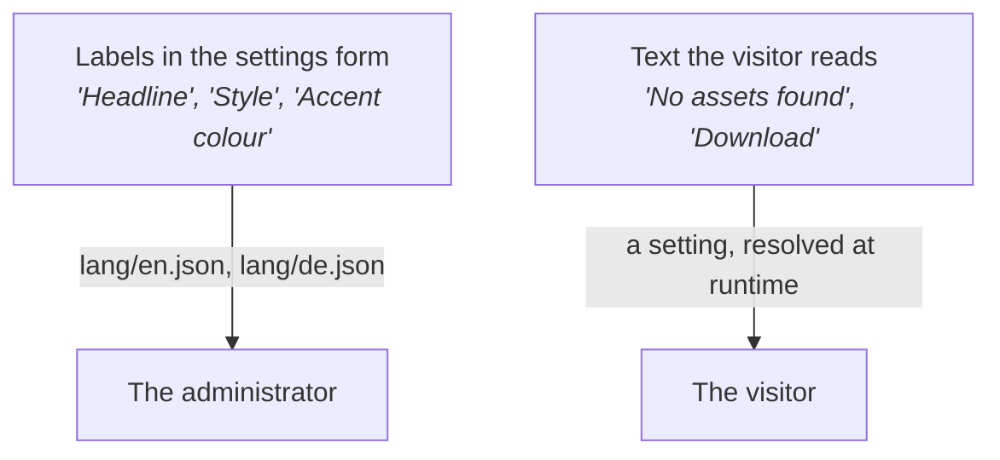

Localization
============

Portals run in many languages, and administrators expect to change wording without asking a
developer. Two separate mechanisms make that work, and mixing them up is the most common
localization bug.

Current version of this document is: 1.0.0 (as of 14th of September, 2026)

1. [Two kinds of text](#user-content-two-kinds-of-text)
1. [Labels in the settings form](#user-content-labels-in-the-settings-form)
1. [Text the visitor reads](#user-content-text-the-visitor-reads)
1. [Numbers, dates and everything cultural](#user-content-numbers-dates-and-everything-cultural)
1. [Accessibility text is different](#user-content-accessibility-text-is-different)
1. [Never build a string from parts](#user-content-never-build-a-string-from-parts)
1. [Checklist](#user-content-checklist)

## Two kinds of text



They travel different routes and they are not interchangeable.

- **Settings form labels** are shipped with your component in `lang/*.json`. You translate them.
- **Visitor-facing text** is a *setting*, so the administrator can change the wording and the
  portal can translate it per language. You supply a sensible English fallback.

The rule that follows from this: **if a visitor can read it, it is a setting.** Button labels,
placeholders, headings, empty-state text, error text, tooltips. All of it.

## Labels in the settings form

Every `display`, `description` and `title` in your configuration is a key:

```ts
.group(styleGroup, (group) => group.title('groupStyle'))
.prop('headline', resource().string(), (prop) =>
  prop.display('headline').description('headlineDesc')
)
```

```json
// lang/en.json
{
  "title": "Banner",
  "description": "A full width banner with a headline.",
  "groupStyle": "Style",
  "headline": "Headline",
  "headlineDesc": "Shown at the top of the banner."
}
```

```json
// lang/de.json
{
  "title": "Banner",
  "description": "Ein Banner über die volle Breite mit einer Überschrift.",
  "groupStyle": "Darstellung",
  "headline": "Überschrift",
  "headlineDesc": "Wird oben im Banner angezeigt."
}
```

Keep the files in step. A key present in one language and missing in another shows an untranslated
label in the settings form — visible to every administrator using that language, and the first
thing they will report.

Add the key in **every** language file at the moment you add the setting, even if the translation
is a placeholder. Catching up later never happens.

## Text the visitor reads

Declare a setting for it, group the settings together so the administrator can find them, and give
an English fallback:

```ts
const localeGroup = 'banner-locale';

.group(localeGroup, (group) => group.title('groupLocale'))
.prop('noResultsText', resource().string(), (prop) =>
  prop.display('noResultsText').group(localeGroup)
)
```

```ts
const { l } = useFilters();
const texts = withLocalizedStringsDefaults(() => props, {
  noResultsText: 'No assets found',
});
```

`resource().string()` rather than a plain `string()` matters here: it lets the administrator point
at a portal resource, so one wording change updates every component that uses it.

Group these settings into a "Texts" or "Labels" section. A form where the wording settings are
scattered among the styling ones is painful to work through.

## Numbers, dates and everything cultural

```ts
const { n, d, locale } = useFilters();
```

Format through these, or through `Intl` seeded from `locale`. Never do it by hand:

| Wrong | Why |
|---|---|
| `` `${value}%` `` | Several languages put the sign elsewhere, or add a space |
| `` `${d.getDate()}/${d.getMonth() + 1}` `` | Day and month order differs by culture |
| `value.toFixed(2)` | Decimal separators differ |
| `` `${count} items` `` | Plural rules differ; many languages have more than two forms |

## Accessibility text is different

Screen reader labels and `aria-label` values are not visitor-facing copy in the sense above. They
may keep a plain English default from the shared accessibility helpers, and they do not need a
setting.

But do not bind a visible label to an accessibility label. They come from different places and are
allowed to differ — a button might read "Download" while announcing "Download 3 selected assets".

## Never build a string from parts

Do not assemble a sentence in code:

```ts
// Wrong — word order differs between languages
const message = t('selected') + ' ' + count + ' ' + t('assets');
```

Use one key with a placeholder, and let the translation decide where the value goes.

The same applies across component layers. A shared building block returns a *value* — a number, a
mode, a key — and your component turns it into words. If you find yourself printing a label that
was produced two layers down, push the raw value up and format it where the language is known.

## Checklist

Before you call a component done:

- [ ] Every visitor-readable string is a setting with an English fallback.
- [ ] `lang/en.json` and every other language file contain exactly the same keys.
- [ ] No number, date, percentage or plural is assembled by hand.
- [ ] Text settings are grouped together in the form.
- [ ] The component still looks right when a translation is much longer than the English —
      German labels are routinely half as long again.

Contributors
============

- Reinhard Holzner, Smint.io GmbH
