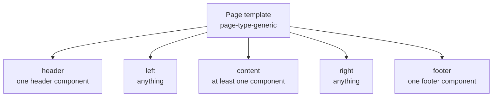

Building a page template
========================

A page template defines the shape of a page: which slots exist, what may go in them, and how they
are arranged. It is the frame; the UI components are the picture.

Current version of this document is: 1.0.0 (as of 14th of September, 2026)

1. [What a page template is responsible for](#user-content-what-a-page-template-is-responsible-for)
1. [The package](#user-content-the-package)
1. [A complete example](#user-content-a-complete-example)
1. [Designing the slots](#user-content-designing-the-slots)
1. [Rendering the slots](#user-content-rendering-the-slots)
1. [Dialog page templates](#user-content-dialog-page-templates)
1. [Spacing is yours](#user-content-spacing-is-yours)

## What a page template is responsible for



A page template:

- **declares the slots** and what each accepts,
- **lays them out**, including how the layout changes on small screens,
- **owns the spacing** between the components it hosts,
- **exposes a small number of page-level settings**, such as content width or gap size.

A page template does *not* fetch data, render asset content, or contain page-specific logic. If
you find yourself writing that, it belongs in a UI component that sits in one of your slots.

## The package

Same shape as a UI component, with its own naming:

| Thing | Pattern | Example |
|---|---|---|
| folder | `sminted-template-<name>` | `sminted-template-generic` |
| package | `@smintio/sminted-ui-page-<name>` | `@smintio/sminted-ui-page-generic` |
| Vue component | `smt-<name>.vue` | `smt-generic.vue` |
| build `libName` | `SmintedTemplate<Name>` | `SmintedTemplateGeneric` |
| config `id` | `<name>` | `generic` |

## A complete example

`smt-generic.smintio.config.ts`:

```ts
import type { InferProps, InferSlots } from '@smintio/sminted-ui-sdk/configs';
import { config, loc, metadata, propOption } from '@smintio/sminted-ui-sdk/configs';

const Config = () =>
  config()
    .pageTemplate('page-type-generic')
    .metadata(
      metadata()
        .id('generic')
        .title('title')
        .description('description')
        .icon('mdi-page-layout-body')
    )
    .prop('gap', (prop) =>
      prop
        .string<'small' | 'medium' | 'large'>()
        .display('gap')
        .defaultValue('medium')
        .options([
          propOption('small').display('gapSmall'),
          propOption('medium').display('gapMedium'),
          propOption('large').display('gapLarge'),
        ])
    )
    .slot('header', (slot) => slot.allowed('ui-type-header', 'ui-type-banner').maxItems(1))
    .slot('left')
    .slot('content', (slot) => slot.minItems(1))
    .slot('right')
    .slot('footer', (slot) => slot.allowed('ui-type-footer').maxItems(1))
    .build();

export default Config;

export type Props = InferProps<ReturnType<typeof Config>>;
export type Slots = InferSlots<ReturnType<typeof Config>>;
```

`pageTemplate()` also gives your template the portal's style automatically, so it picks up the
brand without you declaring anything.

## Designing the slots

Slot design is the whole of page template design, and it is a balance.

**Too loose** and the page has no shape — an administrator can put a footer in the header slot and
the layout falls apart.

**Too tight** and the page cannot be built — you allowed exactly three component types and the
customer needs a fourth.

Some rules of thumb that hold up:

- Name slots for their **position and purpose**, the way a reader would describe them: `header`,
  `content`, `left`, `right`, `footer`, `banner`.
- Restrict a slot only where the restriction is real. A header slot genuinely needs a header
  component. A content slot genuinely does not care.
- Use `minItems(1)` on the slot that gives the page its reason to exist.
- Use `maxItems(1)` where more than one would be nonsense — two headers, two footers.
- Keep the count small. Five slots is a rich page; ten is a page nobody can configure.

If you are implementing an existing page type, match the slot names the other implementations of
that page type use. Two templates of the same type that expose different slot names cannot be
swapped for one another, which defeats the point of the type.

## Rendering the slots

Your template renders each declared slot in the position it belongs:

```vue
<template>
  <div class="smt-generic" :class="`gap-${gap}`">
    <header class="smt-generic-header">
      <slot name="header" />
    </header>

    <div class="smt-generic-body">
      <aside class="smt-generic-left"><slot name="left" /></aside>
      <main class="smt-generic-content"><slot name="content" /></main>
      <aside class="smt-generic-right"><slot name="right" /></aside>
    </div>

    <footer class="smt-generic-footer">
      <slot name="footer" />
    </footer>
  </div>
</template>

<script setup lang="ts">
import type { Props, Slots } from './smt-generic.smintio.config';
import './smt-generic.css';

const { gap } = defineProps<Props>();
defineSlots<Slots>();
</script>
```

A slot with nothing in it should collapse, not leave a gap. Check every optional slot with no
content before you consider the template done — empty side columns and floating gaps are the most
common page template bug.

## Dialog page templates

Some pages are dialogs rather than full pages — the download, share and collect flows work this
way. Mark them in the metadata:

```ts
.metadata(metadata().id('download').title('title').dialog().dialogAlignment('center'))
```

Alignment accepts `center`, `left`, `right`, `top` and `bottom`, which is the edge the dialog
comes from.

Inside the component you can adjust the dialog's behaviour — whether it can be closed, whether the
mask dismisses it, its size — through the page dialog controller described in
[runtime services](sminted-ui-runtime-services.md).

## Spacing is yours

This is the division of labour worth remembering:

- A **UI component** fills the box it is given, edge to edge. It adds no outer margin, and its
  content does not overflow.
- A **page template** decides every gap between those boxes.

That way, any combination of components an administrator chooses produces consistent spacing, and
no component can throw off a page it was never designed for. Give administrators one gap setting
rather than letting each component set its own — that is exactly the consistency this split buys.

Contributors
============

- Reinhard Holzner, Smint.io GmbH
