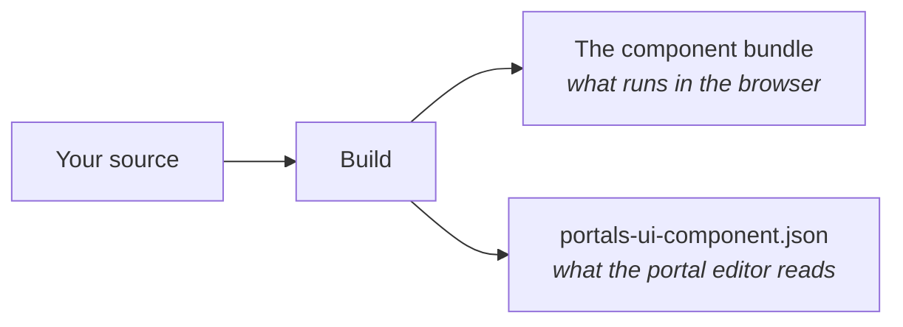
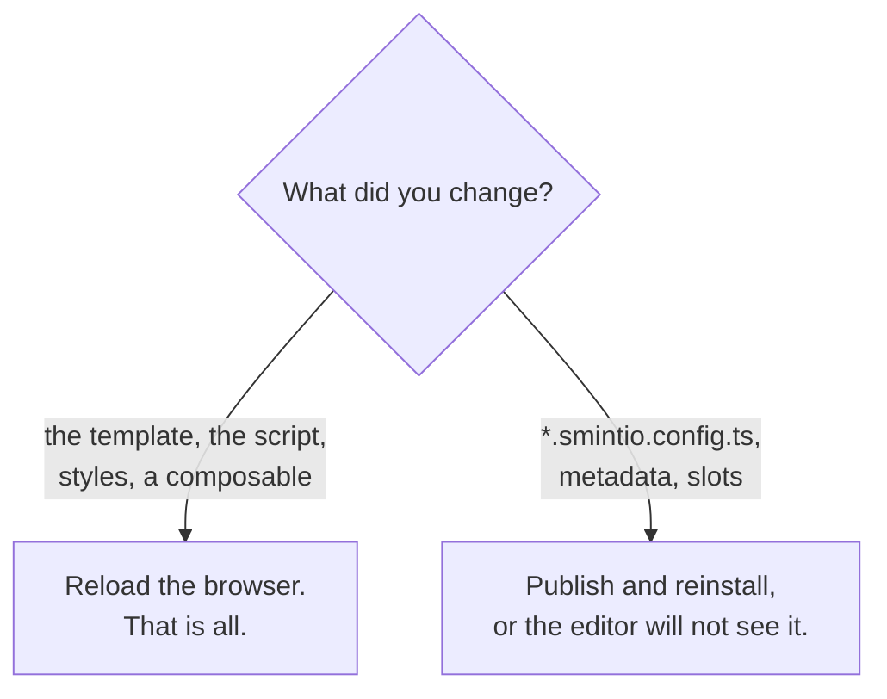
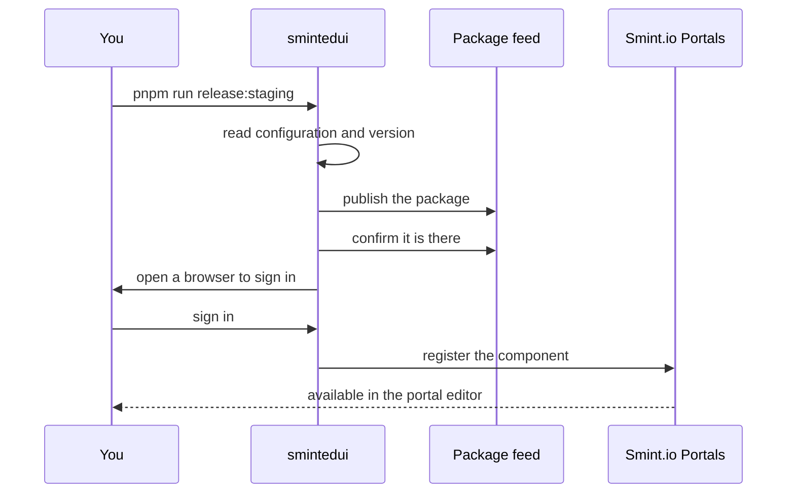

Building and publishing
=======================

How a component goes from your working copy to a portal, and how to work on it day to day without
publishing every time.

Current version of this document is: 1.0.0 (as of 14th of September, 2026)

1. [What the build produces](#user-content-what-the-build-produces)
1. [The one rule to remember](#user-content-the-one-rule-to-remember)
1. [The development loop](#user-content-the-development-loop)
1. [Versioning](#user-content-versioning)
1. [Publishing](#user-content-publishing)
1. [When something goes wrong](#user-content-when-something-goes-wrong)
1. [Things that are permanent](#user-content-things-that-are-permanent)

## What the build produces



Two artefacts, and the second is the one people forget.

The build runs your `*.smintio.config.ts`, takes the result and writes it out as a manifest: your
component's id, its type, its settings, its groups, its slots. **The settings form an administrator
sees is drawn from that manifest**, not from the running component.

## The one rule to remember



A setting you just added and cannot find in the portal editor is, almost always, this. The code is
live; the manifest is not.

## The development loop

The **Portals Dev-Server** reroutes a development portal's requests for your component to the files
on your machine. You edit, rebuild, reload — no publishing.

```bash
# in your component package
pnpm build --watch
```

Two things have to be arranged by Smint.io before this works at all:

1. the portal must have **development mode** enabled, and
2. your user must be **cleared as a developer**.

If the dev server logs no incoming requests whatsoever, it is one of those two — not a mapping
mistake. A mapping mistake shows up as requests that arrive and miss.

Turn off your browser cache while you work. See [TOOLS.md](../TOOLS.md) for installation.

## Versioning

Raise the `version` in your package's `package.json` whenever you change it. Every release needs a
version that has not been published before.

## Publishing

From the component's own package folder:

```bash
pnpm run release:staging      # or release:production
```

Each runs an audit for known vulnerabilities, then publishes and registers the component.

`release` does several things in order:



The publish and the registration are **two separate steps**, and that matters when one of them
fails — see below.

## When something goes wrong

| Symptom | Cause |
|---|---|
| A new setting is missing from the editor | The configuration changed but the component was not republished |
| Publishing fails saying the version exists | Raise the version in `package.json` — every publish needs a new one |
| Publish succeeded, registration failed | Do **not** publish again — the version is taken. Re-run the registration only |
| The dev server sees no requests at all | Development mode off, or your user is not cleared as a developer |
| The component renders nothing and says nothing | Make it log why. This is worth doing before you need it |
| A label shows a raw key | The key is missing from that language's file |

## Things that are permanent

Once a portal has been configured against your component, some things cannot change without
breaking that configuration:

| Permanent | What breaks if you change it |
|---|---|
| The component **id** | The portal can no longer find the component at all |
| A **setting name** | Every administrator's saved value for that setting is lost |
| The component **type** | It no longer fits the slots it was placed in |
| The **tenant** it was published to | A component is published for one tenant unless arranged otherwise |

Adding a setting is safe. Renaming or removing one is not. If a setting has to change meaning, add
a new one and leave the old one in place.

This is why the [questions at the start](README.md#user-content-before-you-start-the-questions-to-answer)
are worth answering before you write any code.

## Before you release

- [ ] Tests pass.
- [ ] Lint passes.
- [ ] The build succeeds.
- [ ] The version in `package.json` has been raised.
- [ ] Every language file has the same keys.
- [ ] Every setting actually does something.
- [ ] Loading, empty, error and no-permission states all render.
- [ ] The component works at phone width, and in both light and dark.

Contributors
============

- Reinhard Holzner, Smint.io GmbH
