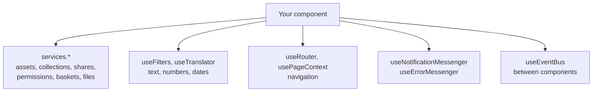
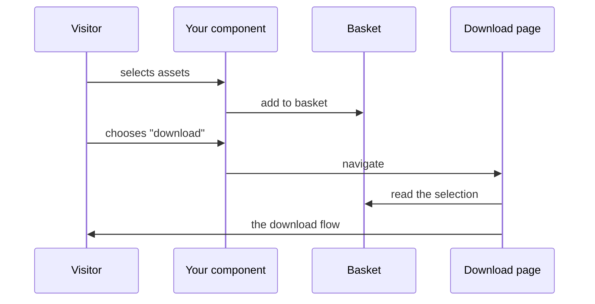

Runtime services
================

The portal runtime gives your component everything it needs to behave like part of the portal
rather than an island — navigation, permissions, translations, shared state, notifications.

Current version of this document is: 1.0.0 (as of 14th of September, 2026)

1. [The shape of it](#user-content-the-shape-of-it)
1. [Working with data](#user-content-working-with-data)
1. [Text, numbers and dates](#user-content-text-numbers-and-dates)
1. [Navigation](#user-content-navigation)
1. [Permissions](#user-content-permissions)
1. [Baskets: sharing a selection](#user-content-baskets-sharing-a-selection)
1. [Download, share and collect](#user-content-download-share-and-collect)
1. [Talking to other components](#user-content-talking-to-other-components)
1. [Messages and errors](#user-content-messages-and-errors)
1. [Analytics and consent](#user-content-analytics-and-consent)
1. [Reuse before you build](#user-content-reuse-before-you-build)

## The shape of it

Two ways in. Data services hang off the portal context:

```ts
import { usePortalsContext } from '@smintio/sminted-ui-sdk';

const { services } = usePortalsContext();
```

Everything else is a function you call from your component's setup:

```ts
import { useFilters, useRouter, useEventBus } from '@smintio/sminted-ui-sdk';
```



## Working with data

| Service | What it holds |
|---|---|
| `services.assets` | Reading, searching, browsing folders, downloading |
| `services.resourceAssets` | Assets managed as portal resources |
| `services.productAssets` | Product assets |
| `services.collections` | Creating, reading, searching, updating, deleting collections |
| `services.collectionsAndAssets` | What is in a collection |
| `services.collectionsAndUsers` | Who may see a collection |
| `services.shares` | Share links |
| `services.files` | Uploading |
| `services.permissions` | What the current visitor may do |
| `services.baskets` | Lists shared between components |

Most components never touch these directly — the ready-made composables described at the end of
this document cover the common cases.

## Text, numbers and dates

```ts
const { t, l, n, d, locale } = useFilters();
```

| Call | Use |
|---|---|
| `l(value)` | Resolve a localized string or resource to text |
| `t(key)` | Translate one of your own keys |
| `n(value)` | Format a number for the current culture |
| `d(value)` | Format a date for the current culture |
| `locale` | The current culture, when you need `Intl` directly |

Never assemble culture-dependent text by hand. `` `${percent}%` `` is wrong in several languages,
and a hard-coded date format is wrong in most. See [localization](sminted-ui-localization.md).

## Navigation

```ts
const router = useRouter();
const resolver = usePageReferenceResolver();
const page = usePageContext();
```

- `usePageReferenceResolver()` turns a `page()` setting into a real route. Always resolve a page
  reference this way rather than constructing a path.
- `useRouter()` gives the current route and lets you navigate.
- `usePageContext()` describes the page you are on, including what is in each slot — page
  templates use this.
- `usePlatform()` handles URLs, opening a new window, and global browser events.

## Permissions

```ts
const { permissions } = usePortalsContext().services;
```

Checks are available for viewing asset details, downloading, downloading high resolution files and
layout files, and permissions on a specific asset.

Use them to decide what to render — whether to show a download button, whether to show a preview
or a placeholder.

**They are not a security boundary.** The backend enforces access on every request regardless of
what the interface shows. Use them to avoid offering an action that would fail, never to protect
data.

## Baskets: sharing a selection

A basket is a named list that lives in the runtime. Every component asking for the same name gets
the same list, so a selection made in one place is visible everywhere.

```mermaid
flowchart TD
    A[Gallery A] -->|basket "cart"| B((Basket))
    C[Gallery B] -->|basket "cart"| B
    D[Toolbar with count] -->|basket "cart"| B
    B -->|the same items, reactively| A
    B --> C
    B --> D
```

For the common case — "let the user select from this list" — use the selection helper rather than
the service:

```ts
const selection = useSdkBasketSelection({
  assets: galleryAssets,
  getItemId: (asset) => asset.id,
  // a name → shared with every component using that name
  // undefined → private to this component
  basketId: () => (props.useBasket ? props.basketId : undefined),
});
```

It gives you `toggleSelected`, `isSelected`, `selectedAssets`, `selectionCount`, `hasSelection`
and `clearSelection` — enough to drive a grid and a toolbar.

Baskets can survive a page reload (`session`) or persist across tabs (`local`), they de-duplicate
by item id, and they tell you when someone else clears them. Making selection shareable is usually
worth a single boolean setting.

## Download, share and collect

These are **pages**, not dialogs your component opens. The portal has page types for them —
`page-type-download`, `page-type-share`, `page-type-collect` — and an administrator configures
which page each action goes to.

So a component that offers "download selected" does not build a download dialog. It puts the
selection in a basket and navigates. The download page picks the selection up from there.



This is a deliberate change from the previous generation, where each component carried its own
dialog. Making them pages means one download experience across the whole portal, configurable by
the administrator, rather than one per component.

## Talking to other components

```ts
const bus = useEventBus();
```

The event bus carries typed events across the page — a collection was created, an asset was added
to one, a dialog closed, consent was given, a basket was cleared.

Use it when components that do not know about each other need to stay in step: a gallery clearing
its selection after a bulk action finishes elsewhere on the page.

Do not use it for communication between your own component and its own children. Props down,
events up is clearer and easier to follow.

## Messages and errors

```ts
const notifications = useNotificationMessenger();
const errors = useErrorMessenger();
```

- `showNotification(...)` for feedback the visitor asked for — "added to your collection".
  Severity, position and duration are yours to set.
- `errors.error(caught)` for anything that went wrong. It presents a translated message and
  reports the detail.

Do not swallow a failure, and do not print a technical message into the interface. Route it
through the error messenger and let the portal handle presentation.

## Analytics and consent

`useAnalyticsProvider()` records events. `useConsentProvider()` tells you what the visitor has
agreed to, and lets a consent component record their choice.

If your component tracks anything, check consent first. Do not assume it has been handled
elsewhere on the page.

## Reuse before you build

Before writing anything that talks to the runtime, check whether it already exists. The shared
component package `@smintio/sminted-ui-core-components` provides ready-made composables for the
common jobs:

| Need | Use |
|---|---|
| Load whatever an `assetsReference` points at | the reactive assets loader |
| Run and page a search | the search composable |
| Resolve a configured menu | the menu items composable |
| Know whether the visitor is signed in | the login composable |
| Check permissions reactively | the permissions composable |
| Selection over a list, optionally shared | the basket selection composable |
| Fall back to an English default for a localized setting | the localized strings helper |

The same package holds the shared building blocks — links, icons, images, buttons, galleries,
lightboxes, dialogs — together with the keyboard and screen reader behaviour they need. Building
your own is how components drift apart from the rest of the portal.

Contributors
============

- Reinhard Holzner, Smint.io GmbH
