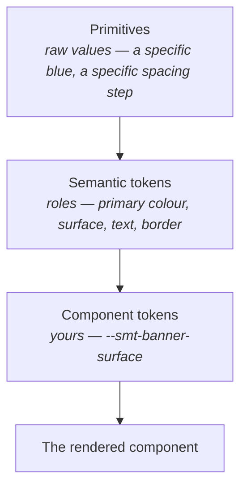
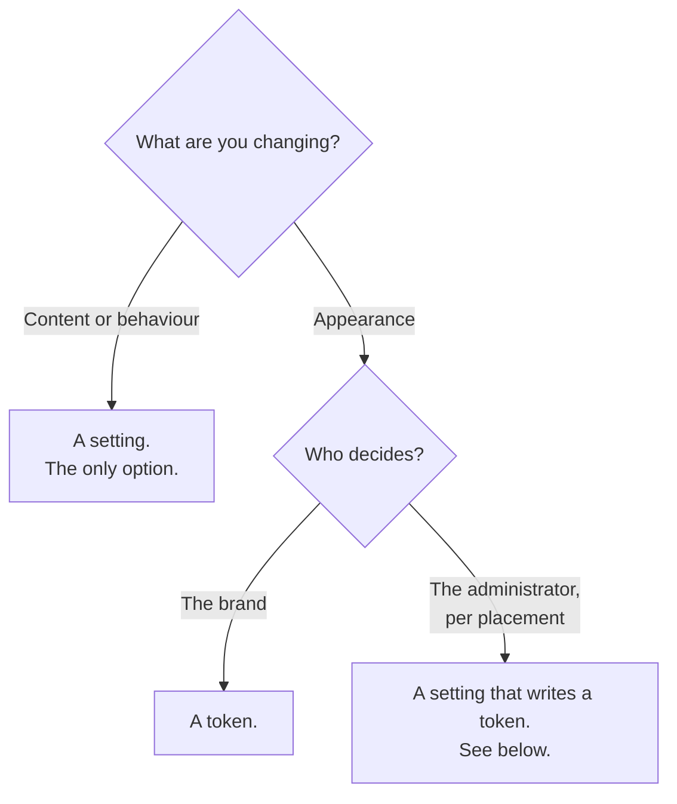

Tokens and theming
==================

Your component has to look like it belongs in whichever portal it lands in. Design tokens are how
that happens without you knowing anything about the brand in advance.

Current version of this document is: 1.0.0 (as of 14th of September, 2026)

1. [The idea](#user-content-the-idea)
1. [Three layers](#user-content-three-layers)
1. [Declaring your tokens](#user-content-declaring-your-tokens)
1. [Using them in CSS](#user-content-using-them-in-css)
1. [Variants](#user-content-variants)
1. [Settings or tokens?](#user-content-settings-or-tokens)
1. [When a setting has to compute a value](#user-content-when-a-setting-has-to-compute-a-value)
1. [Practical rules](#user-content-practical-rules)

## The idea

You never write a colour into a component. You write "this surface uses the component's surface
colour", and you say that the component's surface colour comes from the portal's surface colour
unless someone says otherwise.

The result is a component that re-brands itself. A portal sets its palette once, and every
component follows — including yours, which was written before that portal existed.

## Three layers



- **Primitives** are the raw design values. You do not touch these.
- **Semantic tokens** say what a value is *for*. A portal's theme sets them, and that is what
  makes a portal look like itself.
- **Component tokens** are yours, named for your component, and they point at semantic tokens.

Always anchor to the semantic layer. Pointing a component token at a primitive works today and
breaks the first time a portal changes its brand.

## Declaring your tokens

In `smt-banner.tokens.ts`, one entry per token, each with a type, a value and a description:

```ts
import { featureTokens, self, t, css } from '@smintio/sminted-ui-core-components';

export const smtBannerTokensName = 'banner';

const { tokens, variants } = featureTokens(smtBannerTokensName, {
  surface: { type: 'color', value: t('color-surface'), description: 'Banner background' },
  text: { type: 'color', value: t('color-text'), description: 'Banner text colour' },
  padding: { type: 'size', value: t('spacing-lg'), description: 'Inner padding' },
  radius: { type: 'size', value: css('8px'), description: 'Corner radius' },
});
```

| Helper | Means |
|---|---|
| `t('color-surface')` | Point at a semantic token |
| `self('surface')` | Point at another of your own tokens |
| `css('8px')` | A literal value — use sparingly |

Each token becomes a custom property named after your component, `--smt-banner-surface`, which is
what makes it addressable from outside.

Where the design genuinely needs a derived value — a tint, a translucent overlay — derive it with
`color-mix` on top of a semantic token rather than writing a new literal colour.

## Using them in CSS

Read every custom property where you use it, with a semantic fallback:

```css
.smt-banner {
  background: var(--smt-banner-surface, var(--smt-color-surface));
  color: var(--smt-banner-text, var(--smt-color-text));
  padding: var(--smt-banner-padding, var(--smt-spacing-lg));
  border-radius: var(--smt-banner-radius, 8px);
}
```

That two-step fallback is the whole trick. It means the value can be overridden at any level —
the whole portal, one page, or a single instance of your component — and your component picks it
up without any code.

For the same reason, component styles are not scoped. Scoping would lock values into generated
selectors and make both of those overrides impossible.

## Variants

A variant is a prepared alternative look: a set of token values plus a class on the root.

```ts
variants: {
  tone: {
    group: 'tone',
    muted: { surface: t('color-surface-muted'), text: t('color-text-muted') },
    accent: { surface: t('color-primary'), text: t('color-on-primary') },
  },
}
```

Variants in the same group are mutually exclusive — only one applies. This is the right mechanism
for a setting like `tone`, `shape` or `size`, where the administrator is choosing between looks you
designed rather than supplying a value.

## Settings or tokens?

The question comes up constantly, and it has a clean answer. They are two different axes:



- **What the component shows or does** is always a setting. There is no other mechanism.
- **How it looks** is a token — whether that token is set once for the portal or on a single
  instance.

So "which assets" is a setting, and "the heading font" is a token.

## Colours come from the portal, not from your code

This one is worth stating on its own, because the instinct runs the other way.

**Do not calculate colours.** Your component's colours come from the portal's own style, through
the semantic tokens, and an administrator who needs a different colour overrides the token. You do
not need a colour setting to make that possible — the token is already addressable.

```css
/* right — follows the portal, overridable at any level */
.smt-banner { background: var(--smt-banner-surface, var(--smt-color-surface)); }
```

Deriving a colour in code — mixing a tint, working out a readable text colour for an
administrator-chosen accent — is a rare-case escape hatch, not the normal way to build a
component. If you genuinely need it, that computation goes in the optional `smt-banner.style.ts`,
under two rules:

- **Additive only.** If the setting is unset, emit nothing, so the token default stands.
- **Nothing but mapping.** No layout, no behaviour.

Most components need no `*.style.ts` at all.

## Practical rules

**Expose intent, not every value.** The instinct is to give the administrator a setting for each
token. Resist it. A handful of meaningful choices — a shape, a typeface, a tone — with everything
else coming from the theme produces better portals than forty raw values. Contrast, spacing and
hit targets are craft: keep them yours.

**Never hard-code a design value.** Map it to a semantic token first. If there is no suitable
semantic token, that is worth raising with us rather than working around.

**Keep sizes on sensible steps.** Use pixels for spacing, sizing and radius; keep relative units
for things that should scale with the reader's font size. Avoid values with more precision than a
designer would ever specify.

**Check both light and dark.** Portals switch appearance. A component that only works on one
background will be found immediately.

Contributors
============

- Reinhard Holzner, Smint.io GmbH
